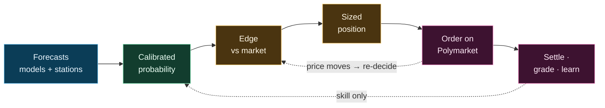

# Zeus

> Quantitative trading engine for weather-settlement prediction markets on Polymarket.

Zeus trades daily high/low temperature markets across 54 cities. It ingests weather
forecasts, converts them into calibrated probabilities for each market, trades where its
probability beats the price by a defensible margin, and runs the full loop end to end:
forecast, decide, execute, settle, learn.



> **Status** — Private, operator-run engine trading real capital. Published for transparency
> and audit; not open source and not deployable as-is. See [LICENSE](LICENSE).

## What it trades

Each market asks a yes/no question (*"will Tokyo's high land in 50–51°F?"*) and settles on the
integer temperature an official provider reports that day. Because settlement is rounded, the
rounding rule is part of the contract — most cities round to the nearest degree, Hong Kong
truncates — and is modelled exactly. Markets take three shapes: an exact value or range
(`50–51°F`), an open ceiling (`75°F or higher`), or an open floor (`30°C or below`). High and
low markets for a city are independent — separate measurement, history, and calibration.

## How it works

**Probability.** Forecasts from ~25 sources (ECMWF, GFS, ICON, …, plus official station feeds
for cities that settle on a known station) are each de-biased against their own settled history
and fused by inverse-variance weighting. The fusion shrinks its covariance toward the diagonal
(noisy cross-correlations at small sample sizes) and collapses same-model resolutions into one
family so nothing is double-counted. The grid value is read at the station's exact coordinates,
corrected for altitude with a per-city fitted lapse rate, with the residual distance/elevation
mismatch added as variance rather than subtracted as bias. The predictive spread is floored to
the cell's realized settlement error (no overconfidence), then integrated onto each bin over the
preimage of the rounding rule.

**Edge.** A bin is traded only if it clears, in order: a conservative lower bound on its
probability; a settlement-graded check of how often bins of its kind have actually won (the
guard against adverse selection — beating the price preferentially selects the bins the model is
overconfident on); a real margin over price plus cost; and false-discovery control across all
bins scanned that cycle.

**Sizing.** Survivors are ranked by return per dollar at risk and sized with fractional Kelly,
scaled down for confidence-interval width, lead time, portfolio heat, and drawdown. Either side
of any bin is tradeable. Any bad input yields no trade.

**Execution.** Limit orders only — entries rest as a maker (zero fee) and escalate to a taker
cross only if the edge persists past a deadline. Submission is idempotent (no double-fills
across crashes), fills are verified each cycle, and an hourly sweep reconciles against the
venue.

**Learning.** Each settled position is graded into one of six outcomes that separate skill from
luck; only genuine-skill results feed the calibration. Feedback is walk-forward — the
decision-time probability is frozen and the calibration only learns from already-settled
outcomes — so no information leaks backward from the future.

## Design notes

Much of the engine is structural, so that classes of mistake cannot be expressed:

- Temperatures carry their unit in the type system; mixing °F and °C is a compile error.
- A settlement value cannot be stored without passing through its city's rounding rule.
- Kelly sizes against the real all-in cost (fee included), never a bare market probability.
- Believed positions are kept separate from on-chain truth; unmatched on-chain inventory is
  surfaced for review, never silently trusted or voided.
- World facts, forecasts, and trades live in three separate stores; any cross-store write is
  atomic.

## Strategies

| Strategy | Edge | Fades |
|----------|------|:-----:|
| Settlement Capture | observed fact once the day's peak has passed | slowest |
| Center Bin Buy | model beats the market on the most-likely bin | fast |
| Imminent Open Capture | re-opened or next-day markets near settlement | fast |
| Opening Inertia | mispricing in a freshly opened market | fastest |

Each is graded on its own settled record; more are registered but held back until the evidence
earns them in.

## Project structure

```text
src/             Engine — forecasting, calibration, decision, execution, state, risk
tests/           Correctness and regression guards
scripts/         Maintenance tools and integrity checks
architecture/    Machine-readable manifests and invariants
config/          Runtime configuration and source registries
docs/            Reference, domain, and operational documentation
state/           Runtime databases (local, not committed)
```

## Documentation

- [`docs/reference/theory_map.md`](docs/reference/theory_map.md) — the forecasting, calibration,
  and sizing methods in detail; [`glossary.md`](docs/reference/glossary.md) defines the terms.
- [`AGENTS.md`](AGENTS.md) — the contract for the AI agents that maintain the codebase.

## License

Proprietary — all rights reserved. See [LICENSE](LICENSE).
