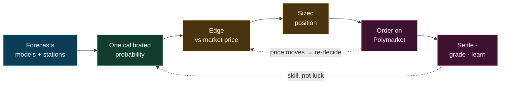

# Zeus

> Quantitative trading engine for weather-settlement prediction markets on Polymarket.

Zeus trades daily high and low temperature markets across **54 cities** end to end: it
gathers forecasts from roughly two dozen weather models and official station feeds, turns
them into a probability honest enough to bet real money against a market price, sizes and
places the trade itself, then watches it to settlement and learns from the result. The
whole engine exists to make that probability trustworthy — calibrated against what has
actually settled, conservative where it is uncertain, and never confident for the wrong
reasons.

Predicting the weather is the easy part; everyone has the same forecasts. The work is
everything that turns a forecast into a defensible position and keeps a live book honest.



> **Status** — Private, operator-run engine trading real capital. Published for
> transparency and audit; not open source, not built for redeployment. See [LICENSE](LICENSE).

---

## What it trades

Each market asks a yes/no question — *"will Tokyo's high land in 50–51°F?"* — and settles on
the integer temperature an official provider reports for the day. That integer is the end of
a rounding chain: a real `74.45°F` is measured by a sensor, rounded in the weather report,
and posted as `74°F`. A fraction of a degree decides which side of a bin boundary the day
lands on, and not every city rounds the same way — most round to the nearest degree, Hong
Kong truncates — so the rounding itself is part of the contract, modelled exactly rather than
assumed. Markets come as an exact value or range (`50–51°F`), an open ceiling (`75°F or
higher`), or an open floor (`30°C or below`); high and low markets for a city share nothing —
separate measurement, separate history, separate calibration.

## The probability

Everything downstream is only as good as this number, so it is built with care.

**Forecasts, weighted by reliability rather than reputation.** The inputs are several
independent global models — ECMWF, GFS, ICON, and more — and, for a city that settles on a
known station, that nation's own official forecast for that exact station. Each model is
first de-biased against its own settled history with an **empirical-Bayes shrinkage**: the
correction is trusted in proportion to how much history supports it, so a long-tested model
moves freely while a barely-seen one is held near a neutral prior. The de-biased models are
then combined by **precision-weighted fusion** — each weighted by the inverse of how much it
actually errs. The covariance behind those weights is **shrunk toward its diagonal**, because
with only a handful of models the cross-correlations are mostly noise; and models that are
really the same forecast at two resolutions are collapsed into one **family**, so a popular
model can't vote twice. On settled cells this fusion beats an equal-weighted average by more
than ten times its own standard error — and beats betting on the single best model outright.
*It wins because it fuses, not because it trusts any one source.*

**A physical correction the grid can't make for you.** A gridded model describes a square
kilometre of map; a market settles at one airport thermometer, often kilometres away and at a
different altitude. Zeus reads each model at the station's exact coordinates by interpolation,
corrects the altitude gap with a **lapse rate fitted per city** from settled outcomes — not
the textbook −6.5 °C/km, which sea-breezes and thin mountain air routinely break — and treats
the *remaining* distance-and-elevation mismatch as **added variance, not subtracted bias**. A
far-off or badly-matched station isn't reliably cold; it is reliably *uncertain*, so the
fusion simply leans on it less.

**Width that can't lie.** The spread is floored to the error the system has *actually* made at
settlement for cells like this one. Overconfidence — a spread too narrow, piling probability
onto one bin — is the single mistake that empties a book, so the served uncertainty is never
allowed below the measured truth. Finally the distribution is integrated onto each market's
bins across the **preimage of the rounding rule** — the real temperatures that *round* to the
bin — not its face value; get this wrong and a single-degree bin can read as zero probability
when it is in fact the most likely outcome.

## The edge

A number that beats the price is not yet a reason to trade. Each bin runs a gauntlet, and most
are turned away:

- **Confidence, not hope** — Zeus acts on a conservative lower bound of the probability, not
  the optimistic midpoint.
- **The winner's curse, answered.** This is the sharpest idea in the engine. The plain rule
  "trade when my probability beats the price" quietly selects exactly the bins where the model
  is *most overconfident* — it wins the bets it has no business winning. Zeus measures this
  directly: it asks how often bins of this exact kind have actually settled in its favour, and
  serves a conservative lower bound on that realised rate, standing down where the record is
  thin or poor. On one live stretch the model believed a side at thirteen percent that settled
  at thirty-three — the kind of gap no model-internal check can see, and exactly what this one
  catches.
- **A real margin** — the edge must clear the price *and* the cost of trading.
- **No flukes** — across all the bins weighed in a cycle, a false-discovery control keeps the
  rate of edges that are really just noise in check.

## The trade

Among the bins that survive, Zeus takes the best **return per dollar at risk** — not the
biggest gross swing — so the book funds several independent bets instead of one oversized one,
and it sizes the winner by **fractional Kelly** scaled back through independent brakes (how
wide the uncertainty, how far off settlement, how much risk the book already carries, how deep
any recent drawdown). It will buy either side of any bin; the forecast's favoured outcome
never vetoes the other.

It places **limit orders only**. An entry rests quietly as a maker — collecting the spread, no
fee — and only escalates to crossing the book as a taker if the edge is still there past a
measured deadline. Every order is built deterministically with an idempotency key, so a crash
mid-submission can never double-fill, and the intent is written down before the venue is ever
contacted. Fills are verified against the venue each cycle, partial fills are tracked and
recovered, and an hourly reconciliation sweep catches anything the live path missed. Nothing
reaches the market until a chain of safety gates passes; a single missing or broken input
produces no trade, never a careless one.

## Settlement and learning

When a market resolves, Zeus does not simply tally profit and loss — it asks *why* it won or
lost. Every settled position is graded into one of six outcomes that separate **skill from
luck**: a win that the forecast earned, a win it stumbled into, a loss it should have seen, a
loss from genuine miscalibration, a decision made on stale data, and an outcome it cannot
honestly attribute. Only the genuine-skill results are allowed to feed back into the
calibration the next forecast depends on — luck is not a lesson.

That feedback is strictly **walk-forward**: the probability a position was sized on is frozen
at decision time and never quietly rewritten, and the calibration only ever learns from
outcomes that had already settled, so nothing the model "knows" can leak backward from the
future. Held positions, meanwhile, are reconciled continuously against the blockchain — where
a *missing* reading is never mistaken for a closed position — and re-decided whenever a fresh
forecast or a moved price changes the picture.

## Built so the wrong trade can't be made

A surprising share of the engine is structural — written so that whole classes of expensive
mistake simply cannot be expressed. Temperatures carry their unit in the type system, so
adding a Fahrenheit to a Celsius is a compile error, not a silent off-by-1.8 in the edge. A
settlement value cannot be stored without passing through its city's exact rounding rule. The
price Kelly sizes against must be the real all-in cost, fee included, not a bare market
probability — the type refuses the unsafe one. What the engine *believes* it holds is kept
strictly apart from what the blockchain actually shows, with unmatched on-chain inventory
surfaced for review rather than silently trusted or silently voided. Truth lives in three
separate stores — world facts, forecasts, and trades — and any write that must touch more than
one of them is atomic, never able to leave them half-agreeing. The aim throughout is to make
the wrong code unwritable, not merely to catch it at runtime.

## Strategies

Five strategies trade live, each capturing a different inefficiency and fading at its own pace
as the market competes it away:

| Strategy | Where the edge comes from | Fades |
|----------|---------------------------|:-----:|
| **Settlement Capture** | observed fact, once the day's peak has passed | very slowly |
| **Center Bin Buy** | the model beating the market on the most-likely bin | quickly |
| **Imminent Open Capture** | re-opened or next-day markets close to settlement | quickly |
| **Opening Inertia** | mispricing in a freshly opened market | fastest |

Each is graded on its own settled record; several more are registered but held back until the
evidence earns them in.

---

## Project structure

```text
src/             Engine — forecasting, calibration, decision, execution, state, risk
tests/           Correctness and regression guards
scripts/         Maintenance tools and integrity checks
architecture/    Machine-readable manifests and invariants
config/          Runtime configuration and source registries
docs/            Reference, domain, and operational documentation
state/           Runtime databases (local, not committed)
```

The full derivations — the precision-fusion mathematics, the representativeness model, the
settlement calibration, and the sizing — are indexed in
[`docs/reference/theory_map.md`](docs/reference/theory_map.md), with terms defined in
[`glossary.md`](docs/reference/glossary.md).

## License

Proprietary — all rights reserved. See [LICENSE](LICENSE).
