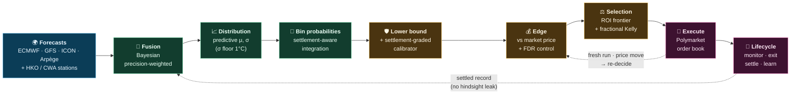
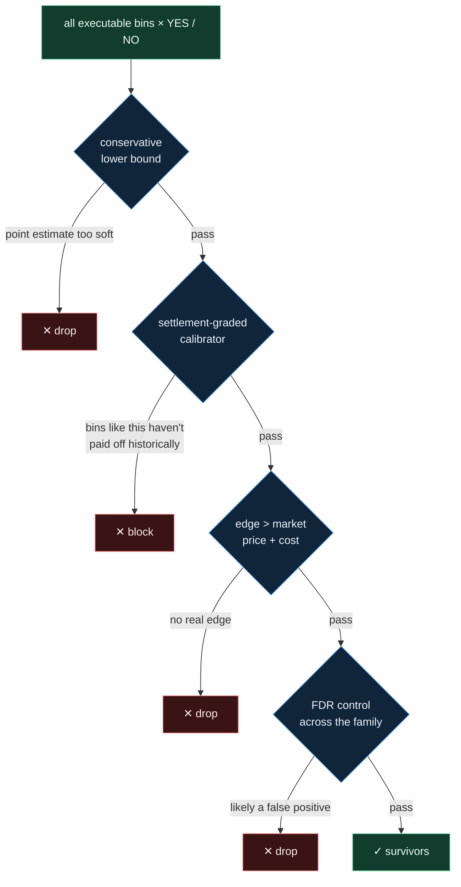

# Zeus

> **A quantitative trading engine for weather-settlement prediction markets on Polymarket.**

Zeus reads the sky and prices it. It fuses competing weather models into one calibrated probability, measures that probability against the live market, and — only where it holds a defensible edge — sizes and places the trade. Every figure on the path is traceable to its source: which forecast run, which settlement rule, which settled track record. Nothing downstream is permitted to guess what something upstream actually was.

<p align="center">
<b>multi-model ensemble</b> + national station forecasts &nbsp;·&nbsp; <b>settlement-exact probability</b> &nbsp;·&nbsp; <b>adverse-selection-aware edge</b><br/>
<sub>forecast → calibrated probability → edge → sized order → settlement → learning — on a continuous loop</sub>
</p>

> **Status.** Private, operator-run engine trading real capital. This source is published for transparency and audit, not for reuse: it is **not** open source, not a library, and not deployable as-is — see [LICENSE](LICENSE) and [CONTRIBUTING.md](CONTRIBUTING.md). It documents how the system actually works, not how to run your own.



---

## What it trades

Zeus trades **discrete settlement contracts** on a city's daily high or low — markets that ask, for example, *"will Tokyo's high land in 50–51°F?"* and resolve on the integer temperature an official provider (typically Weather Underground) reports that day.

The catch is that the settled number is the *end* of a rounding chain, not the real temperature. A genuine 74.45°F is sensed as ≈74.2°F, the METAR observation rounds it, and the provider publishes 74°F. Treating temperature as continuous quietly misprices every bin near a boundary, so Zeus models the whole chain explicitly:


Each market resolves on one of three bin shapes, and Zeus respects the exact rounding rule each city settles under:

| Shape | Example | Settles on |
|-------|---------|-----------|
| **Exact** | `10°C` · `50–51°F` | a single value or a closed range |
| **Open-high** (ceiling) | `75°F or higher` | everything at or above a bound |
| **Open-low** (floor) | `30°C or below` | everything at or below a bound |

High-temperature and low-temperature markets for the same city and day look alike but are **separate families** — different physical quantity, different observation, different calibration. They never share state. And nothing is computed until the contract is pinned: city, local date, metric, unit, bin layout, settlement source, and rounding rule. A probability means nothing until those are fixed.

---

## How it works

The engine runs in four movements: turn many forecasts into one honest probability, test that probability for a defensible edge, commit to a single sized trade, then live with it until settlement and learn from the result.

### 1 · From many forecasts to one probability

Several global ensemble models run alongside, for any city that settles on a known station, that nation's own **official station forecast** for the exact station the market resolves on. Each model is first **de-biased** against its own settled history, shrinking toward a structural prior when that history is short so a thinly-tested model is never over-trusted. A **Bayesian precision-weighted fusion** then collapses them into a single center and spread, weighting each by how reliable it has actually been and discounting models that merely echo one another. The spread is widened by residual error and floored at 1°C — the forecast may never claim more certainty than it has earned. A single settlement-aware integrator finally maps that distribution onto each market's bins under the city's exact rounding rule.

### 2 · From a probability to a defensible edge

A point estimate is not permission to trade. Each candidate runs a gauntlet, and most are turned away:



The **lower bound** means Zeus acts on edge it is statistically confident is real, not on a hopeful midpoint. The **calibrator** is the sharpest filter: it checks how often bins *like this one* — same side, lead, and class — have truly resolved in its favor, and blocks the trade when that record is thin or weak. It exists to defeat the system's own worst instinct: systematically buying exactly the bins where the model runs overconfident. What clears the gauntlet has a positive, false-discovery-controlled edge against the live price.

### 3 · From survivors to one sized trade

Among the survivors, Zeus takes the single best **return per dollar at risk** — discarding trades too small to matter and breaking ties by growth rate. It will buy YES *or* NO on any bin; the forecast's favorite outcome never vetoes the other side. The winner is sized by **fractional Kelly**, then trimmed for confidence-interval width, lead time, win rate, portfolio heat, and drawdown — and it **fails closed**: any malformed number yields no trade, never a reckless one.

### 4 · Execution, redecision, and learning

The order rests on the Polymarket book — but it is never fire-and-forget. Every cycle Zeus re-checks each open order against fresh data and the current same-side bid, pulling and re-deciding the moment the edge shifts or the price drifts away; a new forecast run for a city already held is itself new information. Held positions are monitored to exit, reconciled against on-chain truth, settled, and folded back into the very track records the calibration depends on — with strict care that hindsight never leaks into what the model "knew" at decision time.

### A trade, end to end

One market, traced line by line — *Tokyo daily high, `50–51°F`* (illustrative):

```text
Fusion       model high ≈ 50.6°F,  predictive σ ≈ 1.4°F
Bin shape    exact range {50, 51},  WMO half-up  →  settles if 49.5°F ≤ high < 51.5°F
Probability  P(bin) ≈ 0.61,  conservative lower bound ≈ 0.55
Calibrator   bins like this (side · lead · class) have resolved ~57%  →  licensed
Market       YES trading at 0.46
Edge         0.55 − 0.46 − cost  →  positive, survives FDR
Decision     BUY YES,  fractional-Kelly sized,  resting order placed
Live         re-checked each cycle; pulled and re-decided if a fresh run or price move kills the edge
```

No single number is the point. The point is that every line is a checkable claim with a source — and a thin track record or a degraded input *stops* the trade rather than letting it slip through silently.

> **Legacy baseline.** An older 51-member ensemble chain (Monte-Carlo extrema → Extended Platt calibration → model/market fusion → bootstrap bounds) still runs as an independent diagnostic only. It no longer caps or vetoes the live probability — its value is kept alongside purely as a reference. The Extended Platt calibrator and the empirical-Bayes bias model live here, off the live path.

---

## Methodology — the hard parts

The difficulty is not "run a weather model." It is that a continuous atmospheric field has to become an *honest, settlement-exact, adversarially-robust* probability with no hindsight and no hand-tuned fudge factors. Every hard problem below is solved by **fixing the generator** — moving uncertainty into a covariance or a preimage — never by clamping a broken output. And every fitted quantity is **walk-forward**: trained only on what had already settled before the forecast date, so nothing the model "knows" leaked from the future.

### Fusing models without double-counting them

Several models are combined by **inverse-variance (precision) weighting**, so a model counts in proportion to how reliable it has actually been:

```math
V^* = \left(\tau_0^{-2} + \mathbf{1}^\top \Sigma^{-1}\mathbf{1}\right)^{-1}
\qquad
\mu^* = V^*\left(\tau_0^{-2}\mu_0 + \mathbf{1}^\top \Sigma^{-1} z\right)
```

Three subtleties make this work where a naïve average fails:

- **Empirical-Bayes de-bias.** Each model's correction is shrunk toward a structural prior, $\hat b = \lambda\,\bar r + (1-\lambda)\,\text{parent}$ with $\lambda = n/(n+\kappa)$, $\kappa=8$ — so a model with eight settled days is trusted about halfway, and a model with two is barely trusted at all. No per-model hyper-tuning; the shrinkage *is* the sample size.
- **Ledoit–Wolf covariance shrinkage.** With only a handful of models, the sample covariance $\Sigma$ is rank-deficient and its off-diagonals are mostly noise. $\Sigma$ is shrunk toward its diagonal by a data-driven intensity $\delta^\star=\varphi/\gamma$ — collapsing to per-model variances when data is thin, trusting the full matrix when it is rich. The regularization adapts to data quality instead of being a constant someone picked.
- **Decorrelated provider families.** Two resolutions of the same model (ICON-D2 and ICON-EU) are *not* two votes. Only one representative per physics/provider family enters the fusion, so correlated models can't quietly double-count.

> Algebraically the "prior" label is irrelevant under a diagonal $\Sigma$ — it is just one more precision weight. On settled cells the precision-weighted mean beat equal weighting by ~12× its standard error; concentrating on the single best model was *worse*. **The fusion wins because it fuses, not because it has a prior.**

### Representativeness: a grid cell is not a weather station

A gridded model value describes a *cell*; the market settles at an *airport thermometer* that may sit 10–16 km away and hundreds of metres higher or lower. Zeus treats that gap as **physics, not bias**:

- The grid is read at the station's exact coordinate by bilinear (regular grids) or barycentric (rotated grids) interpolation, which also yields an effective distance $d_{\text{eff}}=\sqrt{\sum_i w_i d_i^2}$ — not a nearest-cell snap.
- A **walk-forward-fitted lapse rate** corrects the elevation offset, $\beta_{\text{alt}}\,(z_{\text{station}}-z_{\text{interp}})$, learned per city/season rather than assuming the textbook −6.5 °C/km — because sea-breeze lock and thin-air effects break the textbook.
- The leftover mismatch becomes a **representativeness variance** added to the fusion's diagonal, $\sigma_{\text{repr}}^2 = a_0 + a_d\,d_{\text{eff}}^2 + a_z\,\Delta z^2$ (scaled up for coastal/orographic/urban regimes). A far-away or badly-matched station is a *noisier instrument*, so precision-weighting down-weights it automatically.

> The key move: representativeness enters as **variance to add, not bias to subtract**. A distant cell isn't reliably cold — it's reliably *uncertain*. You can't subtract a distance; you can only distrust it. So it widens $\Sigma$ and lets $\Sigma^{-1}$ do the rest, with no "de-trust coastal cities" hand-gate anywhere.

### Honest width: never tighter than the truth

Overconfidence is ruin: a too-narrow spread piles probability onto the modal bin and quietly sells the winner. The predictive width composes the model-disagreement variance with the fused center's own realized miss, $\sigma_{\text{pred}}=\sqrt{V^{*}+\sigma_{\text{resid}}^2}$, and is then **floored by the realized walk-forward settlement error** of that very cell. The served spread can never be tighter than the errors the system has actually made — calibration measured against settlement (σ/RMSE ≈ 0.99), not assumed.

### Settlement-exact probability: integrate the preimage, not the bin

The market settles on a *rounded integer*, so the probability of a bin is the mass of the forecast over the **preimage of the rounding map**, not over the nominal bin edges. Each settlement convention has its own preimage, declared once and reused everywhere:

| Rounding rule | Maps via | Preimage of label *X* |
|---------------|----------|-----------------------|
| `wmo_half_up` (most cities) | $\lfloor x+0.5\rfloor$ | $[X-0.5,\;X+0.5)$ — symmetric |
| `oracle_truncate` (e.g. Hong Kong) | $\lfloor x\rfloor$ | $[X,\;X+1)$ — asymmetric |
| `ceil` | $\lceil x\rceil$ | $(X-1,\;X]$ — asymmetric |

```math
P(\text{settle}\in\text{bin}) = \Phi\!\left(\tfrac{\text{hi}+o_{\text{hi}}-\mu}{\sigma}\right) - \Phi\!\left(\tfrac{\text{lo}+o_{\text{lo}}-\mu}{\sigma}\right)
```

This is not pedantry. Integrating a `75°F` bin over `[75, 76)` instead of `[74.5, 75.5)` misplaces most of its mass — and a point bin like `10°C` integrated over `[10,10)` is *zero*, untradeable, until the preimage gives it width. The rounding rule is part of the contract: on Hong Kong's truncating oracle, the asymmetric rule matched 14/14 settled days where symmetric rounding matched 5/14. Open-ended bins (`75°F+`) are integrated as a **one-sided tail**, never a symmetric range.

### Causality on the day of settlement

Once the day is underway, the high can only go up. Zeus conditions on what has already been observed — the settled value is $Y=\max(\text{observed so far},\,X_{\text{remaining}})$ — so a bin entirely below the running high carries *exactly* zero probability, built into the integrator rather than clamped on afterward. Hindsight is structurally excluded: the conditioning uses only what was observable at decision time.

### A lower bound that stays coherent

Zeus trades a conservative lower bound on each bin's probability, found by drawing from the parameter posterior and taking a low quantile. The subtlety: **each draw is renormalized to sum to one *before* the quantile is taken**, so the bins remain a coherent distribution. Lower-bounding each bin independently would let a confident mode get "hollowed out" by a few draws where the peak shifted one bin over — the lower bound would collapse to nonsense. Renormalize-then-quantile keeps it honest.

### Beating the winner's curse

This is the filter that matters most. The admission test "my probability beats the price" **adversely selects** exactly the bins where the model most *underestimates its own uncertainty* — the trades that look good only because the model is wrong about being sure. On one live slice the system believed a side at 0.13 while it actually resolved at 0.33: a 20-point overstatement, invisible to any model-internal bound.

The cure is empirical and settlement-graded. Group every candidate into a cell — *(side, lead, bin class, raw-probability bucket)* — and serve a **Wilson lower bound on how often that cell has actually won**:

```math
q_{\text{safe}} = \frac{\hat p + \frac{z^2}{2N} - z\sqrt{\hat p(1-\hat p)/N + z^2/4N^2}}{1+z^2/N},\quad z=1.645
```

keyed on the *raw signal that admits the trade*, not on the model's own number. Thin cell, stale evidence, or fewer than 30 settled samples → it serves zero and the trade is blocked. The center is never moved; the system simply refuses to bet where its track record doesn't earn it.

### Selecting and sizing what survives

- **One edge, not two.** Edge is the settlement-payoff vector against cost — for YES it is $q_i-\text{cost}$, for NO it is $(1-q_i)-\text{cost}$ — never a scalar "probability minus ask" bolted on after sizing.
- **False-discovery control.** Scanning ~200 bins a cycle, some will look like edges by chance. Benjamini-Hochberg FDR across the *complete* tested family (not the survivors) caps the false-positive rate where per-test significance would flood the book.
- **Return per dollar, robustly.** Among survivors Zeus maximizes guarded edge *per dollar at risk* — capital efficiency that funds many decorrelated bets instead of one bloated one — with robust (lower-quantile) log-growth as the tiebreak.
- **Fractional Kelly, multiplied down.** Size is full-Kelly scaled by an independent cascade — confidence width, lead, win rate, portfolio heat, drawdown, data-density — that compounds geometrically and **fails closed**: any NaN yields no trade.

> The thread through all of it: **no hand-written weights.** Thin history, model correlation, station distance, stale observations, adverse selection — each becomes a variance, a precision, or an empirical lower bound, and the math down-weights it on its own. Confidence is something the system *earns from settled outcomes*, never something it assumes.

---

## Trading strategies

Five families trade live, each mining a distinct inefficiency — and each decaying at its own pace as the market competes it away:

| Strategy | Where the edge comes from | Decay |
|----------|---------------------------|:-----:|
| **Settlement Capture** | observed fact, once the day's peak has passed | 🐢 very slow |
| **Center Bin Buy** | the model beating the market on the single most-likely bin | 🦊 fast |
| **Imminent Open Capture** | re-opened or next-day markets close to settlement | 🦊 fast |
| **Opening Inertia** | fresh-market mispricing from first-LP anchoring | 🐇 fastest |

Each is graded on its *own* settled record — portfolio P&L hides which specific edge is eroding. Other strategies (shoulder-bin sell, center-bin sell, tail capture) are registered but held **blocked** until forward settled evidence earns them in; the shoulder-bin sell was refuted on its own data and stays off.

---

## State & safety

A position runs a fixed lifecycle from intent to settlement:


Two principles govern the runtime, and both are the same instinct as the methodology — *never act on certainty you haven't earned*:

- **Fail closed.** Risk is a hard gate, not advice, escalating from normal operation down to "exit everything." The system always runs at the **worst** level any signal reports, and any broken risk computation forces the most defensive state. Sizing that hits a NaN yields no trade.
- **Silence is not absence.** Every cycle reconciles local belief against on-chain truth, but a *missing or stale* snapshot is never treated as proof a position is gone — only a fresh, complete, authoritatively-empty chain can void one. A flaky data feed cannot delete a real position.

State lives in three separate stores — world facts, forecasts, and trades — so a heavy forecast write never stalls a trade write; a change that must span them commits atomically rather than through independent connections a crash could tear.

---

## Repository layout

```text
src/             Engine source — forecasting, calibration, decision, execution, state, risk
tests/           Correctness and regression guards
scripts/         Maintenance tools and SQL migrations
architecture/    Machine-readable manifests and invariants
config/          Runtime configuration and source registries
docs/            Architecture law, domain/math reference, and settlement evidence
state/           Runtime databases and projections (local, not committed)
```

The decision cycle lives in `src/engine/` (orchestration, evaluation, monitoring), execution in `src/execution/`, the forecast and calibration math in `src/forecast/` and `src/calibration/`, and trade/position truth in `src/state/`.

---

## Reading the source

Three doors, depending on what you're after:

- **This README** — what the system does and why (start here).
- **[docs/reference/theory_map.md](docs/reference/theory_map.md)** — a guided index of the math and physics: the precision-fusion derivation, settlement integration, calibration, sizing. **[glossary.md](docs/reference/glossary.md)** defines the load-bearing terms and reconciles the naming.
- **[AGENTS.md](AGENTS.md)** — the operating law and change-control that govern how the codebase is modified (it is maintained largely by AI agents under that contract). Of interest mainly if you want to understand *why* the repo is structured as it is.

Source under `src/`, tests under `tests/`. There is no setup to run it against live markets, by design.
