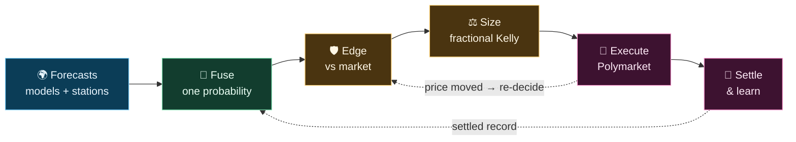

# Zeus

> Quantitative trading engine for weather-settlement prediction markets on Polymarket.

Zeus turns weather forecasts into calibrated probabilities, compares them against live market prices, and trades the gap — placing money only where it has an edge it can defend against its own settled track record. It runs the full loop continuously: forecast, price, decide, execute, settle, learn.



> **Status** — Private, operator-run engine trading real capital. Published for transparency and audit, **not** open source and not deployable as-is. See [LICENSE](LICENSE).

---

## What it trades

Discrete daily-temperature contracts: a market asks *"will Tokyo's high land in 50–51°F?"* and settles on the integer temperature an official provider (usually Weather Underground) reports for the day.

That settled integer is the end of a rounding chain — a real `74.45°F` is sensed, rounded, and posted as `74°F` — so Zeus models the rounding explicitly instead of treating temperature as continuous. Markets come in three shapes:

| Shape | Example | Settles on |
|-------|---------|-----------|
| Exact | `10°C` · `50–51°F` | a single value or closed range |
| Open-high | `75°F or higher` | everything at or above a bound |
| Open-low | `30°C or below` | everything at or below a bound |

High and low markets for the same city are handled as **separate families** — different measurement, different calibration — and never share state.

---

## How it works

**1 · One probability from many forecasts.** Several global ensemble models — plus, where a market settles on a known station, that nation's own official station forecast — are each de-biased against their own history and fused into a single calibrated probability per bin. The forecast is never allowed to look more certain than its track record justifies.

**2 · Edge it can defend.** A bin is traded only if it clears every gate: a conservative lower bound on its probability, a settlement-graded check that bins *like this one* have actually paid off (the guard against buying exactly where the model is overconfident), a real edge over the market price after cost, and false-discovery control across all bins scanned that cycle.

**3 · One sized trade.** Among the survivors Zeus picks the best return per dollar at risk and sizes it with fractional Kelly, trimmed for uncertainty, lead time, and portfolio heat. It buys YES or NO on any bin — the forecast's favorite outcome never vetoes the other side — and fails closed: a bad number yields no trade.

**4 · Execute, re-decide, learn.** The order rests on the Polymarket book and is re-checked every cycle; if the edge shifts or the price drifts, it is pulled and reconsidered. Settled outcomes feed back into the calibration — with care that hindsight never leaks into past decisions.

> The design principle throughout: **no hand-tuned fudge factors.** Thin history, model overlap, far-away stations, stale data, adverse selection — each is expressed as a variance or an empirical lower bound, and the math down-weights it on its own. Confidence is earned from settled results, never assumed.
>
> The full derivations — precision fusion, grid-to-station representativeness, settlement-preimage integration, the adverse-selection calibrator, sizing — live in **[docs/reference/theory_map.md](docs/reference/theory_map.md)**.

---

## Trading strategies

Five families trade live, each with a different edge and a different rate of decay:

| Strategy | Edge | Decay |
|----------|------|:-----:|
| **Settlement Capture** | observed fact once the day's peak has passed | very slow |
| **Center Bin Buy** | model beats the market on the most-likely bin | fast |
| **Imminent Open Capture** | re-opened / next-day markets near settlement | fast |
| **Opening Inertia** | fresh-market mispricing at the opening tick | fastest |

Each is graded on its own settled record. Several other strategies are registered but held back until forward evidence earns them in.

---

## Project layout

```text
src/             Engine — forecasting, calibration, decision, execution, state, risk
tests/           Correctness and regression guards
scripts/         Maintenance tools and migrations
architecture/    Machine-readable manifests and invariants
config/          Runtime configuration and source registries
docs/            Reference, domain/math, and operational docs
state/           Runtime databases (local, not committed)
```

Where to go next:

- **[docs/reference/theory_map.md](docs/reference/theory_map.md)** — the math and physics, indexed; **[glossary.md](docs/reference/glossary.md)** for terms.
- **[AGENTS.md](AGENTS.md)** — operating contract for the AI agents that maintain the codebase.
