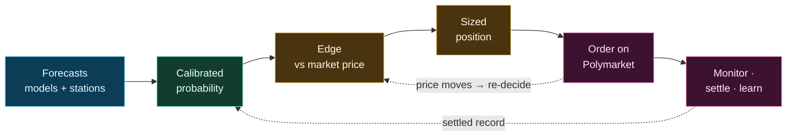

# Zeus

> Quantitative trading engine for weather-settlement prediction markets on Polymarket.

Zeus trades daily high and low temperature markets. It reads the same weather the rest
of the world reads, turns it into a calibrated probability for each market, and commits
capital only where that probability disagrees with the price by a margin it can defend.
What follows is how a forecast becomes a position, from end to end.



> **Status** — Private, operator-run engine trading real capital. Published for
> transparency and audit; not open source, not built for redeployment. See [LICENSE](LICENSE).

---

## What it trades

Each market asks a yes/no question — *"will Tokyo's high land in 50–51°F?"* — and settles
on the integer temperature an official provider reports for the day. That integer is the
end of a rounding chain: a real `74.45°F` is measured, rounded, and posted as `74°F`. Zeus
follows that chain exactly rather than treating temperature as a smooth quantity, because a
fraction of a degree decides which side of a bin boundary the market lands on.

Markets take three shapes — an exact value or range (`50–51°F`), an open ceiling
(`75°F or higher`), or an open floor (`30°C or below`) — and high and low markets for the
same city are treated as entirely separate, with their own measurement and calibration.

## How a position is made

**The forecast becomes one probability.** Several global weather models, and where a market
settles on a known station that nation's own official forecast, are each corrected against
their own settled history and combined into a single estimate — each model weighted by how
reliably it has performed, not by reputation. The spread of that estimate is widened to
match the errors the system has actually made, so a forecast can never look more certain
than it has earned. That distribution is then read onto each market's bins under the exact
rounding rule the city settles by.

**The probability becomes an edge — or nothing.** A number that beats the price is not yet a
reason to trade. Each bin must pass in turn: a conservative lower bound, so Zeus acts on
confidence rather than a hopeful midpoint; a check against the settled record of bins *like
this one*, which blocks precisely the cases where the model tends to be overconfident; a
genuine margin over the market price after cost; and a control on false positives across all
the bins weighed that cycle. Most candidates are turned away here.

**The edge becomes a sized position.** Among what survives, Zeus takes the best return per
dollar at risk and sizes it with fractional Kelly, scaled back for uncertainty, lead time,
and how much risk the book already carries. It will buy either side of any bin — the
forecast's favored outcome never vetoes the other — and it fails safe: a missing or broken
input produces no trade, never a careless one.

**The position is kept honest until it settles.** The order rests on the book and is
re-examined every cycle; if the edge fades or the price drifts away, it is pulled and
decided again. Held positions are monitored, exited, and reconciled against the chain, and
every settled outcome flows back into the calibration the next forecast depends on — with
care that knowledge of the result never leaks back into what the model is judged to have
known beforehand.

## Strategies

Five strategies trade live, each capturing a different inefficiency and fading at its own
pace as the market competes it away:

| Strategy | Where the edge comes from | Fades |
|----------|---------------------------|:-----:|
| **Settlement Capture** | observed fact, once the day's peak has passed | very slowly |
| **Center Bin Buy** | the model beating the market on the most-likely bin | quickly |
| **Imminent Open Capture** | re-opened or next-day markets close to settlement | quickly |
| **Opening Inertia** | mispricing in a freshly opened market | fastest |

Each is graded on its own settled record; several more are held back until the evidence
earns them in.

---

## Project structure

```text
src/             Engine — forecasting, calibration, decision, execution, state, risk
tests/           Correctness and regression guards
scripts/         Maintenance tools and integrity checks
architecture/    Machine-readable manifests and invariants
config/          Runtime configuration and source registries
docs/            Reference, domain, and operational documentation
state/           Runtime databases (local, not committed)
```

For the methods behind each step — the forecast fusion, settlement calibration, and sizing —
see [`docs/reference/theory_map.md`](docs/reference/theory_map.md), with terms defined in
[`glossary.md`](docs/reference/glossary.md).

## License

Proprietary — all rights reserved. See [LICENSE](LICENSE).
