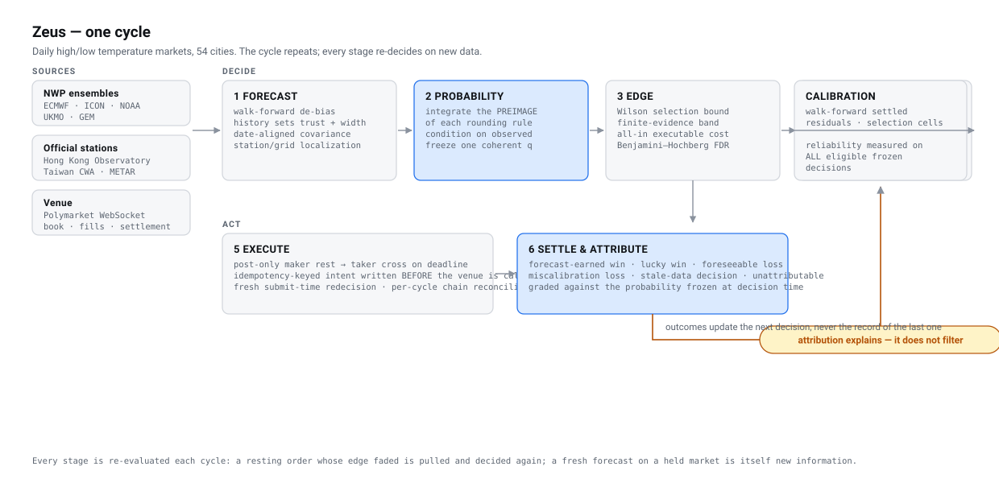

# Zeus

Weather-derivatives trading engine for Polymarket daily-temperature markets, across 54
cities. It ingests weather forecasts, calibrates them into a settlement probability for
every bin of every market, trades the bins it prices differently from the book, manages the
orders through to settlement, and feeds graded outcomes back into calibration.

<picture>
  <source media="(prefers-color-scheme: dark)" srcset="docs/architecture-dark.svg">
  
</picture>

## What this repository establishes — and what it does not

This is a running system, not a backtest: the code in this repository is the code the
engine trades with, live, and every claim above is checkable against the databases it
writes. What the history here establishes is that the full loop — forecast, price,
execute, settle, attribute, recalibrate — runs unattended end to end; that changes to it,
including AI-assisted ones, go through a reviewable, auditable process rather than being
pasted in; and that the calibration discipline (skill-only learning, frozen decision-time
probabilities, selection-aware bounds) is real and enforced in code, not aspirational. It
does not establish durable net alpha — the settled sample is small, and the honest reading
of it is calibration evidence, not a return claim. It also does not establish operation at
institutional scale or as a team practice; this is one person's system, sized accordingly.

---

## Three things worth a minute

If you read nothing else, read these. Each is a decision that changes the answer, not a
detail of the implementation.

**Bins are priced over the preimage of the rounding rule, not the bin's face value.**
A market settles on an integer temperature that an official provider publishes — a sensor
reading encoded in a METAR report and rounded to a whole degree. So the rounding rule is
part of the market. Most cities round half-up; Hong Kong truncates. Pricing bin `X` as
written, rather than as `Φ((X+0.5−μ)/σ) − Φ((X−0.5−μ)/σ)`, is a systematic error that every
participant who skips this step carries on every trade.
[→ Integrate](#forecast-to-probability)

**Multiple-comparisons control is applied across every bin tested, not the survivors.**
A cycle prices every bin of every market in 54 cities. Applying Benjamini–Hochberg only to
candidates that already passed earlier filters would be selecting on the outcome. It runs
across the full set tested that cycle. Above it sits a selection calibrator: each candidate
is keyed by `(side, lead, bin class, probability bucket)` and its admission probability is
replaced by a Wilson lower bound on how often that cell has historically settled in its
favour, over at least 30 settled samples.
[→ Probability to edge](#probability-to-edge)

**Only skill outcomes are allowed to train the model.**
When a market resolves, the position is graded into one of six classes — forecast-earned
win, lucky win, foreseeable loss, miscalibration loss, stale-data decision, unattributable —
and calibration consumes the skill outcomes only. The probability the position was sized on
is frozen at decision time, so the grade compares the decision that was actually made rather
than one reconstructed afterwards. A system that learns from its lucky wins is worse than
one that does not learn at all.
[→ State and learning](#state-and-learning)

---

## Operation

The engine runs a repeating cycle. Each cycle it reconciles its positions against the chain,
refreshes forecasts, observations, and prices, re-evaluates every held position and resting
order against the new data, and scans for new entries. A resting order whose edge has faded
or whose limit the market has moved away from is pulled and decided again; a fresh forecast
cycle on a market already held is itself new information. Held positions are re-evaluated
each cycle and exited when their edge reverses, a profit is takeable, or settlement is near.
The sections below detail one pass of that cycle.

## Markets

A market is a set of yes/no bins over a city's daily high or low (`50–51°F`, `75°F or
higher`, `49°F or below`). One bin resolves YES, on the integer temperature an official
provider publishes for the local date. That integer is a rounded value — a sensor reading
encoded in a METAR report and rounded to a whole degree — so the rounding rule is part of
each market: most cities round half-up (the integer is `floor(x + 0.5)`), Hong Kong
truncates (`floor(x)`). Bins are exact (a value or closed range), open-ceiling, or
open-floor; a city's bins form a complete partition, Fahrenheit bins span two integers and
Celsius one, and a city's high and low markets are separate objects with separate
calibration.

## Data

Forecasts come from ECMWF's global ensemble (the anchor) plus decorrelated regional model
families — ICON (DWD), NOAA, UKMO, and GEM (CMC) — each used where it covers a city, sourced
through ECMWF OpenData and Open-Meteo. For cities that settle on a known station, that
nation's official station forecast is ingested as well (Hong Kong Observatory, Taiwan CWA).
Models refresh two to four times a day on their issue cycles.

Observations come from Weather Underground (daily settlement values), METAR (15-minute), and
the HKO and CWA feeds. Market data — market topology, the order book, and the engine's own
fills — streams from Polymarket over WebSocket. Every record is stamped with when the source
issued it, when Zeus fetched it, and when Zeus wrote it; freshness gates use those stamps to
drop stale forecasts, unsettled observations, and old quotes. Ingestion is split across
separate daemons per feed.

## Forecast to probability

1. **De-bias.** Each model is corrected against its own settled residuals with an
   empirical-Bayes shrinkage, `b̂ = λ·r̄ + (1 − λ)·prior` with `λ = n/(n + 8)`: thin history
   stays near a structural prior, long history trusts the model's own mean. The fit uses only
   residuals that had settled before the forecast date.

2. **Fuse.** The de-biased model values `z` are combined into one posterior mean and variance
   by inverse-variance (precision) weighting against an ECMWF prior `(μ₀, τ₀²)`:
   `V* = (τ₀⁻² + 1ᵀΣ⁻¹1)⁻¹`, `μ* = V*(τ₀⁻²μ₀ + 1ᵀΣ⁻¹z)`. The residual covariance `Σ` is
   shrunk toward its diagonal (Ledoit–Wolf) so noisy cross-correlations do not dominate at
   small sample sizes, and models that are the same forecast at two resolutions are collapsed
   into one provider family so none is counted twice.

3. **Localize.** A grid value is read at the settlement station's exact coordinates by
   interpolation rather than nearest-cell. The altitude difference between grid and station
   is corrected by a lapse rate fitted per city and season; the remaining distance and
   elevation mismatch is added to that source's variance,
   `σ_repr² = a₀ + a_d·d² + a_z·Δz²`.

4. **Spread.** The predictive spread is the fused variance plus the walk-forward residual
   error of the fused centre, floored to the cell's realized settlement error.

5. **Integrate.** The distribution is integrated onto each bin over the preimage of the
   rounding rule, not the bin's face value — under half-up, bin `X` is
   `Φ((X+0.5−μ)/σ) − Φ((X−0.5−μ)/σ)`; under truncation, `Φ((X+1−μ)/σ) − Φ((X−μ)/σ)`. Open
   shoulders integrate as a single tail.

6. **Condition on the day.** Once part of the day's extreme is already observed, the settled
   value is `max(observed, remaining)`; the distribution is conditioned on the running
   extreme, placing remaining mass on the hours still to come.

## Probability to edge

1. **Lower bound.** The bin probability is bootstrapped over the parameter posterior and a
   low quantile is taken; each draw is renormalized to a distribution before the quantile.

2. **Selection calibrator.** Each candidate is keyed by `(side, lead, bin class, probability
   bucket)` and its admission probability is replaced by a Wilson lower bound on how often
   that cell has settled in its favour, over at least 30 settled samples.

3. **Edge.** `edge = q − price − cost`, where cost is the all-in entry cost including the
   Polymarket taker fee `rate·p·(1−p)`.

4. **False-discovery control.** Benjamini–Hochberg is applied across every bin tested in the
   cycle, not only those that passed earlier filters.

## Sizing

Surviving bins are ranked by return per dollar at risk, ties broken on lower-quantile
log-growth. The selected bin is sized by fractional Kelly, `f* = (q − price)/(1 − price)`,
reduced by a multiplicative cascade — strategy multiplier, observation coverage, confidence
width, lead time, portfolio heat, and a two-rail data-density discount (a hard stop below
0.35 coverage past the window mid-point, a continuous discount otherwise). A NaN or missing
input sizes to zero.

## Execution

Orders are limit orders. Entries rest as a maker (good-till-cancel, post-only) and escalate
to a taker cross (fill-or-kill or fill-and-kill) only if the edge holds past a deadline. Each
order carries an idempotency key and its intent is written before the venue is contacted.
Fills are verified against the venue each cycle; an order is entered only on a confirmed
trade fact, and partial fills track their remainder. Exits run a separate state machine, and
an exit's fill-or-kill is coerced to fill-and-kill so a thin book does not reject it whole.
An hourly sweep reconciles local intent against venue and chain facts. Settlement is read
from the market feed; redemption of winning tokens is recorded for accounting.

## Worked example

One market through the loop, with illustrative numbers — Tokyo daily high, the `50–51°F`
bin, two days out (Tokyo rounds half-up):

```
Models (de-biased, °F)   ECMWF 50.4 · global ICON 51.0 · UKMO 50.1 · …
Fuse                     precision-weighted → μ* = 50.3 °F, fused sd 0.9 °F
Localize                 station 8 km / +5 m from the grid cell → +representativeness variance
Spread                   √(V* + resid²) = 1.3 °F, floored to realized settlement error → σ = 1.4 °F
Integrate (half-up)      P(50–51) = Φ((51.5−50.3)/1.4) − Φ((49.5−50.3)/1.4) = 0.804 − 0.284 = 0.52
Lower bound              5th-percentile bootstrap → 0.46
Calibrator               cell settled in favour 57% over 60 samples → Wilson lower bound 0.46
Edge                     market YES at 0.40, cost 0.01 → 0.46 − 0.40 − 0.01 = 0.05  (> 0, passes FDR)
Size                     f* = (0.46 − 0.40)/(1 − 0.40) = 0.10, reduced by the cascade
Order                    rest as maker buying YES at 0.40; escalate to a taker cross if the edge holds
```

The same numbers drive an exit: if a later forecast cycle moves `μ*` away and the
lower-bound probability falls below the price plus cost, the position's edge has reversed
and it is closed.

## State and learning

What the engine believes it holds is a projection over immutable venue facts (orders,
trades, balances) and local intent. Chain reconciliation distinguishes a complete-empty
snapshot from a missing or stale one, and surfaces on-chain inventory with no matching intent
as a reviewable item. State is held in three SQLite databases — world facts, forecasts,
trades — with cross-database writes done in one transaction via `ATTACH` and a savepoint.

When a market resolves, the position is graded into one of six outcomes — forecast-earned
win, lucky win, foreseeable loss, miscalibration loss, stale-data decision, unattributable —
and only the skill outcomes feed calibration. The probability a position was sized on is
frozen at decision time, and calibration consumes only outcomes that have already settled.

## Strategies

| Strategy | Edge source | Fades |
|----------|-------------|:-----:|
| Settlement Capture | the daily extreme is observed once the peak has passed | slowest |
| Center Bin Buy | the model prices the most-likely bin against the market | fast |
| Imminent Open Capture | re-opened or next-day markets within hours of settlement | fast |
| Opening Inertia | first-liquidity anchoring on a freshly opened market | fastest |

Each is tracked on its own settled record. Further strategies (shoulder-bin sell, center-bin
sell, tail-capture) are registered but not live.

## Scope and honest limits

Read this before drawing conclusions from anything above.

**Capital is small and deliberately so.** This runs on a personal account with low
four-figure exposure. The strategy is unproven at any size and the sizing cascade is tuned
for survival rather than growth, so absolute returns are not the thing to look at. What the
sample is large enough to say something about is *calibration* — whether the stated
probabilities match settled frequencies — and that is what the attribution taxonomy exists
to measure.

**Per-strategy attribution is not clean.** The account holds unrelated positions, so
account-level PnL is not a measurement of this system. Chain-truth reconciliation separates
Zeus decisions from foreign inventory, but the separation is a reconstruction, not an
instrument. Any single number quoted from it should be read as indicative.

**Two modules have accreted past the point of easy reasoning.**
`src/engine/event_reactor_adapter.py` and `src/execution/command_recovery.py` are the
largest files in the repository, and neither should be one module. This is the same failure
in structural form that the system's own history keeps producing: the signal layer gets
over-engineered and the position-lifecycle layer accretes around it. Decomposition is in
progress against explicit invariant seams rather than by line count.

**What is not claimed.** That the strategies generalize beyond daily temperature markets;
that the microstructure edges persist as the venue matures; that the forecast fusion beats a
well-tuned single-model baseline by a margin this sample can resolve. Each of those is a
falsifiable claim and none of them has enough settled data behind it yet.

## Reading this repository

Depending on how much time you have:

| Time | Read |
|---|---|
| 2 min | this page, [Three things worth a minute](#three-things-worth-a-minute) |
| 10 min | [`AGENTS.md`](AGENTS.md) — root operating law: what governs a change to this repository |
| 10 min | [`REVIEW.md`](REVIEW.md) — review doctrine: what a change is checked against before it lands |
| 15 min | [`docs/reference/theory_map.md`](docs/reference/theory_map.md) — index of the derivations behind each step above |
| 15 min | [`loop/README.md`](loop/README.md) — the unattended improvement loop that proposes and reviews changes against this system |
| 30 min | [`src/forecast/`](src/forecast) and [`src/calibration/`](src/calibration) — the statistics, end to end |
| 30 min | [`src/execution/exit_lifecycle.py`](src/execution/exit_lifecycle.py) — the exit state machine, which is where the real difficulty lives |
| 45 min | [`architecture/`](architecture) — machine-readable invariants and the AST rules that enforce them in CI |
| — | [`docs/reference/glossary.md`](docs/reference/glossary.md) for terms |

## Engineering

Solo-built. Roughly 590 source modules against 1,400 test modules. Architecture invariants
are expressed as machine-readable manifests and enforced by AST rules and an import-linter
contract in CI, alongside a money-path release gate that blocks changes to order-submitting
code without the corresponding safety tests. Runtime state is SQLite; deployment is a set of
launchd daemons designed for continuous operation.

Three paths worth reading closely, each for a different reason:

- [`src/decision/selection_calibrator.py`](src/decision/selection_calibrator.py) — the
  admission lower bound, backed by a from-scratch, pure-Python regularized incomplete-beta
  function and an empirical-Bayes bound over settled cells, with no SciPy in the hot path.
- [`src/execution/command_bus.py`](src/execution/command_bus.py) — `IdempotencyKey`, a
  frozen value object with a deterministic factory whose collision probability is argued
  from first principles (birthday bound over a 128-bit key), not assumed away.
- [`src/analysis/settlement_skill_attribution.py`](src/analysis/settlement_skill_attribution.py)
  — grades every settled position into one of six skill/luck classes off an immutable,
  decision-time certificate, so a lucky win can never be counted as evidence of skill.

## License

Source-available for reading and review. Not licensed for use, modification, or
redistribution — see [LICENSE](LICENSE). This is published so the work can be examined, not
as an open-source project; [`CONTRIBUTING.md`](CONTRIBUTING.md) explains why it is closed to
contributions.
