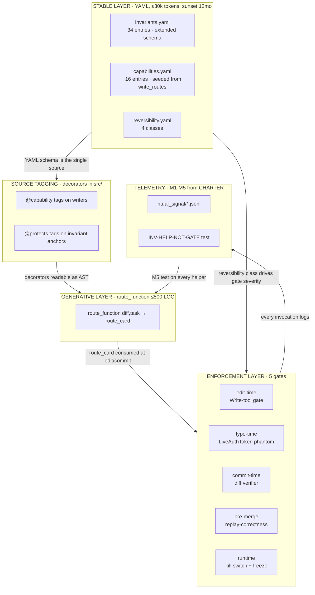
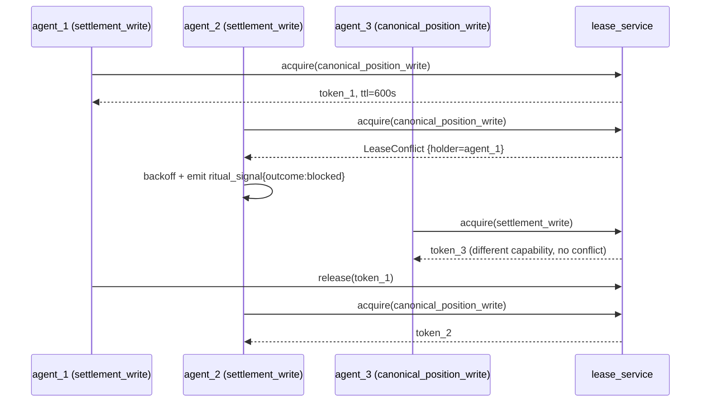

# ULTIMATE_DESIGN

## Sunset: 2027-05-06

Annual operator re-affirmation; otherwise auto-demote to
`docs/operations/historical/`. Charter rules in
`ANTI_DRIFT_CHARTER.md` apply (M3).

## §0 Operator decisions (preface)

Briefing §10 lists 10 decisions required before Phase 0 begins. The
operator scans this section first; nothing in the design proceeds without
all checkboxes signed.

| # | Decision | Default | Signed |
|---|---|---|---|
| 1 | Invariants + capabilities as dual primitive (vs file-path / object-cohort / relationship-only) | accept | ☐ |
| 2 | Structural deletion of profile catalog (`digest_profiles.py` + 60 profiles) | accept | ☐ |
| 3 | Type-discipline migration: `LiveExecutor` / `ShadowExecutor` ABCs + `LiveAuthToken` phantom | accept | ☐ |
| 4 | Topology-infrastructure reduction target (29,290 → ≤1,500 verified-floor; ≥19× actual; ≥26× per briefing-baseline framing) | accept | ☐ |
| 5 | M1-M5 anti-drift mechanisms binding (all or none) | accept | ☐ |
| 6 | 20-hour-replay acceptance test as Phase 0.H GO gate | accept | ☐ |
| 7 | Self-sunset for PLAN documents and the redesigned system | accept | ☐ |
| 8 | Confirm `src/state/chronicler.py` event log is sufficient for replay-correctness gate, or list additional event types needed | confirm or list | ☐ |
| 9 | Approve parallel `zeus-ai-handoff` rescoping work stream (3 days) | accept | ☐ |
| 10 | 90-day total implementation timeline | accept | ☐ |

ADRs (Phase 0.C) collapse the 10 decisions into 6 by topic:
- **ADR-1** primitive choice (#1)
- **ADR-2** profile-catalog deletion (#2, #4)
- **ADR-3** paper/live type discipline (#3)
- **ADR-4** anti-drift binding (#5, #7)
- **ADR-5** acceptance gate + replay event scope (#6, #8)
- **ADR-6** scope and timeline (#9, #10)

## §1 Five-layer architecture



**Data shapes between layers:**

- STABLE → SOURCE: capability `id` + `hard_kernel_paths` is what the
  decorator reads at import time.
- SOURCE → GEN: route function reads decorators via AST + a one-time
  lint; the catalog is *queried*, not authored separately.
- GEN → ENF: route card is a typed dict with six keys (§4).
- STABLE → ENF: each gate consults `reversibility.yaml` to set severity
  (advisory vs blocking).
- ENF → TEL: every gate that fires (advisory or blocking) emits one
  `ritual_signal` line.

## §2 Stable layer schemas

### 2.1 `invariants.yaml` extension (extends, not replaces)

The current schema (verified at `architecture/invariants.yaml`):
`id / zones / statement / why / enforced_by{spec_sections, schema,
scripts, semgrep_rule_ids, tests, docs, negative_constraints}`. The
redesign adds three keys: `capability_tags`, `relationship_tests`,
`sunset_date`.

INV-04 is the canonical illustration (already exists; keys are appended):

```yaml
- id: INV-04
  zones: [K1_governance, K3_extension]
  statement: strategy_key is the sole governance key.
  why: edge_source, discovery_mode, and entry_method are metadata and
       must not compete as governance centers.
  enforced_by:
    spec_sections: [3, P0.2, P3, 18]
    schema:
      - architecture/2026_04_02_architecture_kernel.sql
    tests:
      - tests/test_architecture_contracts.py::test_strategy_key_manifest_is_frozen
  # NEW KEYS (redesign):
  capability_tags: [canonical_position_write, calibration_persistence_write]
  relationship_tests:
    - tests/test_strategy_key_manifest_is_frozen.py
    - tests/test_cross_module_invariants.py::test_strategy_key_governance
  sunset_date: 2027-05-06
```

**Renumbering policy (R9 in RISK_REGISTER):** `INV-11` and `INV-12` IDs
are unused in the current file (verified — IDs jump 10→13). The briefing §8
references `INV-12` for "contract semantic violation"; the actual
settlement-semantics invariants are **INV-02** (Settlement is not exit)
and **INV-14** (canonical settlement row identity: temperature_metric,
physical_quantity, observation_field, data_version). Phase 1 audit
decision: **leave the gaps** (do not compact). Compaction rewrites every
historical reference to INV-13..INV-36 across the codebase, evidence
folders, and packet history; the cost is greater than the cosmetic
benefit. The §8 mapping below uses the actual IDs (INV-02, INV-14), not
the briefing's INV-12.

### 2.2 `capabilities.yaml` (new file)

Seeded from `architecture/source_rationale.yaml::write_routes` (verified
9 existing route owners) plus 7 net-new (live_venue_submit,
on_chain_mutation, authority_doc_rewrite, archive_promotion,
source_validity_flip, calibration_rebuild, settlement_rebuild) → **16
total**.

Two example entries (one seed, one new):

```yaml
schema_version: 1
metadata:
  charter_version: 1.0.0
  catalog_size: 16
capabilities:
  # ─── seeded from source_rationale.yaml::write_routes::settlement_write ─
  - id: settlement_write
    owner_module: src/execution/harvester.py
    rounding_law_module: src/contracts/settlement_semantics.py
    db_gate_module: src/state/db.py
    intent: >
      Write canonical settlement values (DR-33-A live-enabled path).
  relationships:
      protects_invariants: [INV-02, INV-14]
      blocked_when: settlement_window_freeze_active
    hard_kernel_paths:
      - src/execution/harvester.py
      - src/contracts/settlement_semantics.py
      - state/zeus.db
      - state/zeus-world.db
    original_intent:
      intent_test: "diff touches harvester or settlement contract"
      does_not_fit: log_and_advisory
      scope_keywords: [settlement, harvester, oracle, hko, wmo]
      out_of_scope_keywords: [paper, replay, backtest, mock]
    sunset_date: 2027-05-06
    lease_required: true
    telemetry:
      ritual_signal_emitted: true
      latency_budget_ms: 200
    reversibility_class: TRUTH_REWRITE

  # ─── new: live venue submit ─
  - id: live_venue_submit
    owner_module: src/execution/venue_adapter.py
    intent: >
      Submit a real order to a live venue. Single boundary at which
      LiveAuthToken phantom must be present.
    relationships:
      protects_invariants: [INV-21, INV-04]
      blocked_when:
        - kill_switch_active
        - settlement_window_freeze_active
        - risk_level_RED
    hard_kernel_paths:
      - src/execution/venue_adapter.py
      - src/execution/live_executor.py
    original_intent:
      intent_test: "diff touches live executor or venue adapter submit path"
      does_not_fit: refuse_with_advice
      scope_keywords: [live, submit, order, venue]
      out_of_scope_keywords: [shadow, paper, replay, simulate, mock, dry-run]
    sunset_date: 2027-05-06
    lease_required: true
    telemetry:
      ritual_signal_emitted: true
      latency_budget_ms: 50
    reversibility_class: ON_CHAIN
```

### 2.3 `reversibility.yaml` (new file)

```yaml
schema_version: 1
classes:
  - id: ON_CHAIN
    severity: 4
    description: External venue / chain confirmation; no rollback path.
    anchor_capability: live_venue_submit
    enforcement_default: blocking
    sunset_date: 2027-05-06
  - id: TRUTH_REWRITE
    severity: 3
    description: Canonical DB / event log mutation; rollback requires replay rebuild.
    anchor_capability: settlement_write
    enforcement_default: blocking
    sunset_date: 2027-05-06
  - id: ARCHIVE
    severity: 2
    description: Provenance and historical record; rollback by git revert only.
    anchor_capability: authority_doc_rewrite
    enforcement_default: advisory_with_evidence_required
    sunset_date: 2027-05-06
  - id: WORKING
    severity: 1
    description: Local working surface; reversible by ordinary means.
    anchor_capability: script_repair_write
    enforcement_default: advisory
    sunset_date: 2027-05-06
```

## §3 Source tagging convention

Two decorators, both in `src/architecture/decorators.py` (new module):

```python
def capability(cap_id: str, *, lease: bool | None = None):
    """Mark a function as the writer for a capability. CI lint asserts
    every function whose path is in capabilities.yaml :: hard_kernel_paths
    carries this decorator. The decorator records into a module-level
    registry consumed by the route function and the diff verifier.
    Architect §3.1 #1 (capability primitive); researcher §3.2 #1 (phantom).
    """
def protects(*invariant_ids: str):
    """Mark a function as the runtime anchor of one or more invariants.
    The lint asserts every invariant whose `enforced_by.tests` cite a
    function has a corresponding @protects on that function.
    Architect §3.1 #4, #9.
    """
```

Two real Zeus examples (drawn from current code paths):

```python
# src/execution/harvester.py
@capability("settlement_write", lease=True)
@protects("INV-02", "INV-14")
def write_canonical_settlement(...):
    ...

# src/state/ledger.py
@capability("canonical_position_write", lease=True)
@protects("INV-04", "INV-08")
def append_position_event(...):
    ...
```

CI lint (`tests/test_capability_decorator_coverage.py`): for every path in
`capabilities.yaml :: hard_kernel_paths`, AST-walk the file; assert
exactly one top-level function or class method carries `@capability`
matching the cap_id.

## §4 Generative layer — the route function

Single module: `src/architecture/route_function.py`, ≤200 lines of Python,
≤500 lines including doc. Replaces the entire `digest_profiles.py` (6,001
lines) and the relevant portions of `topology_doctor*.py` (~12,290 lines).

```python
# src/architecture/route_function.py  (pseudo-code, ≤200 lines)
from __future__ import annotations
from dataclasses import dataclass
import yaml, ast, pathlib

@dataclass(frozen=True)
class RouteCard:
    capabilities:        list[str]
    invariants:          list[str]
    relationship_tests:  list[str]
    hard_kernel_hits:    list[str]
    reversibility:       str           # max severity class hit
    leases:              list[str]

def route(diff_paths: list[str], task_text: str = "") -> RouteCard:
    inv = yaml.safe_load(open("architecture/invariants.yaml"))
    cap = yaml.safe_load(open("architecture/capabilities.yaml"))
    rev = yaml.safe_load(open("architecture/reversibility.yaml"))

    hits = []
    for c in cap["capabilities"]:
        if any(p in c["hard_kernel_paths"] for p in diff_paths):
            hits.append(c)
                 elif any(_path_matches(d, c["hard_kernel_paths"])
                 for d in diff_paths):
            hits.append(c)

    invs = sorted({iid for c in hits
                   for iid in c["relationships"]["protects_invariants"]})
    tests = sorted({t for c in hits for t in _tests_for(c, inv)})
    leases = sorted({c["id"] for c in hits if c.get("lease_required")})
    severity = max((_class_severity(c["reversibility_class"], rev)
                    for c in hits), default=("WORKING", 1))[0]

    return RouteCard(
        capabilities=[c["id"] for c in hits],
        invariants=invs,
        relationship_tests=tests,
        hard_kernel_hits=[c["owner_module"] for c in hits],
        reversibility=severity,
        leases=leases,
    )

def render(card: RouteCard, tier: int = 0) -> str:
    """Tiered render: T0 ≤500 tok, T1 ≤1000, T2 ≤2000, T3 ≤4000."""
    ...
```

**Token budget tests** (failing build if violated; briefing §6 hard
constraint):

```python
# tests/test_route_card_token_budget.py
import tiktoken
enc = tiktoken.encoding_for_model("cl100k_base")

def _len(s): return len(enc.encode(s))

def test_route_card_t0_under_500_tokens():
    card = route(["src/execution/harvester.py"])
    assert _len(render(card, tier=0)) <= 500

def test_route_card_t1_under_1000_tokens():
    assert _len(render(route(["src/execution/harvester.py",
                              "src/state/ledger.py"]), tier=1)) <= 1000

def test_route_card_t2_under_2000_tokens():
    ...  # 4-path diff
def test_route_card_t3_under_4000_tokens():
    ...  # full live boundary touch
```

Deletion record (referenced by §9 inventory):

- `architecture/digest_profiles.py` — entire file, 6,001 LOC
- `architecture/topology.yaml :: digest_profiles:` block — 35 fossil
  profiles within (the briefing §3.3 high-value first cut)
- `scripts/topology_doctor_digest.py` — superseded entry point
- `scripts/topology_doctor_packet_prefill.py` — superseded
- (full deletion list in §9)

## §5 Enforcement layer

| # | Gate | Mechanism | Failure prevented | External pattern | Block / advisory |
|---|---|---|---|---|---|
| 1 | **Edit time** | Write-tool capability check: hook reads route card; if path is in `hard_kernel_paths` for a capability not in current task scope, the Write tool refuses (or surfaces a phantom-typed warning) | Agent self-attests "read-only" then edits a guarded path mid-task (architect §3.1 #2, #7) | Researcher §3.2 #1 phantom-type capability; §3.2 #6 capability-autonomy inverse | **blocking** for ON_CHAIN + TRUTH_REWRITE; **advisory** for WORKING |
| 2 | **Type time** | `LiveAuthToken` phantom + `LiveExecutor` / `ShadowExecutor` ABCs; `submit()` requires LiveAuthToken parameter; ShadowExecutor cannot construct one | "Wrong order to wrong market at wrong time" (briefing §8 #1) — paper/live confusion at submit boundary | Researcher §3.2 #4 QuantConnect/Lean | **blocking** (mypy / pyright fails) |
| 3 | **Commit time** | Diff verifier reads decorators from changed files; emits route card; rejects commit if a capability is touched whose `original_intent.does_not_fit` matches the task | Mid-task drift after orient-time route card was approved (architect §3.1 #2) | Researcher §3.2 #7 AgentSpec runtime DSL | **blocking** for ON_CHAIN + TRUTH_REWRITE |
| 4 | **Pre-merge** | Replay-correctness gate: re-run the deterministic Chronicler (`src/state/chronicler.py`) projection over a fixed seed window; compare to baseline snapshot; mismatch blocks merge | Calibration / settlement / projection regression silently introduced (briefing §8 #5; architect §3.1 #12) | Researcher §3.2 #3 MiFID II / Dodd-Frank event-sourced replay | **blocking** |
| 5 | **Runtime** | Kill switch + settlement-window freeze, both promoted to topology-layer non-bypassable gates (currently in evaluator code; architect §3.1 #11) | Continued live emissions during a market halt or settlement window | Researcher §3.2 #2 FIA pre-trade risk + CFTC 2024 mandatory kill switch | **blocking** (process-level halt) |

Each gate logs `ritual_signal` per CHARTER §3 (M1).

## §6 Telemetry + anti-drift wiring

Each mechanism cited authoritatively by `ANTI_DRIFT_CHARTER.md §3-§7`.
Concrete artifacts in this redesign:

| Mechanism | Concrete artifact | Owner |
|---|---|---|
| **M1 telemetry-as-output** | `logs/ritual_signal/<YYYY-MM>.jsonl` (schema in CHARTER §3); written by every gate from §5 + by the route function on every render | route_function + each gate |
| **M2 opt-in-by-default** | `mandatory: false` is the default in the helper frontmatter validator (`tests/test_charter_mandatory_evidence.py`) | charter validator |
| **M3 sunset clock** | `sunset_date` field required by schema; `tests/test_charter_sunset_required.py` | schema validator |
| **M4 original-intent** | `original_intent.intent_test` evaluated at gate fire time; `does_not_fit: refuse_with_advice` returns 0 | route_function |
| **M5 INV-HELP-NOT-GATE** | `tests/test_help_not_gate.py` (full pseudo-code in CHARTER §7); ships in Phase 5 | implementer + critic |

## §7 Multi-agent lease service

```yaml
lease_service_schema:
  endpoint: src/architecture/lease_service.py     # in-process, sqlite-backed
  storage: state/leases.sqlite
  api:
    acquire(capability_id, agent_id, ttl_s) -> token | LeaseConflict
    release(token) -> None
    extend(token, additional_s) -> None
    list_active() -> [{capability_id, agent_id, expires_at}]
  contention_policy:
    timeout_eviction_s: 600                       # 10 min default
    operator_priority_list: state/lease_priority.yaml
                                                  # operator-pinned ordering
                                                  # for hot capability collisions
  failure_modes:
    deadlock_detection: timeout_eviction (no graph cycles allowed)
    crash_release: TTL expires + CI cron sweep
  sunset_date: 2027-05-06
```



Each lease acquire/release/conflict emits a `ritual_signal` line so M1
telemetry observes contention.

## §8 Quant-system failure category coverage

| # | Failure category (briefing §8) | Structural answer | Capability ID(s) | Invariant ID(s) | Enforcement gate |
|---|---|---|---|---|---|
| 1 | Wrong order to wrong market at wrong time | LiveAuthToken phantom at submit boundary; Write-tool gate; runtime kill switch; settlement-window freeze | live_venue_submit | INV-21 | §5 gate 1, 2, 5 |
| 2 | Wrong data feeding probability chain | source_validity_flip is its own capability HARD; calibration_rebuild protects family-separation; replay-correctness gate | source_validity_flip, calibration_rebuild | INV-04, INV-06 | §5 gate 3, 4 |
| 3 | Contract semantic violation (settlement, bin) — **briefing referenced INV-12; actual IDs are INV-02, INV-14** | settlement_write capability HARD; replay-correctness gate; row identity enforced by canonical schema | settlement_write, settlement_rebuild | INV-02, INV-14 | §5 gate 1, 4 |
| 4 | State / DB corruption | canonical_position_write HARD; reversibility class TRUTH_REWRITE; chronicler replay verifies determinism | canonical_position_write | INV-03, INV-08 | §5 gate 1, 4 |
| 5 | Calibration / math regression | Replay-correctness gate as merge gate; relationship tests on Platt monotonicity | calibration_persistence_write, calibration_rebuild | INV-15, INV-21 | §5 gate 4 |
| 6 | On-chain irreversibility / ghost positions | Reversibility class ON_CHAIN; live_venue_submit + on_chain_mutation HARD; chain reconciliation void-on-divergence | live_venue_submit, on_chain_mutation | INV-21 | §5 gate 1, 2 |
| 7 | Risk-level / fail-closed bypass | INV-05 (risk-must-change-behavior); kill switch reads risk level; capability `blocked_when: risk_level_RED` | live_venue_submit, settlement_write | INV-05, INV-21 | §5 gate 5 |
| 8 | Authority confusion / archive-as-truth | authority_doc_rewrite + archive_promotion as separate HARD capabilities; reversibility class ARCHIVE | authority_doc_rewrite, archive_promotion | INV-10 | §5 gate 1, 3 |
| 9 | Multi-agent contention on shared state | `lease_required: true` on capabilities; lease service in route card; harness coordination | (all `lease_required`) | n/a | §7 lease service |
| 10 | Drift of the safety system itself | M1-M5 mechanisms; INV-HELP-NOT-GATE; sunset on every capability and invariant | n/a | INV-HELP-NOT-GATE | CHARTER §3-§7 |

## §9 Removed / preserved / new file inventory

### 9.1 Removed (Phase 0.D, Phase 3)

| File | LOC | Phase |
|---|---|---|
| `architecture/digest_profiles.py` | 6,001 | Phase 3 |
| `architecture/topology.yaml :: digest_profiles:` block | ~3,500 (within 6,891) | Phase 0.D + Phase 3 |
| 35 fossil profiles within `topology.yaml :: digest_profiles` (`r3-*`, `phase-N-*`, `batch h *`) | included above | Phase 0.D |
| `scripts/topology_doctor_digest.py` | (in 12,290) | Phase 3 |
| `scripts/topology_doctor_packet_prefill.py` | (in 12,290) | Phase 3 |
| `scripts/topology_doctor_context_pack.py` | (in 12,290) | Phase 3 |
| `scripts/topology_doctor_core_map.py` (subsumed by route function) | (in 12,290) | Phase 3 |
| ~263 prose `forbidden_files` entries (39% of 674; advisory pretending to be hard) | n/a | Phase 0.D |
| `architecture/topology_schema.yaml` (537 LOC, R12) | 537 | Phase 3 (subsumed; schema migrates to capabilities.yaml + reversibility.yaml) |
| `architecture/inv_prototype.py` (348 LOC, R12) | 348 | Phase 1 (subsumed by extended invariants.yaml + decorators) |

**Subtotal removed:** ≥27,500 LOC across files + ~3,500 LOC of YAML inside
preserved files.

### 9.2 Preserved (extended, not replaced)

| File | LOC | Treatment |
|---|---|---|
| `architecture/invariants.yaml` | 468 → ~600 | extended schema (3 new keys per entry) |
| `architecture/source_rationale.yaml :: write_routes` | 1,957 → reduced as capability data migrates | seed for capabilities.yaml; remainder retained for non-write rationale |
| `architecture/test_topology.yaml` | 1,276 | Phase 1 audit decides whether to subsume |
| `architecture/task_boot_profiles.yaml` | 407 | Phase 1 audit (likely subsume into capabilities) |
| `tests/test_*invariant*.py` (11 files) | n/a | Phase 1 grows to 16+ to match capability count |
| `src/state/chronicler.py` | (existing) | replay-correctness gate consumes its event log |
| `scripts/replay_parity.py` | (existing) | becomes the merge gate runner |

### 9.3 New

| File | Estimated LOC |
|---|---|
| `architecture/capabilities.yaml` | ~400 (16 entries × ~25 lines) |
| `architecture/reversibility.yaml` | ~80 |
| `src/architecture/decorators.py` | ~120 |
| `src/architecture/route_function.py` | ≤200 (≤500 including doc) |
| `src/architecture/lease_service.py` | ~250 |
| `tests/test_help_not_gate.py` | ~150 |
| `tests/test_route_card_token_budget.py` | ~80 |
| `tests/test_capability_decorator_coverage.py` | ~60 |
| `tests/test_charter_sunset_required.py` | ~50 |
| `tests/test_charter_mandatory_evidence.py` | ~50 |

**Subtotal new:** ~1,440 LOC.

### 9.4 Net reduction

| Baseline framing | Removed | New | Net |
|---|---|---|---|
| Verified-floor (this exploration) | 29,290 | 1,440 | **27,850 LOC removed (≥19× reduction)** |
| Briefing §2 framing (39,800) | (cite as comparison) | 1,440 | **38,360 LOC removed (≥26× reduction)** |

Both numbers are stated transparently. The verified floor (29,290) is the
sum of named files in this exploration; the briefing's 39,800 includes
adjacent files (`tests/test_topology_*.py`, helper-related scripts) that
were not directly enumerated. **Briefing §6 net-add ≤ net-delete is
satisfied: 1,440 ≪ 27,850.**

## §10 Future-proofness

Three scenarios at increasing horizon. The design's primitives are
physical / economic (briefing §12) — they do not change shape in 1 year.

| Scenario | What changes | What does NOT change |
|---|---|---|
| **1-month: new venue (e.g., second prediction market)** | Append one capability entry: `live_venue_submit_<venue>`; one new ABC subclass `<Venue>LiveExecutor` | invariants.yaml; route_function code; reversibility classes; M1-M5 wiring; decorator catalog |
| **6-month: new settlement source** | Append one capability entry (`settlement_write_<source>`); update `INV-14` schema citation if the source has a different field naming | route_function code; reversibility classes; lease service; gates 1-5 mechanism |
| **1-year: new product class** | Append capability entries; potentially one new invariant (with full enforced_by + capability_tags + sunset_date) | route_function code; reversibility classes; lease service; M1-M5 wiring |

**Anti-pattern check:** the design accepts only *appends* in
`capabilities.yaml`, not new dimensions in `route_function.py`. If a future
need cannot be expressed as a capability append, the design itself is
re-evaluated (charter sunset triggers operator review).

## §11 Honest tradeoffs (what the design gives up)

1. **Capability tag rollout will be incomplete on day 1.** Phase 2
   ships ~80% coverage on guarded writers; the remainder are caught by
   §5 gate 3 (commit-time diff verifier) when first touched. R1 in
   RISK_REGISTER tracks.
2. **Replay-correctness gate adds ~30s to PR CI.** The cost buys
   silent-regression detection that the current system does not have. CI
   throughput drops measurably.
3. **Phantom-type adds friction on legitimate executor refactors.**
   Renaming `LiveExecutor` requires touching `LiveAuthToken` and the
   submit boundary together — by design — but this is friction the team
   feels.
4. **Token-budget tests can fail noisily during a multi-capability
   touch.** A diff that legitimately touches 5 capabilities will exceed
   T0; tier promotion is a real workflow step (T0 → T1 → T2 → T3) that
   the current system does not require.
5. **Lease service is new operational surface to monitor.** State at
   `state/leases.sqlite` becomes a liveness dependency; a wedged lease
   service blocks all multi-agent capability work. Mitigation: TTL
   eviction + CI cron sweep; R5 in RISK_REGISTER.
6. **The 26× / 19× reduction is asymmetric per metric.** LOC drops by
   ≥19×; bootstrap tokens drop by ≥7× (220k → ≤30k); profile count drops
   60 → 0. The headline ratio is LOC; tokens and profiles are lower
   leverage but more visible to the agent population.
7. **Renumbering INV-11/INV-12 was rejected (R9).** The gaps remain
   visible in the YAML; this is honest history at the cost of cosmetic
   irregularity.
