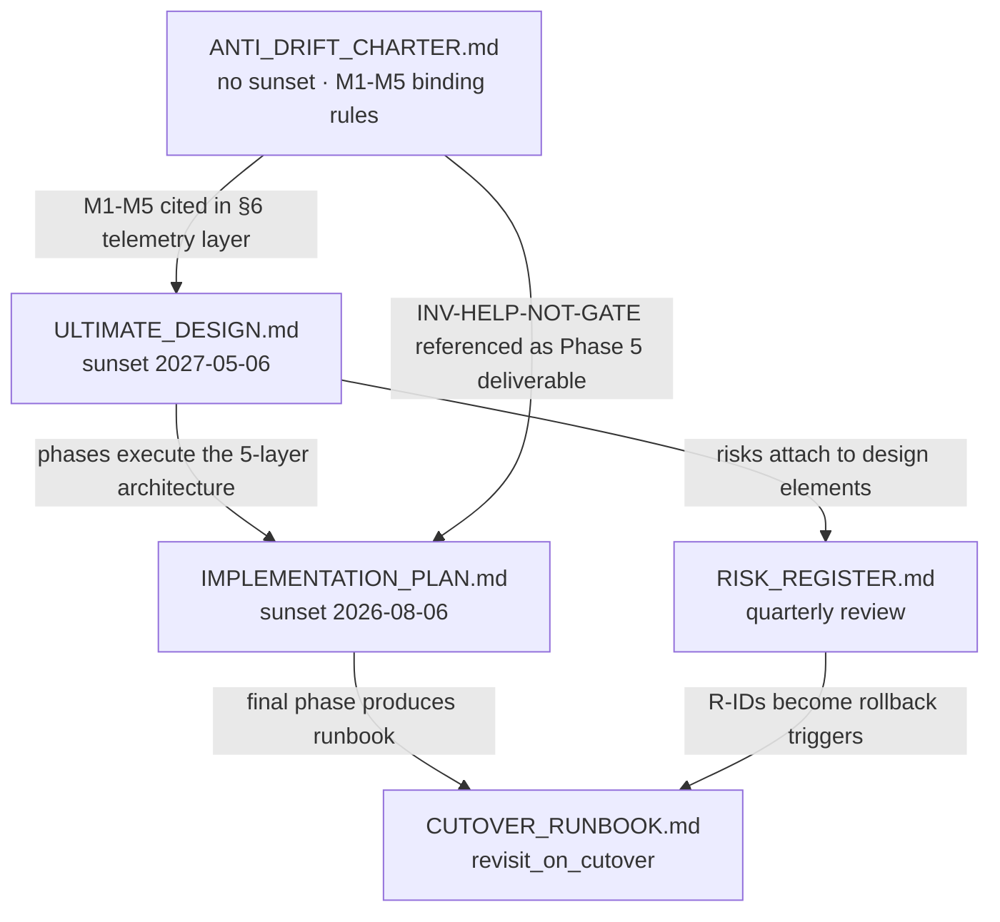

# Plan — Zeus topology redesign deliverable (5-file blueprint + 90-day runway)

## Context

The briefing prompt asks for a single integrated final design plus a 90-day
implementation runway, expressed as **five markdown files** in
`docs/operations/task_2026-05-06_topology_redesign/`. The prompt itself
contains the synthesized substrate from four prior in-session rounds
(architect, researcher, scientist, integrator). No prior plan files exist on
disk — the cloud session is the first time this material becomes a durable
artifact. Everything below is the operational specification for producing
the five files. No code changes; no edits outside the deliverable directory.

## Verified baseline (corrections to briefing §2)

Read directly from the repo:

| Item | Briefing claim | Verified | Note |
|---|---|---|---|
| `scripts/topology_doctor*.py` LOC | 12,290 | 12,290 | exact |
| `architecture/topology.yaml` LOC | 6,891 | 6,891 | exact |
| `architecture/digest_profiles.py` LOC | 6,001 | 6,001 | exact |
| `architecture/source_rationale.yaml` LOC | 1,957 | 1,957 | exact |
| `architecture/test_topology.yaml` LOC | 1,276 | 1,276 | exact |
| `architecture/task_boot_profiles.yaml` LOC | 407 | 407 | exact |
| `architecture/invariants.yaml` entries | 44 INV-XX | **34** | **gap; INV-11, INV-12 IDs unused** |
| `digest_profiles.py` profiles | 61 | **60** | minor |
| `[skip-invariant]` commits, last 60d | ~50 | **159** | **stronger evidence** |
| `architecture/topology_schema.yaml` | not cited | 537 LOC | existing schema artifact |
| `architecture/inv_prototype.py` | not cited | 348 LOC | existing invariant prototype |
| Sum of named topology infra | 39,800 | 29,290 | §2 figure includes adjacent files; design uses 29.3k as floor |
| Target directory exists? | implied | **no** | must be created |
| Prior PLAN/AMENDMENT/PREP/BEST_DESIGN files | implied | **no** | content lives only in briefing §3-§4 |

Two consequences for the deliverable:

1. **INV-12 is referenced in briefing §8** ("contract semantic violation
   protected by INV-12") but the file has no INV-12. ULTIMATE_DESIGN.md must
   either cite the actual settlement-semantics invariant ID (likely **INV-14**
   or a renumbering) or explicitly enumerate the renumbering plan in §9
   (what is removed / preserved / new). No silent inheritance of broken IDs.
2. The 26× reduction target (39,800 → ≤1,500) was framed against the
   inflated baseline. Restated against the verified 29,290 floor it becomes
   **≥19× reduction**. ULTIMATE_DESIGN.md §9 must restate both numbers
   transparently — the goal is the bounded primitive, not a marketing ratio.

## Reusable existing structure (cite these instead of inventing new shapes)

- **`architecture/invariants.yaml` schema**: `id / zones / statement / why /
  enforced_by{spec_sections, schema, scripts, semgrep_rule_ids, tests, docs,
  negative_constraints}`. The redesign **extends** this with three keys
  (`capability_tags`, `relationship_tests`, `sunset`); it does not replace
  the file. Cite this when describing the §2 stable-layer schema in
  ULTIMATE_DESIGN.md.
- **`architecture/source_rationale.yaml::write_routes`** already encodes 9
  capability owners (`canonical_position_write`, `control_write`,
  `settlement_write`, `backtest_diagnostic_write`,
  `calibration_persistence_write`, `calibration_decision_group_write`,
  `decision_artifact_write`, `venue_command_write`, `script_repair_write`).
  Use these as the **seed catalog** for `capabilities.yaml` rather than
  starting from a clean sheet. The "12-15 capabilities" target in
  briefing §3.1#1 maps to: existing 9 + (live_venue_submit, on_chain_mutation,
  authority_doc_rewrite, archive_promotion, source_validity_flip,
  calibration_rebuild, settlement_rebuild) = ~16. The ULTIMATE_DESIGN §2
  YAML example must show two seed entries pulled directly from
  `write_routes` so readers see the lineage.
- **`architecture/topology_schema.yaml`** (537 LOC) — existing schema doc.
  ULTIMATE_DESIGN §9 must declare it either subsumed (deleted) or retained
  (with explicit capability mapping). No silent overlap.
- **`architecture/inv_prototype.py`** (348 LOC) — existing invariant
  prototype. Same disposition rule.
- **`docs/methodology/adversarial_debate_for_project_evaluation.md`** is
  referenced by zeus-ai-handoff and remains the methodology home; the
  redesign does not move it.

## Deliverable directory

```
docs/operations/task_2026-05-06_topology_redesign/
├── ULTIMATE_DESIGN.md          (~5,500 words, §1–§11)
├── IMPLEMENTATION_PLAN.md      (~5,500 words, Phase 0.A-H + Phase 1-5)
├── RISK_REGISTER.md            (~2,500 words, R1-R8 + new)
├── ANTI_DRIFT_CHARTER.md       (~3,000 words, M1-M5 binding)
└── CUTOVER_RUNBOOK.md          (~2,500 words, gates + sequence + rollback)
```

Each file ≤6,000 words (briefing §11 hard rule). Use tables and YAML blocks,
not prose. Every file carries a `Sunset:` line in its first H2.

## File dependency shape (authoring order = topological order)



Author CHARTER first because every other file cites M1-M5. Author DESIGN
second because PLAN, RISK, and RUNBOOK all reference its phase-layer
mapping. PLAN before RISK (risks attach to phase steps). RUNBOOK last (it
sits on top of PLAN's Phase 5 + RISK's R-IDs).

## File-by-file spec

### 1. `ANTI_DRIFT_CHARTER.md` (author first)

**Sunset:** none — this is the meta-rule (briefing §7).

Required sections:

1. **Help-Inflation Ratchet — named mechanism.** Six-stage progression
   (opt-in helper → near-miss → new gate → mandatory → ritual → 禁书).
   Cite the two empirical drifts: topology (60 profiles, 159 [skip-invariant]
   bypasses/60d) and zeus-ai-handoff (anti-ritual warning at SKILL.md line 71
   — verified present — drifted anyway).
2. **M1 telemetry-as-output** — every helper invocation emits structured
   `ritual_signal` JSON line; >20% over 30d auto-flags for deprecation
   review. Include exact emit schema (`{helper, task_id, fit_score,
   advisory_or_blocking, outcome}`).
3. **M2 opt-in-by-default, escalation-by-evidence** — helpers default to
   advisory; `mandatory: true` requires (a) operator signature, (b) cite of
   recent miss within 30d, (c) sunset_date.
4. **M3 sunset clock per rule** — every artifact (capability, invariant,
   profile if any survive, doc, ADR) carries `sunset_date`. Default 90 days
   for operational rules; 12 months for stable primitives. Auto-demote to
   `historical/` without re-justification.
5. **M4 original-intent contract per helper** — frontmatter
   `original_intent: { intent_test: <one-line predicate>, does_not_fit:
   <action> }`. Helper refuses to run when `does_not_fit` matches.
6. **M5 INV-HELP-NOT-GATE** — full pseudo-code for the relationship test
   (`tests/test_help_not_gate.py`). Test asserts: no helper writes to
   `forbidden_files` of an unrelated capability; no helper raises a non-zero
   exit on a task whose `intent_test` did not fit; telemetry log exists for
   every invocation.
7. **Telemetry review cadence** — monthly critic-agent review of
   ritual_signal logs; quarterly operator review.
8. **Mandatory mid-implementation drift checks** at Phase 3 (post
   route-function ship) and Phase 5 (pre-cutover); both are PLAN exit gates.
9. **Operator override protocol** — single emergency clause; requires
   signed evidence file + auto-expiry ≤14 days.
10. **Sunset schedule for redesign artifacts** — table mirroring briefing §7
    so this is the single source.

Word budget: ≤3,000. Heavy use of YAML blocks for telemetry schema and
intent-contract examples.

### 2. `ULTIMATE_DESIGN.md` (author second)

**Sunset:** 2027-05-06.

Operator-decisions preface (briefing §10) — list all 10 decisions with
checkboxes; this section is what the operator scans first.

Required sections (matching briefing §5.1 exactly):

- **§1 Five-layer architecture diagram.** Mermaid. Top→bottom:
  STABLE (invariants/capabilities/reversibility YAML) → SOURCE TAGGING
  (`@capability`/`@protects` decorators in `src/`) → GENERATIVE (route
  function ≤500 LOC) → ENFORCEMENT (5 gates: edit/type/commit/pre-merge/
  runtime) → TELEMETRY (M1-M5 wired). Show what data flows between each
  pair of layers.
- **§2 Stable layer schemas.** Three full YAML examples:
  - `invariants.yaml` extension — show INV-04 (existing,
    strategy_key) **with** new keys `capability_tags: [canonical_position_write]`,
    `relationship_tests: [tests/test_strategy_key_manifest_is_frozen.py]`,
    `sunset_date: 2027-05-06`. Cite renumbering policy for the INV-11/12
    gaps (briefing §8 referenced INV-12 — design must pick: leave gaps
    or compact to INV-01..INV-32).
  - `capabilities.yaml` — full example with two entries (one read directly
    from `source_rationale.yaml::write_routes::settlement_write`, one new
    like `live_venue_submit`). Required keys: `id, owner_module, intent,
    relationships, hard_kernel_paths, original_intent{intent_test,
    does_not_fit}, sunset_date, lease_required, telemetry`.
  - `reversibility.yaml` — 4 classes (ON_CHAIN, TRUTH_REWRITE, ARCHIVE,
    WORKING) with one capability assigned to each as anchor.
- **§3 Source tagging convention.** Decorator definitions in Python:
  `@capability("live_venue_submit")` (writer-side), `@protects("INV-21")`
  (reader-side or invariant-anchor). Semantics: tag is metadata; CI lint
  asserts every function in `forbidden_files`-listed paths carries a
  `@capability` tag. Show 2 example real Zeus functions tagged (pulled
  from `src/state/ledger.py`, `src/execution/harvester.py`).
- **§4 Generative layer.** Route-function pseudo-code, ≤200 lines Python.
  Inputs: diff (path list + line diffs), task description. Output: route
  card with the six sections from briefing §5.1 (capabilities, invariants,
  relationship_tests, hard_kernel_hits, reversibility, leases). Token-budget
  tests as named pytest cases (`test_route_card_t0_under_500_tokens`,
  through T3). Explicitly list deletion: `digest_profiles.py` and the 60
  profile entries are removed; profile ID becomes `<unused>` in any code
  reference.
- **§5 Enforcement layer.** Table with one row per gate, columns:
  *gate / mechanism / failure prevented / external pattern / blocking-vs-
  advisory*. Five rows:
  1. **Edit time** — Write-tool capability gate (architect §3.1#7;
     researcher §3.2#1 phantom-type)
  2. **Type time** — `LiveAuthToken` phantom + `LiveExecutor`/`ShadowExecutor`
     ABCs (researcher §3.2#4 QuantConnect)
  3. **Commit time** — diff verifier reads decorators, blocks if a
     non-listed capability is touched (architect §3.1#2)
  4. **Pre-merge** — replay-correctness gate via Chronicler (researcher
     §3.2#3 MiFID; architect §3.1#12)
  5. **Runtime** — kill switch + settlement-window freeze, both
     non-bypassable (researcher §3.2#2 FIA/CFTC)
- **§6 Telemetry + anti-drift wiring.** Each of M1-M5 with a concrete
  artifact (file path + schema). Cross-reference CHARTER as authoritative.
- **§7 Multi-agent lease service.** Full spec: lease keys = capability IDs;
  acquire/release; deadlock detection (timeout-based eviction); contention
  policy (operator-pinned priority list). One sequence diagram showing
  3 agents contending for `canonical_position_write`.
- **§8 Quant-system failure category coverage.** Table mapping the 10
  briefing §8 categories to: structural answer / capability ID / invariant
  ID / enforcement gate. **Reconcile the INV-12 reference** (use actual
  ID for settlement semantics — verified via grep of `architecture/` for
  `SettlementSemantics`).
- **§9 Removed / preserved / new file inventory.** Three columns. Removed:
  digest_profiles.py, the 35 fossil profiles in topology.yaml's
  `digest_profiles` section, ~263 prose `forbidden_files` entries.
  Preserved: invariants.yaml (extended), source_rationale.yaml::write_routes
  (extended into capabilities.yaml), tests directory.
  New: capabilities.yaml, reversibility.yaml, route function module,
  decorator module, lease service module, INV-HELP-NOT-GATE test.
  Numeric totals at the bottom: 29,290 → ≤1,500 actual; 39,800 → ≤1,500
  per briefing framing — both stated transparently.
- **§10 Future-proofness.** Three scenarios (1m: new venue; 6m: new
  settlement source; 1y: new product class). Each: what changes (append a
  capability YAML entry); what does NOT change (invariant set, route
  function, enforcement gates).
- **§11 Honest tradeoffs.** Named, not hidden:
  - Capability tag rollout will be incomplete on day 1 (R1).
  - Replay-correctness gate adds ~30s to PR CI.
  - Phantom-type adds friction on legitimate executor refactors.
  - Token-budget tests can fail noisily during a multi-capability touch.
  - Lease service is new operational surface to monitor.

Word budget: ≤5,500.

### 3. `IMPLEMENTATION_PLAN.md` (author third)

**Sunset:** 2026-08-06 (auto-demote if Phase 0 not started by then).

Format: one section per phase. Within a phase, sub-section per sub-phase.
Each phase row table: `day_range / owner / deliverables / dependencies /
exit_criteria / rollback`.

Phase 0 (15 days) — verbatim from briefing §3.2 amendments, A through H:

| Sub | Days | Key deliverable |
|---|---|---|
| 0.A | 1-3 | Baseline measurement: token cost log, false-block rate audit |
| 0.B | 1-5 | Capability catalog (~16 entries) authored, each tied to existing `write_routes` or new |
| 0.C | 1-7 | 6 ADRs operator-signed (briefing §10 maps to 10 decisions; collapse to 6 by topic) |
| 0.D | 3-7 | Fossil profile retirement (35 profiles deleted from topology.yaml + digest_profiles regenerated) |
| 0.E | 5-10 | Capability tagging spike: one capability (`settlement_write`) end-to-end |
| 0.F | 7-15 | Shadow router build, ≥7d side-by-side agreement window |
| 0.G | 7-15 | Replay-correctness gate scaffold against Chronicler |
| 0.H | 15 | Operator GO/NO-GO against briefing §9 acceptance table |

Phase 1 — Stable layer authoring (days 16-25, 10d).
Phase 2 — Source decorator rollout (days 26-40, 15d).
Phase 3 — Generative route function + delete digest_profiles (days 41-50, 10d).
**Phase 3 mid-drift check** (M-rule, CHARTER §8).
Phase 4 — Enforcement layer (days 51-70, 20d): Write-tool gate,
LiveAuthToken phantom, diff verifier, replay-correctness merge gate,
kill switch lift to topology layer.
Phase 5 — Telemetry + INV-HELP-NOT-GATE + cutover + 20-hour replay re-run
(days 71-90, 20d).
**Phase 5 mid-drift check** before cutover.

Each phase row must include numeric exit criteria — pulled from briefing
§9 acceptance table — so the plan is auditable at any phase boundary.

Word budget: ≤5,500.

### 4. `RISK_REGISTER.md` (author fourth)

**Sunset:** quarterly review (next: 2026-08-06).

Required risks: R1-R8 from briefing §5.3 with full schema.

Add at minimum these additional risks discovered during planning:

- **R9** INV-11/INV-12 ID gaps cause ambiguous routing — invariant
  references in legacy code/docs may resolve to nothing. Mitigation:
  Phase 1 audit + decision in ULTIMATE_DESIGN §2.
- **R10** Verified [skip-invariant] rate is 159/60d, not 50 — implies
  agent population already trained to bypass. Acceptance threshold
  (<1/week) may be too aggressive at cutover; structural mitigation:
  cutover GO requires 30d of pre-cutover [skip-invariant] rate <2/week
  in shadow mode.
- **R11** Sum-of-files baseline (29,290) is lower than briefing's 39,800;
  ratio interpretation differs. Mitigation: ULTIMATE_DESIGN §9 states
  both transparently.
- **R12** `topology_schema.yaml` (537 LOC) and `inv_prototype.py` (348 LOC)
  not in briefing inventory — disposition undecided. Mitigation:
  ULTIMATE_DESIGN §9 must classify.

Each risk row: `id / title / probability(L/M/H) / impact(L/M/H) /
structural mitigation / detection signal / owner / sunset`.

Word budget: ≤2,500.

### 5. `CUTOVER_RUNBOOK.md` (author last)

**Sunset:** revisit_on_cutover.

Required sections (briefing §5.5):

- **Pre-cutover gates** — itemized: shadow-router agreement ≥98% over 7d;
  CI lanes green (list them: pytest core, replay-correctness, token-budget,
  capability-coverage); 30d shadow [skip-invariant] rate <2/week (R10).
- **Cutover sequence** — gradual: enable Write-tool gate first (24h
  observation), then LiveAuthToken phantom (48h), then commit-time
  verifier (72h), then replay-correctness merge gate (final). At each step,
  the rollback trigger is a specific telemetry signal.
- **First 24h / 7d / 30d telemetry to watch** — table with metric, source,
  rollback threshold.
- **Rollback plan** — full (revert to old `topology_doctor` entry point;
  re-enable `digest_profiles.py` from git tag) and partial (per-gate
  disable flag; documented in §6 of CHARTER as the single allowed
  override path).
- **Post-cutover stabilization** — dead-code removal of old topology_doctor
  modules; archive of old topology.yaml; 90-day anti-drift telemetry
  baseline reset; runbook auto-rewritten by Phase 5 owner per its own
  `revisit_on_cutover` clause.

Word budget: ≤2,500.

## Authoring discipline (applies to every file)

- Every claim that quotes a number cites either an exploration source
  (file LOC, grep count) or briefing §N.
- Every design element traces to architect finding #N, researcher pattern
  #N, or scientist baseline metric #N.
- Every helper or YAML key proposed comes with a corresponding deletion in
  ULTIMATE_DESIGN §9 (briefing §6 net-add ≤ net-delete rule).
- No marketing language; no "elegant," "beautiful," "world-class" (briefing
  §11).
- No model identifiers anywhere (`claude-*`, `gpt-*`).
- Use tables and YAML blocks; prose only when narrative is essential.

## Verification

All five files exist at the specified paths.

Mechanical:

```bash
ls docs/operations/task_2026-05-06_topology_redesign/    # 5 files
for f in ULTIMATE_DESIGN IMPLEMENTATION_PLAN RISK_REGISTER ANTI_DRIFT_CHARTER CUTOVER_RUNBOOK; do
  wc -w "docs/operations/task_2026-05-06_topology_redesign/$f.md"
done                                                      # all <6000 words
grep -l "^Sunset:" docs/operations/task_2026-05-06_topology_redesign/*.md | wc -l
                                                          # = 5 (charter has "Sunset: none")
```

Structural (read each file, confirm presence of the required sections
listed above, and confirm cross-references resolve):

- ULTIMATE_DESIGN §1 contains a Mermaid block with 5 nodes top-to-bottom.
- ULTIMATE_DESIGN §2 shows full YAML for invariants, capabilities,
  reversibility — copy-pastable, not pseudo-schema.
- ULTIMATE_DESIGN §8 maps 10 categories with no `INV-12` dangling — the
  actual settlement-semantics invariant ID is used.
- ULTIMATE_DESIGN §9 numerics state both baselines (29,290 and 39,800)
  transparently.
- IMPLEMENTATION_PLAN Phase rows all carry numeric exit criteria.
- IMPLEMENTATION_PLAN Phase 3 and Phase 5 each have a mid-drift check
  block referencing CHARTER §8.
- RISK_REGISTER includes R1-R8 plus R9-R12.
- ANTI_DRIFT_CHARTER §6 contains the full INV-HELP-NOT-GATE pseudo-code
  (importable test name).
- CUTOVER_RUNBOOK pre-cutover gates each cite the briefing §9 acceptance
  table row they implement.

Substantive (manual read against briefing §6 hard constraints):

- Constraint 1-5: no live-trade unlock, no DB writes, no report
  publication, no archive rewrite, no new authority plane — confirm
  ULTIMATE_DESIGN explicitly does none of these.
- Constraint 6: token budgets stated as failing tests in §4.
- Constraint 7: every new YAML key has a sunset_date.
- Constraint 8: M1-M5 all wired in §6.
- Constraint 9: 20-hour replay is Phase 0.H GO.
- Constraint 10: §9 net-delete table shows net add ≤ net delete.

If any verification fails, fix the file and re-verify; do not ship a
partially-conforming deliverable (briefing §6 explicit "No partial GO").

## What this plan deliberately does not include

- Any code change in `src/`, `scripts/`, `architecture/`, `tests/`. The
  deliverable is documentation; the implementation lives in
  IMPLEMENTATION_PLAN's Phases 1-5 and is not started until operator
  signs ADRs and Phase 0.H GO clears.
- Any modification of existing invariants.yaml, source_rationale.yaml,
  or other architecture/** files. The 5 files only describe the changes;
  Phase 1 of IMPLEMENTATION_PLAN executes them.
- Cross-referenced edits to `AGENTS.md`, `workspace_map.md`, or skills.
  Those are Phase 5 cutover activities tracked in CUTOVER_RUNBOOK.
- A working route-function prototype. Pseudo-code in ULTIMATE_DESIGN §4
  is sufficient for the design phase; Phase 3 of the implementation plan
  produces the working code.
