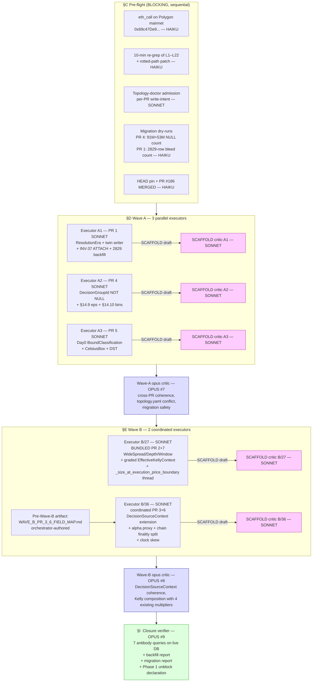

# ULTRAPLAN — Zeus Strategy V-Next Phase 0 (v4-locked, multi-agent execution)

**Locked against**: branch `docs/strategy-vnext-phase0-v4-20260519`, commit `4b7ee95`. v4 addendum + 5 verbatim opus critics + HANDOFF + SYNTHESIS §0/§5/§10 + this ultraplan's own pre-lock external verification + reality re-grep (see §A below for new findings v4 didn't catch).
**Operator confirmed (2026-05-19)**: Q4 $50 Tier-5 cap **REMOVED**. The on-chain wallet bankroll IS the experimental envelope. No per-strategy USD hard cap appears anywhere in this plan, in code, or in any antibody.

---

## Section 0 — Context

Phase 0 of the Zeus strategy upgrade closes **seven structural correctness defects** before any new strategy can be promoted from Phase 1 instrumentation up the EvidenceLadder. The live evidence today (2026-05-19, fresh re-probe required at lock):

| Defect | Live evidence | Impact |
|---|---|---|
| Settlement era-blind harvester gate (UMA-only) | **2,829 rows** in `settlements_v2.provenance_json` carry `harvester_live_uma_vote` with `settled_at >= 2026-02-21` (forecasts.db). Architecture yaml `settlement_dual_source_truth_2026_05_07.yaml:42-46` explicitly forbids this exact tag post-cutover. | Truth DB carries 2,829 lies — every downstream calibration / attribution / promotion read from these rows inherits false provenance. Settlement-capture strategies cannot be safely promoted from Phase 1 shadow until era-correct dispatch + backfill ship. |
| `decision_group_id` NULLable on live + archived calibration_pairs_v2 | **91,040,450 live rows** (forecasts.db) + **53,490,902 archived rows** (world.db); schema at `src/state/schema/v2_schema.py:239-272` has no `NOT NULL`. Math spec §14.6 was authored against `src/state/db.py:1005` (`calibration_pairs` v1 with 0 rows — dead table). | Every `n_eff` overcounts → maturity gates fire early → Platt fits on insufficient evidence → calibrated `P_cal` carries bias → every Day0 / shoulder / MarketAnalysisVNext decision inherits it. |
| `P_CLAMP_LOW = 0.01` in `src/calibration/platt.py:22` vs math spec §14.9 `eps = 1e-6` | 100× deviation. Confirmed via direct read; comment at line 16 marks it as the input clip for `logit_safe`. | 144M+ calibration rows have been squashed before Platt fit. Forecasts near 99% or 1% (common in skewed weather setups) lose information. |
| `kelly_size()` silently over-bets on wide-spread display substitution | Polymarket public docs (Web-verified 2026-05-19): "**The prices displayed on Polymarket are the midpoint of the bid-ask spread in the orderbook unless that spread is over $0.10, in which case the last traded price is used.**" Today's `ExecutableMarketSnapshotV2` does not type-encode the substitution flag. Existing fee model `polymarket_fee(p) = 0.05·p·(1−p)` at `src/contracts/execution_price.py:130` peaks at `p=0.5` (1.25% fee); combined with $0.10+ spread the edge can be fully erased. | Wide_spread_arb candidate cannot promote; stale_quote_detector can silently lose to last-trade UI substitution. |
| Causality chain partially-enforced | `src/contracts/execution_intent.py:678-700` `integrity_errors()` enforces `forecast_issue ≤ fetch ≤ available_at ≤ decision_time` — but `decision_time ≥ observation_available_at`, `provider_reported_time` ordering, and the chain-finality split are not in the type. | Day0 stale-quote + settlement-capture replay scenarios can silently bypass causality. |
| Forecast/submission timestamp chain incomplete | `src/contracts/execution_intent.py:605-615` `DecisionSourceContext` carries 4 forecast time fields. Submit-side: `src/execution/fill_tracker.py:541-542` records `block_number` + `confirmation_count` but no typed `first_inclusion_block_time` + `finality_confirmed_time` split. Alpha definition in v3 (`maker_first_quote_update_time`) is unobservable. | PR 6's INV-alpha-provenance becomes a no-op gate if defined against unobservable fields. |
| Day0 bound classification & DST handling | `src/signal/day0_router.py` / `day0_signal.py` / `diurnal.py` still use raw floats; F3 #177 landed `CelsiusBox`/`FahrenheitBox` unit guards but did not propagate to Day0. London 2026-03-30 spring-forward archetype remains a class of latent bug. | Day0 strategies cannot reliably distinguish bounded vs deterministic, and DST cities produce 1-hour systematic offsets in summer. |

All seven defects are bleeding into live-money operation right now. Phase 0 closes them; Phase 1–7 then sit on top.

---

## Section A — Pre-lock external & internal verification (executed in this planning session)

External verification done:
- ✅ Polymarket midpoint→last-trade substitution at $0.10: confirmed via public docs (https://docs.polymarket.com/polymarket-learn/trading/how-are-prices-calculated). Verbatim: "unless that spread is over $0.10, in which case the last traded price is used."
- ✅ negRisk infrastructure exists on Polygon mainnet (Chain ID 137): Neg Risk CTF Exchange `0xc5d563a36ae78145c45a50134d48a1215220f80a`, Neg Risk Adapter `0xd91e80cf2e7be2e162c6513ced06f1dd0da35296`, Neg Risk Fee Module `0x78769d50be1763ed1ca0d5e878d93f05aabff29e`.
- ⏳ Internal-resolver address `0x69c47De9D4D3Dad79590d61b9e05918E03775f24`: NOT searchable directly (no PolygonScan hit in web search). **Requires eth_call at design-gate (pre-flight Step 1).** Architecture yaml is the only doc-side authority; on-chain bytes are required before PR 1 enum shape locks.

Internal verification done (citations re-grepped 2026-05-19 from this session):
- ✅ `harvester.py:1061` is the gate (`if market.get("umaResolutionStatus") != "resolved": continue` — verified).
- ✅ `harvester.py:1338` writes `"reconstruction_method": "harvester_live_uma_vote"` (verified).
- ✅ `harvester_truth_writer.py:353` uses `outcomePrices` (NO umaResolutionStatus gate — different from harvester.py).
- ✅ `harvester_truth_writer.py:557` writes the SAME `harvester_live_uma_vote` tag (twin writer drift, confirmed).
- ✅ `market_phase.py:203 _f1_fallback_end_utc` is the real 12z fallback site (NOT `dispatch.py:122-149` which is `market_phase_dispatch_enabled` — env flag only).
- ✅ V2 snapshot fields at `executable_market_snapshot_v2.py:85-99`: `neg_risk`, `orderbook_top_bid`, `orderbook_top_ask` (optional), `orderbook_depth_jsonb` (string, currently unparsed), `raw_orderbook_hash`, `authority_tier ∈ {GAMMA, DATA, CLOB, CHAIN}`, `captured_at`, `freshness_deadline`.
- ✅ `DecisionSourceContext` at `execution_intent.py:605-615` carries `forecast_issue_time`, `forecast_valid_time`, `forecast_fetch_time`, `forecast_available_at`, `decision_time`, plus `raw_payload_hash`, `degradation_level`, `forecast_source_role`, `authority_tier`, `decision_time_status`. `integrity_errors()` already enforces forecast_issue ≤ fetch ≤ available_at ≤ decision_time.
- ✅ `record_resolution` at `uma_resolution_listener.py:496`: uses `INSERT OR IGNORE ON (condition_id, tx_hash)`. Critic 1 P7-2 risk confirmed.
- ✅ ECMWF partial-run handling: `ecmwf_open_data.py:773-779` flips status to `PARTIAL` when `observed_members < 51`. PR 6 `first_member_observed_time` lives near this surface.
- ✅ `calibration_pairs_v2` schema at `src/state/schema/v2_schema.py:239-272`: `decision_group_id TEXT` (line 255), no NOT NULL. UNIQUE includes city/target_date/temperature_metric/range_label/lead_days/forecast_available_at/bin_source/data_version (line 263).
- ✅ `platt.py:22` `P_CLAMP_LOW = 0.01`; `platt.py:67 logit_safe(p, eps=P_CLAMP_LOW)`; `platt.py:170-181` bootstrap correctly resamples `unique_groups` (NOT rows) — confirming Critic 4 P3 that §14.8 is ALREADY DONE.
- ✅ Kelly callsites — `kelly_size(` has **exactly 2 callers**:
  - `src/engine/evaluator.py:816` (the v4 listed `src/strategy/evaluator.py:816` — **rotted path**)
  - `src/backtest/executable_ev_replay.py:119` (the v4 listed `src/strategy/backtest/executable_ev_replay.py:119` — **rotted path**)
  Both go through `assert_kelly_safe()` unconditionally per `kelly.py:50`.
- ✅ **NEW finding from grep-gate (this session)**: `_size_at_execution_price_boundary` at `src/engine/evaluator.py:787` is a wrapper around `kelly_size`. It has **5 production callers** that pass raw `entry_price: float` (constructed into `ExecutionPrice` internally):
  - `src/engine/evaluator.py:3674`
  - `src/engine/replay.py:1722`
  - `src/engine/cycle_runtime.py:680`, `:756`, `:793`, `:862`
  PR 7's `EffectiveKellyContext` MUST thread through this wrapper too. The AST-audit antibody must enumerate both `kelly_size(` and `_size_at_execution_price_boundary(` call sites; otherwise PR 7 leaks under live-replay/repricing paths.
- ✅ FOK/FAK at `src/contracts/execution_intent.py:23-26` typed Literal; `marketable_limit_depth_bound` policy requires FOK or FAK at lines 412-413.
- ✅ Architecture authority `architecture/settlement_dual_source_truth_2026_05_07.yaml`: confirms two eras, internal-resolver address, `forbidden_patterns` block, and `provenance_field_contract.required_keys = {reconstruction_method, writer_script, operator_authorization}`.

**Carry forward to lock**: the executor MUST re-run the citation-grep within 10 min of dispatch and update paths in the per-PR file map. Two paths have already rotted in v4; assume more will rot.

---

## Section B — Subagent execution topology (multi-agent, parallel)



**Model-tier discipline** (per Zeus tier overlay 2026-05-07 in `.claude/CLAUDE.md` + `MODEL_TIERING.md`):
- **HAIKU** — grep/locate, citation re-verification, dry-run row counts, AST enumeration, topology receipt capture. No cross-module semantic reasoning.
- **SONNET** — all 5 executors (Wave A × 3, Wave B × 2), all 5 SCAFFOLD critics. Production-code authorship + relationship tests + cross-module reasoning at architectural scaffold level.
- **OPUS** — only architectural plan-lock decisions: pre-plan v3→v4 critics (5, **DONE**), this ultraplan session (1, **THIS RESPONSE**), Wave-A critic (1), Wave-B critic (1), closure verifier (1). **Total opus budget: 9. Six already spent (5 pre-plan + this plan), three remain (Wave A + Wave B + closure).**

**Roles (binding)**

| Role | Model | Owns | Does NOT do |
|---|---|---|---|
| Orchestrator (next session driver) | Sonnet | Dispatching executors, holding `WAVE_B_PR_3_6_FIELD_MAP.md` artifact, merging PRs in dependency order, running closure verifier | Write production code directly |
| Executor A1 / A2 / A3 (Wave A) | Sonnet | One PR each; SCAFFOLD before code; field-level edits per PR brief; migration scripts | Touch files outside their per-PR file map |
| Executor B/27 (bundled PR 2+7) | Sonnet | V2 snapshot extension + `EffectiveKellyContext` + threading through `_size_at_execution_price_boundary` AND direct `kelly_size` callers | Touch `DecisionSourceContext` (B/36's territory) |
| Executor B/36 (coordinated PR 3+6) | Sonnet | DecisionSourceContext in-place extension + storage to `ensemble_snapshots_v2` / `settlement_commands` / `wrap_unwrap_commands` | Touch Kelly path |
| SCAFFOLD critic (per-PR × 5: A1, A2, A3, B/27, B/36) | Sonnet | Critique architectural skeleton BEFORE code; cite file:line; reproduce one antibody as a failing test | Approve code (that's the wave critic's gate) |
| Wave-A critic (1 dispatch) | Opus #7 | Cross-PR coherence; topology.yaml merge-conflict map; DB-lock contention check on PR 1 backfill vs PR 4 migration | Per-PR field decisions |
| Wave-B critic (1 dispatch) | Opus #8 | DecisionSourceContext extension coherence; Kelly composition with the existing 4-multiplier chain; AST audit on Kelly callsites | Per-PR field decisions |
| Closure verifier (1 dispatch) | Opus #9 | Run 7 antibody queries against live DBs; verify backfill + migration evidence; declare Phase 1 unblocked | Write code |
| Pre-flight grep/audit workers | Haiku | C.1 codehash lookup, C.2 citation re-grep, C.4 NULL-count + bleed-count dry-runs, C.5 PR #186 status, AST audit support during PR 2+7 SCAFFOLD | Architectural decisions |

**Parallelism contract**: Wave A executors run **fully in parallel** — no shared file beyond `architecture/topology.yaml` route receipts (which are independent inserts per-PR file map). Wave B's two executors run **coordinated, not parallel** — they share `src/contracts/execution_intent.py` and `src/contracts/executable_market_snapshot_v2.py`. Coordination artifact `WAVE_B_PR_3_6_FIELD_MAP.md` (orchestrator-authored, see C.6) resolves field-level ownership BEFORE either executor writes code.

**Self-correction policy for sonnet executors**: Each executor reads its PR section in this plan + the verbatim critic that drove its corrections. When the executor's grep finds a citation that doesn't resolve (path rot), the executor PATCHES the plan section in place (commit message `docs(strategy-vnext): rot patch <l-id>`) and proceeds with the corrected path. The plan section is the spec; the executor owns rot patches. The SCAFFOLD critic checks that any patch is grep-confirmed before approving. This is intentional — sonnet can grep, sonnet can patch rot, sonnet does not need to escalate for path corrections.

---

## Section C — Pre-flight gates (BLOCKING, ordered)

These run **before any Wave A executor is dispatched**. Skip none. Each gate writes a small JSON artifact under `docs/operations/task_2026-05-17_strategy_vnext_phase0/preflight/<gate>.json` that downstream executors consume.

### C.1 — On-chain ABI verification (eth_call) — 10 min

**Why**: v3 deferred to merge-gate; v4 reverses to design-gate per `feedback_on_chain_eth_call_for_token_identity` ("on-chain bytes > docs > SDK source > inference"). PR 1's enum shape (event signatures, era boundary conditions) depends on the actual contract.

**Actions**:
1. `cast codehash 0x69c47De9D4D3Dad79590d61b9e05918E03775f24 --rpc-url <polygon-mainnet>` — must be non-zero.
2. `cast logs --address 0x69c47De9D4D3Dad79590d61b9e05918E03775f24 --from-block <last 100k blocks> --rpc-url <polygon-mainnet>` — capture distinct event topics; sample 3 settlement events.
3. Optional: `cast call 0x69c47De9D4D3Dad79590d61b9e05918E03775f24 "<candidate-fn>(bytes32)" --rpc-url ...` against any plausible reader function inferred from topics.
4. Write `preflight/eth_call_resolution_authority.json` with `{codehash, sample_event_topics[3], sample_event_payloads[3], polygon_block_height, queried_at}`.

**Outcomes**:
- ✅ Codehash non-zero AND event topics match yaml-implied semantics → PR 1 enum shape confirmed.
- ❌ Codehash zero (EOA, not a contract) → **Abort Wave A**, emit v5 addendum for PR 1 retargeting (pre-mortem Scenario 3).
- ⚠️ Codehash non-zero but events don't look like settlement → escalate to operator; pause until confirmation.

### C.2 — 10-min reality re-grep — pin every L-citation

The 21 L-citations in v4 §"Live evidence" have a known rot half-life ~30 min (per `feedback_grep_gate_before_contract_lock`). Two paths in v4 are already wrong **as of this planning session** (see §A). Run a haiku worker over the L-table:

For each row, execute the exact grep / SQL. For each that fails to resolve:
- patch v4 in-place with the corrected file:line; commit on the v4 branch as `docs(strategy-vnext): citation re-grep <timestamp>`;
- update `preflight/citation_regrep_<timestamp>.json` with `{l_id, original, corrected, evidence_line}`.

**Two already-known rots from this session** (must be in the first patch):
- L13: `src/engine/evaluator.py:816` (NOT `src/strategy/evaluator.py:816`).
- L13: `src/backtest/executable_ev_replay.py:119` (NOT `src/strategy/backtest/executable_ev_replay.py:119`).

**Plus the new finding** (must be added as L22):
- L22 (new): `src/engine/evaluator.py:787 _size_at_execution_price_boundary` is a Kelly-wrapper with 5 production callers (cycle_runtime.py:680/756/793/862, replay.py:1722, evaluator.py:3674). PR 7 must thread `EffectiveKellyContext` through it; AST audit antibody must enumerate both `kelly_size(` and `_size_at_execution_price_boundary(`.

### C.3 — Topology-doctor admission per PR

For each of the 7 PRs (treating bundled PR 2+7 as one, coordinated PR 3+6 as one):
```
PYTHONPATH=. python3 scripts/topology_doctor.py \
  --navigation --intent modify_existing --write-intent write \
  --files <per-PR-file-list>
```
Capture route receipts under `preflight/route_receipts/<pr_id>.json`. **`--intent audit --write-intent read_only` does NOT admit write paths** (v3 mistake).

### C.4 — Migration dry-runs (PR 4 + PR 1 backfill)

PR 4 NULL audit:
```
sqlite3 state/zeus-forecasts.db \
  "SELECT COUNT(*) FROM calibration_pairs_v2 WHERE decision_group_id IS NULL"
sqlite3 state/zeus-world.db \
  "SELECT COUNT(*) FROM calibration_pairs_v2_archived_2026_05_11 WHERE decision_group_id IS NULL"
```
- **Both zero** → PR 4 ships as single-step NOT NULL enforcement.
- **Non-zero** → PR 4 splits into 4a (deterministic backfill via `decision_group_id_derivation_v1` hash, idempotent + rollback) + 4b (NOT NULL after backfill).

PR 1 false-provenance bleed audit:
```
sqlite3 state/zeus-forecasts.db \
  "SELECT COUNT(*) FROM settlements_v2 \
   WHERE provenance_json LIKE '%harvester_live_uma_vote%' \
     AND settled_at >= '2026-02-21'"
```
- Record current row count (expected ~2,829 per v4 L17).
- Pre-flight also captures a **per-city, per-date roll-up** for the backfill report.

Write `preflight/migration_dry_runs.json` with both counts + per-city roll-up.

### C.5 — HEAD pin + PR #186 status

- `mcp__github__list_pull_requests state=closed search="negRisk"` confirms #186 MERGED.
- HEAD SHA: latest `origin/main` AFTER PR #186 merge commit.
- Record in `preflight/head_pin.json`.

### C.6 — `WAVE_B_PR_3_6_FIELD_MAP.md` authored (BEFORE Wave A finishes, in parallel)

Orchestrator authors the field-by-field ownership map for the two coordinated Wave-B executors. This artifact is consumed by Executor B/36 before code starts. Fields in scope:

| Field | New name | Type | Owner PR | Writer (production) | Storage table |
|---|---|---|---|---|---|
| `observation_time` | (existing) | datetime | PR 3 (validator only) | observation_client.py | observation_instants_v2 |
| `provider_reported_time` | (existing) | datetime | PR 3 (validator) | observation_client.py | observation_instants_v2 |
| `observation_available_at` | (existing) | datetime | PR 3 (validator + new assertion) | observation_client.py | observation_instants_v2 |
| `decision_time` | (existing) | datetime | PR 3 (validator) | execution_intent.py | settlement_commands |
| `forecast_issue_time` | (existing) | datetime | PR 6 (validator) | (already populated) | ensemble_snapshots_v2 |
| `forecast_valid_time` | (existing) | datetime | PR 6 | (already populated) | ensemble_snapshots_v2 |
| `forecast_fetch_time` | (existing) | datetime | PR 6 | (already populated) | ensemble_snapshots_v2 |
| `forecast_available_at` | (existing) | datetime | PR 6 | (already populated) | ensemble_snapshots_v2 |
| `first_member_observed_time` | NEW | datetime | PR 6 | ecmwf_open_data.py:~775 | ensemble_snapshots_v2 |
| `run_complete_time` | NEW | datetime | PR 6 | ecmwf_open_data.py | ensemble_snapshots_v2 |
| `raw_orderbook_hash_transition_delta_ms` | NEW | int | PR 6 (alpha proxy) | executable_market_snapshot_v2.py:93 | snapshot row |
| `zeus_submit_intent_time` | NEW | datetime | PR 6 | execution_intent.py (submit) | settlement_commands |
| `venue_ack_time` | NEW | datetime | PR 6 | executor.py | settlement_commands |
| `first_inclusion_block_time` | NEW | datetime | PR 6 | fill_tracker.py:541 | wrap_unwrap_commands |
| `finality_confirmed_time` | NEW | datetime | PR 6 | fill_tracker.py:541 (split) | wrap_unwrap_commands |
| `clock_skew_estimate_ms` | NEW | int | PR 6 | runtime control surface | settlement_commands (optional) |

Both executors read this map first. PR 3 owner is responsible for validators (`__post_init__`) on the DecisionSourceContext type for existing fields + new ordering assertions; PR 6 owner is responsible for new fields + storage wiring.

---

## Section D — Wave A: three parallel executors

### D.1 — Executor A1 (sonnet) — PR 1: ResolutionEra + twin writer consolidation + INV-37 ATTACH+SAVEPOINT + 2829-row backfill

**Closes**: live harvester writes `harvester_live_uma_vote` provenance on 2,829 post-cutover rows in `settlements_v2` (forecasts.db) despite the UMA chain being dead post-2026-02-21. Two writer call-sites (`harvester.py:1338` + `harvester_truth_writer.py:557`) duplicate the false tag through different code paths. PR 1 closes the bleed AND backfills the existing rows.

**Verified file list** (re-grep at C.2 before edit):
- `src/contracts/resolution_era.py` (NEW) — open `Enum` + `EraAuthorityBasis` dataclass
- `src/state/settlement_writers.py` (NEW) — single consolidation helper `write_settlement_v2_with_era_provenance`
- `src/execution/harvester.py:1061` (verified L1) — replace era-blind `umaResolutionStatus` gate with era-dispatch
- `src/execution/harvester.py:1338` (verified L2) — route through new consolidation helper, drop hardcoded `harvester_live_uma_vote`
- `src/ingest/harvester_truth_writer.py:353` (verified L3) — twin gate, replace `outcomePrices >= 0.99` heuristic with era-dispatch
- `src/ingest/harvester_truth_writer.py:557` (verified L4) — twin writer, route through consolidation helper
- `src/engine/dispatch.py:344` — drop hardcoded `uma_resolved=False`; read `era_for_settled_at`
- `src/engine/cycle_runtime.py:2791` — thread `uma_resolved_source` end-to-end (today is era-blind)
- `src/strategy/market_phase_evidence.py:88-223` — era-aware reads of `umaResolutionStatus`
- `src/state/uma_resolution_listener.py:496` — Critic 1 P7-2 sub-task: add `confirmations_required` + late-revalidation pass (reorg safety)
- world.db schema: NEW `era_watermark` table (era boundary + `EraAuthorityBasis` JSON)
- New scripts (idempotent + dry-run flagged):
  - `scripts/audit_settlements_v2_era_provenance.py`
  - `scripts/backfill_settlements_v2_era_provenance.py`
  - `scripts/rollback_settlements_v2_era_provenance.py`
  - `scripts/migrate_settlement_commands_in_flight_at_era_flip.py` (Critic 1 P7-3 — in-flight command quarantine)

**Pre-edit topology_doctor invocation** (executor runs this BEFORE first edit; routing receipt under `preflight/route_receipts/pr1.json`):
```bash
PYTHONPATH=. python3 scripts/topology_doctor.py \
  --navigation --intent modify_existing --write-intent write \
  --files src/contracts/resolution_era.py,src/state/settlement_writers.py,\
src/execution/harvester.py,src/ingest/harvester_truth_writer.py,\
src/engine/dispatch.py,src/engine/cycle_runtime.py,\
src/strategy/market_phase_evidence.py,src/state/uma_resolution_listener.py
```
Receipt must report `admission_status=ADMITTED` for all 8 files. Auditor-intent / read-only-intent does NOT admit write paths.

**Test plan + relationship-test invariant**:
- `tests/test_resolution_era_dispatch.py` — relationship test R-1.1: a synthetic post-cutover market (`umaResolutionStatus=resolved`, `automaticallyResolved=True`, `negRiskMarketID` set, `settled_at >= 2026-02-21`) MUST be classified `ResolutionEra.INTERNAL_RESOLVER_POST_2026_02_21` and gated by Gamma logic, NOT UMA. R-1.2: a synthetic pre-cutover market (same fields, `settled_at < 2026-02-21`) classifies `UMA_OO_V2` and gates through UMA listener.
- `tests/test_twin_writer_no_duplicate_uma_tag.py` — relationship test R-1.3: AST audit — the literal string `"harvester_live_uma_vote"` does NOT appear in either `harvester.py` or `harvester_truth_writer.py` after consolidation (only in the backfill script's compatibility shim).
- `tests/test_settlement_writer_inv37_attach.py` — relationship test R-1.4: monkey-patch the sqlite3 connection; assert that `ATTACH DATABASE` + `SAVEPOINT era_dispatch` calls fire during a settlement write involving both forecasts.db (settlements_v2) and world.db (uma_resolution / era_watermark). NO independent connections.
- `tests/test_uma_resolution_listener_late_revalidation.py` — relationship test R-1.5: a synthetic row with `confirmation_count < confirmations_required` that is later invalidated by chain reorg is removed by the late-revalidation pass.

**Cross-DB write path (explicit)**:
```python
from src.state.db import get_forecasts_connection_with_world

def write_settlement_v2_with_era_provenance(settlement, era_basis):
    with get_forecasts_connection_with_world() as conn:    # ATTACH zeus-world.db AS world
        conn.execute("SAVEPOINT era_dispatch")
        try:
            if era_basis.era == ResolutionEra.UMA_OO_V2:
                row = conn.execute(
                    "SELECT resolved_value FROM world.uma_resolution "
                    "WHERE condition_id = ?", (settlement.condition_id,)
                ).fetchone()
                # ... validate row exists ...
            conn.execute(
                "INSERT OR REPLACE INTO settlements_v2 (..., provenance_json) "
                "VALUES (..., ?)", (..., json.dumps(provenance_with_era))
            )
            conn.execute(
                "INSERT OR IGNORE INTO world.era_watermark (era, era_start_date_utc, ...) "
                "VALUES (?, ?, ...)", (era_basis.era.value, ...)
            )
            conn.execute("RELEASE SAVEPOINT era_dispatch")
        except Exception:
            conn.execute("ROLLBACK TO SAVEPOINT era_dispatch")
            raise
```
INV-37 is explicit, not generic: `get_forecasts_connection_with_world()` is the only legal connection factory for this writer; bare `sqlite3.connect()` of either DB raises `Inv37Violation` at the wrapper boundary.

**Antibody (structurally impossible)**:
`tests/test_inv_era_provenance_post_cutover_count.py` — CI-runnable SQL:
```sql
SELECT COUNT(*) FROM settlements_v2
WHERE provenance_json LIKE '%harvester_live_uma_vote%'
  AND settled_at >= '<PR1_MERGE_DATE>'
```
MUST equal 0. The category "post-cutover row tagged `harvester_live_uma_vote`" is structurally eliminated because (a) both writers route through the same helper; (b) the helper rejects `harvester_live_uma_vote` for `era != UMA_OO_V2`; (c) `era_for_settled_at(>=2026-02-21)` returns `INTERNAL_RESOLVER_POST_2026_02_21`; (d) the AST audit (R-1.3) blocks reintroduction of the literal string. Backfill closes the historical 2,829-row debt.

**Critic dispatch slot**:
- SCAFFOLD critic: sonnet, before code (skeleton: enum + EraAuthorityBasis + helper signature + migration script outlines). Cite verbatim `critic_1_pr1_settlement.md` findings P1, P2, P3, P5, P6, P7-1, P7-2, P7-3 and reproduce R-1.3 antibody as a failing test on a pre-PR-1 commit.
- Wave-A combined critic: opus #7 (after all three Wave-A SCAFFOLDs land).

**SCAFFOLD output**:
```python
# src/contracts/resolution_era.py
from enum import Enum

class ResolutionEra(str, Enum):
    UMA_OO_V2 = "uma_oo_v2"                          # pre-2026-02-21
    INTERNAL_RESOLVER_POST_2026_02_21 = "internal_resolver_post_2026_02_21"
    # OPEN enum — future cutovers add via era_watermark, not by editing this file.

@dataclass(frozen=True)
class EraAuthorityBasis:
    era: ResolutionEra
    era_start_date_utc: date
    era_end_date_utc: date | None         # None = open era
    on_chain_address: str                  # 0x… contract that emits authoritative events
    on_chain_codehash: str                 # from pre-flight eth_call
    authority_doc: str                     # path to architecture yaml
    operator_authorization_date: date
```

Then `harvester.py:1038-1080` becomes:
```python
era = era_for_settled_at(settled_at, conn)  # reads era_watermark, falls back to yaml
gate_fn = ERA_GATE_DISPATCH[era]            # {UMA_OO_V2: uma_gate, INTERNAL_RESOLVER...: gamma_gate}
if not gate_fn(market):
    # ERA_DEAD watermark (Critic 1 P4): empty results ≠ silent fallthrough.
    record_era_empty_observation(market, era, ...)
    continue
```

Twin writer consolidation: replace both `harvester.py:1338` and `harvester_truth_writer.py:557` with a single helper `write_settlement_v2_with_era_provenance(conn, settlement, era_authority_basis, ...)` in `src/state/settlement_writers.py` (NEW). Both call sites call the helper. Helper writes `provenance_json` carrying:
```json
{
  "era": "internal_resolver_post_2026_02_21",
  "era_authority_basis": {
    "on_chain_address": "0x69c47De9...",
    "on_chain_codehash": "0x...",
    "operator_authorization_date": "2026-05-07"
  },
  "reconstruction_method": "gamma_backfill"  // NEW — never "harvester_live_uma_vote" post-cutover
}
```

Cross-DB transaction (INV-37, explicit):
```python
# src/state/db_writer_lock.py canonical lock order
with attach_cross_db("forecasts", "world") as conn:
    conn.execute("SAVEPOINT era_dispatch")
    try:
        # 1. Read uma_resolution from world.db (when era=UMA_OO_V2)
        # 2. Write settlements_v2 to forecasts.db (with era_provenance)
        # 3. Optionally update era_watermark in world.db (if boundary crossed)
        conn.execute("RELEASE SAVEPOINT era_dispatch")
    except Exception:
        conn.execute("ROLLBACK TO SAVEPOINT era_dispatch")
        raise
```

`uma_resolution_listener.record_resolution` gains `confirmations_required: int = 6` + late-revalidation pass (Critic 1 P7-2). Reorg-invalidated rows are revalidated when `confirmations < required` and removed if the canonical chain no longer carries the tx_hash.

`settlement_commands` migration (Critic 1 P7-3): when era flips, in-flight commands (those with `status IN ('SUBMITTED','PENDING_FILL','PARTIAL')`) are quarantined into a sibling table `settlement_commands_era_quarantine` and re-dispatched via era-correct gate on resume. Migration script `migrate_settlement_commands_in_flight_at_era_flip.py` is idempotent.

**Backfill the 2,829 bleeding rows** — `scripts/backfill_settlements_v2_era_provenance.py`:
1. Snapshot `settlements_v2` rows with `provenance_json LIKE '%harvester_live_uma_vote%' AND settled_at >= '2026-02-21'` into `settlements_v2_provenance_backup_2026_05_19`.
2. For each row, look up era at `settled_at` → rewrite `provenance_json` to drop `harvester_live_uma_vote` and add `era` + `era_authority_basis` + `reconstruction_method: gamma_backfill` (or `uma_chain_backfill` if pre-cutover; should be zero post-2026-02-21).
3. Add `backfilled_at: <iso>` field; idempotent (skip if present).
4. `--dry-run` and `--row-cap N` for staged rollout.

**Antibodies (binding)**:
- `tests/test_resolution_era_dispatch.py`: synthetic post-cutover market with `umaResolutionStatus=resolved` (false UMA evidence) is REJECTED by era-dispatch and re-routed through gamma gate.
- `tests/test_inv_era_provenance_post_cutover_count.py`: CI-runnable query asserting `SELECT COUNT(*) FROM settlements_v2 WHERE provenance_json LIKE '%harvester_live_uma_vote%' AND settled_at >= '<PR1 merge date>'` = 0.
- `tests/test_twin_writer_no_duplicate_uma_tag.py`: both `harvester.py` and `harvester_truth_writer.py` write through the consolidated helper; AST check that the raw string `"harvester_live_uma_vote"` does not appear in either file (post-consolidation).
- `tests/test_settlement_writer_inv37_attach.py`: monkey-patch the DB connection to assert `ATTACH DATABASE` + `SAVEPOINT` calls fire for the settlement write path (no independent connections).

**Rollback path**: `scripts/rollback_settlements_v2_era_provenance.py` restores prior provenance from `settlements_v2_provenance_backup_2026_05_19`. Migration is reversible until the backup table is dropped (post-Phase-1 closure).

**Estimated LOC**: 700–900 production + ~400 migration scripts + ~600 tests.

### D.2 — Executor A2 (sonnet) — PR 4: DecisionGroupId NewType + NOT NULL on calibration_pairs_v2 + §14.9 eps decision + §14.10 ±inf audit

**Closes**: math spec §14.6 (NULL `decision_group_id`), §14.7 (already fixed at `manager.py:1099-1103` — confirmation only), §14.9 (`P_CLAMP_LOW = 0.01` deviates 100× from spec `eps = 1e-6`), §14.10 (±inf outer bins). Strikes §14.8 from scope — already done at `platt.py:170-181` (verified this session). The defect category is "statistical bias from row-count maturity gates + over-aggressive logit clipping + dead-table-targeted NOT NULL".

**Verified file list**:
- `src/contracts/decision_group_id.py` (NEW) — `NewType("DecisionGroupId", str)` + `decision_group_id_v1_hash(city, target_date, forecast_available_at, source_id, data_version)` deterministic derivation
- `src/state/schema/v2_schema.py:255` (verified L8) — `decision_group_id TEXT` → `decision_group_id TEXT NOT NULL` (rebuild required; SQLite can't ALTER COLUMN in place)
- `src/calibration/platt.py:22` (verified L7) — `P_CLAMP_LOW = 0.01` (decision: keep at 0.01 + amend spec; see Option-1 below)
- `src/calibration/platt.py:67` — `logit_safe(p, eps=P_CLAMP_LOW)` signature (unchanged under Option 1)
- `src/calibration/platt.py:170-181` — bootstrap correctly resamples `unique_groups` (verified this session); confirm-only, no edit
- `src/calibration/manager.py:1095-1104` — change `Iterable[Row]` → `Iterable[DecisionGroupId]` at bootstrap/maturity-gate signatures
- `src/types/market.py:9-30,200-221` — §14.10 outer-bin ±inf round-trip audit (additive tests; production code already correct per SYNTHESIS §2.1)
- `docs/reference/zeus_math_spec.md` §14.9 — amend text to `eps = 0.01` with rationale paragraph (Option 1)
- New scripts:
  - `scripts/audit_calibration_pairs_v2_null_groups.py` (pre-flight; runs at C.4)
  - `scripts/migrate_calibration_pairs_v2_not_null.py` (idempotent, dual-DB, chunked at 10M rows)
  - `scripts/rollback_calibration_pairs_v2_not_null.py` (drops new table, renames pre-PR4 snapshot back)
  - `scripts/backfill_decision_group_id_v1.py` (deterministic-hash backfill; **only runs if C.4 finds NULLs**)

**Pre-edit topology_doctor invocation**:
```bash
PYTHONPATH=. python3 scripts/topology_doctor.py \
  --navigation --intent modify_existing --write-intent write \
  --files src/contracts/decision_group_id.py,src/state/schema/v2_schema.py,\
src/calibration/platt.py,src/calibration/manager.py,src/types/market.py
```
Receipt at `preflight/route_receipts/pr4.json`.

**§14.9 P_CLAMP_LOW decision — Option 1 default (locked unless operator overrides at SCAFFOLD time)**:
- Option 1 (DEFAULT): amend math spec text to `eps = 0.01`. Zero data backfill. Rationale: realized P_cal output range is already `[0.001, 0.999]` per `platt.py:210` regardless of input clip; the input clip's downstream effect is information loss at p ∈ (0.99, 1) ∪ (0, 0.01), which is rare in promoted weather-bin candidates. The 100× deviation has been live for an unknown duration with no observed adverse calibration drift.
- Option 2 (if operator overrides): code → `1e-6`, refit 144M+ rows. Becomes PR 4a (eps + spec drift test) + 4b (NOT NULL) + 4c (Platt refit pipeline). Refit is idempotent + resumable per `scripts/refit_platt_eps_1e6.py`. Model versions bump; downstream replay cohort tagged pre/post.

**Test plan + relationship-test invariant**:
- `tests/test_decision_group_id_constraint.py` — relationship test R-4.1: `INSERT INTO calibration_pairs_v2 (..., decision_group_id, ...) VALUES (..., NULL, ...)` raises `sqlite3.IntegrityError`. Same on `calibration_pairs_v2_archived_2026_05_11`.
- `tests/test_inv_eps_spec_conformance.py` — relationship test R-4.2: parse `P_CLAMP_LOW` from `src/calibration/platt.py:22` (AST or import); parse `eps =` from `docs/reference/zeus_math_spec.md §14.9` (regex); both must agree. Build fails on drift.
- `tests/test_calibration_pairs_v2_migration.py` — relationship test R-4.3: dry-run migration on synthetic 10k-row fixture (mixed NULL + non-NULL `decision_group_id`); deterministic hash backfill produces stable IDs; rebuild preserves row count, distinct UNIQUE-tuples, and bin_source distribution.
- `tests/test_outer_bin_inf_roundtrip.py` — relationship test R-4.4: `Bin(low=None, high=10.0)` and `Bin(low=10.0, high=None)` round-trip through `src/types/market.py` factory → SQLite → factory, preserving `±inf` semantics.
- `tests/test_decision_group_id_newtype_audit.py` — relationship test R-4.5: AST audit — every callsite of `manager.maturity_level()` and the bootstrap function passes `Iterable[DecisionGroupId]`, not `Iterable[Row]`. Bare-string callers raise `TypeError` at function entry.

**Cross-DB write path**: PR 4 schema migration touches BOTH `state/zeus-forecasts.db` (live `calibration_pairs_v2`, 91M rows) AND `state/zeus-world.db` (archived `calibration_pairs_v2_archived_2026_05_11`, 53M rows). The migration script connects to each DB **separately and sequentially** — these are not in the same logical transaction, only the same migration run. Each DB's rebuild is its own `BEGIN IMMEDIATE; ... COMMIT;` block with a SAVEPOINT per chunk. The 10M-row chunking caps wal-journal growth.
```python
# scripts/migrate_calibration_pairs_v2_not_null.py
for db_path, table in [
    ("state/zeus-forecasts.db", "calibration_pairs_v2"),
    ("state/zeus-world.db",     "calibration_pairs_v2_archived_2026_05_11"),
]:
    with sqlite3.connect(db_path) as conn:
        conn.execute("BEGIN IMMEDIATE")
        # ... backfill (if needed), then chunked rebuild ...
        conn.execute("COMMIT")
```

**Antibody (structurally impossible)**:
`tests/test_decision_group_id_constraint.py` (R-4.1) AND the CI antibody:
```sql
SELECT COUNT(*) FROM calibration_pairs_v2 WHERE decision_group_id IS NULL;
SELECT COUNT(*) FROM calibration_pairs_v2_archived_2026_05_11 WHERE decision_group_id IS NULL;
```
Both MUST be 0 after PR 4 merge. The category "NULL `decision_group_id` row reaches calibration maturity gate" is structurally eliminated because (a) DB constraint refuses the insert; (b) `Iterable[DecisionGroupId]` typed signature means upstream callers must commit to a non-empty hash; (c) backfill closes legacy debt. Plus `INV-eps-spec-conformance` (R-4.2) makes code↔spec drift on the eps value a CI failure.

**Critic dispatch slot**:
- SCAFFOLD critic: sonnet, reproduces R-4.2 antibody as a failing test on pre-PR-4 (asserts the eps drift exists). Verifies §14.9 Option-1 amendment text reads "0.01" and cites realized P_cal output-range rationale.
- Wave-A combined critic: opus #7.

**§14.9 P_CLAMP_LOW decision (operator-blocking)**:

Two options, each with concrete plan:
1. **Change spec to 0.01**: amend `docs/reference/zeus_math_spec.md` §14.9 with rationale (e.g., empirical numerical stability at p ∈ {1e-6, 1-1e-6} causes NaN propagation in observed buckets). Zero data backfill — code already at 0.01. INV-eps-spec-conformance asserts `P_CLAMP_LOW == 0.01` AND math spec text contains "eps = 0.01".
2. **Change code to 1e-6**: re-run Platt fit on all 144M rows with new clipping. Full backfill pipeline. INV-eps-spec-conformance asserts `P_CLAMP_LOW == 1e-6`. Cost: ~6–18 hours of compute; downstream calibration model versions bump.

**Operator decision required at SCAFFOLD critic time, not at code time.** Default for this plan: **option 1 (change spec to 0.01)** — preserves 144M rows of fitted models; the deviation has been live for an unknown duration and the realized P_cal output range is `[0.001, 0.999]` per `platt.py:210` regardless of input clip. The deviation cost is information loss at p ∈ (0.99, 1) ∪ (0, 0.01), where weather markets rarely live for promoted candidates. If operator overrides to option 2, PR 4 absorbs the backfill + becomes 4a (eps decision) + 4b (NOT NULL) + 4c (Platt refit) — three sub-PRs.

**NOT NULL migration plan**:
```sql
-- forecasts.db
BEGIN IMMEDIATE;
SAVEPOINT pr4_not_null;
-- (only if pre-flight found NULL rows): backfill them deterministically
UPDATE calibration_pairs_v2
   SET decision_group_id = decision_group_id_v1_hash(city, target_date, forecast_available_at, source_id, data_version)
 WHERE decision_group_id IS NULL;
-- Verify
SELECT COUNT(*) FROM calibration_pairs_v2 WHERE decision_group_id IS NULL;
-- Must be 0 before continuing.

-- SQLite cannot ALTER COLUMN to add NOT NULL in-place. Standard pattern:
CREATE TABLE calibration_pairs_v2_new (... decision_group_id TEXT NOT NULL ...);
INSERT INTO calibration_pairs_v2_new SELECT * FROM calibration_pairs_v2;
DROP TABLE calibration_pairs_v2;
ALTER TABLE calibration_pairs_v2_new RENAME TO calibration_pairs_v2;
-- Recreate indexes + UNIQUE constraint
... (per schema/v2_schema.py:255-285)
RELEASE SAVEPOINT pr4_not_null;
COMMIT;

-- world.db archived twin (same pattern on calibration_pairs_v2_archived_2026_05_11)
```

Migration is **chunked**: rebuild proceeds in batches of 10M rows with progress logging + restart-safe checkpoints. Dry-run mode reports estimated wall time + disk space (table will roughly double during the rebuild).

**§14.10 ±inf outer bin audit**:
Per SYNTHESIS §2.1, mostly closed at `src/types/market.py:9-30,200-221` (None→±inf normalization + `BinTopologyError` for malformed shapes). PR 4 adds:
- end-to-end test that `Bin(low=None, high=X)` and `Bin(low=Y, high=None)` round-trip through SQLite without precision loss
- AST audit: every Bin construction site uses the canonical factory (no raw `Bin(...)` calls outside the factory or fixtures)

**Antibodies**:
- `tests/test_decision_group_id_constraint.py`: insert with NULL `decision_group_id` raises `IntegrityError`.
- `tests/test_inv_eps_spec_conformance.py`: code constant `P_CLAMP_LOW` must equal the `eps` value parsed from math spec §14.9. Build fails if drift.
- `tests/test_calibration_pairs_v2_migration.py`: dry-run migration on a synthetic 10k-row fixture preserves row count, distinct decision_group_ids, and reproduces UNIQUE constraint violations correctly.
- `tests/test_outer_bin_inf_roundtrip.py`: ±inf bins survive insert + select through SQLite.

**Rollback**: migration creates `calibration_pairs_v2_pre_pr4_<timestamp>` as a snapshot before the rebuild; rollback drops the new table and renames the snapshot back. Documented in `scripts/rollback_calibration_pairs_v2_not_null.py`.

**Estimated LOC**: 400–700 production + ~500 migration + ~400 tests + math spec doc patch (Option 1).

### D.3 — Executor A3 (sonnet) — PR 5: Day0 BoundClassification + CelsiusBox propagation + DST audit

**Closes**: Day0 strategies lack a typed distinction between (a) extremum already observed/bounded, (b) extremum still in flight with lower bound, (c) no observation yet. DST cities still use `timedelta(hours=…)` arithmetic at `src/signal/diurnal.py` — London 2026-03-30 spring-forward archetype produces 1-hour systematic offset. F3 #177 landed `CelsiusBox`/`FahrenheitBox` unit guards at the ingest layer; Day0 surfaces still pass raw floats.

**Verified file list**:
- `src/contracts/day0_observation_context.py` — add `BoundClassification` Enum + field on `Day0ObservationContext`
- `src/signal/day0_router.py` — emit `BoundClassification` at router output
- `src/signal/day0_signal.py` — consume `BoundClassification`; replace raw-float temperatures with `CelsiusBox` / `FahrenheitBox` at evaluation entry
- `src/signal/diurnal.py` — DST audit: replace every `timedelta(hours=…)` near time-of-day logic with `ZoneInfo(city_tz)`-aware operations
- New tests: `tests/test_day0_bound_classification.py`, `tests/test_diurnal_dst_property.py`

**Pre-edit topology_doctor invocation**:
```bash
PYTHONPATH=. python3 scripts/topology_doctor.py \
  --navigation --intent modify_existing --write-intent write \
  --files src/contracts/day0_observation_context.py,src/signal/day0_router.py,\
src/signal/day0_signal.py,src/signal/diurnal.py
```
Receipt at `preflight/route_receipts/pr5.json`. All four files admit since they live under `src/signal/` (additive surface; no schema migration; no INV-37).

**Test plan + relationship-test invariant**:
- `tests/test_day0_bound_classification.py` — relationship test R-5.1: enum exhaustiveness via mypy strict mode; `BoundClassification` covers `{DETERMINISTIC, BOUNDED_LIVE, UNBOUNDED_NO_OBS_YET}`; property test maps `(observation_state, daypart, observed_extremum_present)` to the expected classification across 12 input cells.
- `tests/test_diurnal_dst_property.py` — relationship test R-5.2: three DST archetypes — London 2026-03-30 (spring-forward), Sydney 2025-10-05 (mirror DST), New York 2026-11-02 (fall-back). For each: diurnal partition function MUST produce no off-by-1-hour boundary across the DST transition day; raw `timedelta(hours=…)` math fails this test, `ZoneInfo` math passes.
- `tests/test_day0_unit_box_propagation.py` — relationship test R-5.3: Day0 signal entry-point accepts `CelsiusBox` / `FahrenheitBox` (not raw `float`); bare-float callers raise `TypeError`. Mirrors F3 #177's antibody pattern.

**Cross-DB write path**: NONE. PR 5 is purely additive within `src/signal/` and `src/contracts/`. No schema migration; no production DB touched.

**Antibody (structurally impossible)**:
The category "Day0 evaluator silently mis-classifies bounded-live as unbounded" is structurally eliminated because (a) `BoundClassification` is required (non-default) on `Day0ObservationContext`; (b) every constructor path threads it from the router; (c) mypy strict catches missing variants. The category "DST off-by-1-hour in diurnal partition" is eliminated because raw `timedelta(hours=…)` is replaced by `ZoneInfo`-aware operations — verified by R-5.2 property test across 3 archetypes. The category "Day0 receives raw-float temperatures" is eliminated by R-5.3 enforcement of `CelsiusBox`/`FahrenheitBox` at Day0 entry, mirroring F3 #177 already landed.

**Critic dispatch slot**:
- SCAFFOLD critic: sonnet, reproduces R-5.2 by running the London 2026-03-30 test against pre-PR-5 code (expects FAIL); verifies enum exhaustiveness skeleton.
- Wave-A combined critic: opus #7.

**SCAFFOLD output**:
```python
# src/contracts/day0_observation_context.py
from enum import Enum

class BoundClassification(str, Enum):
    DETERMINISTIC = "deterministic"      # observed extremum already fixed
    BOUNDED_LIVE = "bounded_live"        # extremum still in flight, lower bound exists
    UNBOUNDED_NO_OBS_YET = "unbounded_no_obs_yet"  # no observation arrived yet
```

DST audit pattern:
```python
# OLD (Day0 archetype bug):
local_dt = base_dt + timedelta(hours=offset_hours)  # WRONG on DST day

# NEW:
local_dt = base_dt.astimezone(ZoneInfo(city_tz))   # ZoneInfo-aware
local_eod = local_dt.replace(hour=23, minute=59, second=59)  # local end-of-day
```

**Antibodies**:
- `tests/test_day0_bound_classification.py`: enum exhaustiveness via mypy + property test that classification matches `(observation_state, daypart)` cases.
- `tests/test_diurnal_dst_property.py`: 2026-03-30 London (spring-forward), 2025-10-05 Sydney (mirror DST), 2026-11-02 New York (fall-back). All three must produce no off-by-1-hour offset in the diurnal partition.

**Rollback**: pure additive in `src/signal/`; revert PR is safe.

**Estimated LOC**: 300–500 production + ~250 tests.

### D.4 — Wave A SCAFFOLD critics (per-PR, opus, parallel with executors)

Each Wave-A executor pauses after producing a SCAFFOLD (architectural skeleton: class signatures, function shells, migration pseudocode, test scaffold) BEFORE writing code. The SCAFFOLD goes to a dedicated opus critic with the input:

```
Brief: <PR_ID> SCAFFOLD critic
Read: docs/operations/task_2026-05-17_strategy_vnext_phase0/PHASE_0_V4_ADDENDUM.md
      + critic_<n>_*.md (the verbatim original critic that drove this PR's correction)
      + the SCAFFOLD draft
Reproduce: ONE antibody test from the brief; report whether it would fail today.
Verdict: APPROVE / NEEDS-REVISION
```

Per `feedback_opus_critic_on_architectural_scaffold_4_for_4_roi` — these are the highest-ROI critic dispatches in the Zeus catalog (10:1).

### D.5 — Wave A opus critic (cross-PR coherence, after all 3 SCAFFOLDs land)

Inputs: all 3 SCAFFOLDs + the 3 SCAFFOLD-critic verdicts. Audits:
- `architecture/topology.yaml` updates from each PR do not conflict.
- Migration ordering: PR 1 backfill of 2,829 rows must complete before PR 4 NOT NULL rebuild touches `calibration_pairs_v2` (NO direct dep, but DB lock contention if both run within the same window — schedule serially).
- INV-37 ATTACH path in PR 1 and the calibration migration path in PR 4 don't collide on the same DB-writer lock.
- No SCAFFOLD includes Phase 1 work (`decision_events` table, `book_hash_transitions` table, `NoTradeReason` enum). These are out-of-scope by v4 line 125.

Verdict gates Wave A merge. NEEDS-REVISION → executor re-spins SCAFFOLD; second pass triggers operator escalation.

### D.6 — Wave A merge (sequential)

Order: **PR 5 → PR 4 → PR 1**. Why:
- PR 5 is purely additive in `src/signal/`; lowest blast radius.
- PR 4 lands the NOT NULL constraint + eps decision; touches schema but doesn't read settlement provenance.
- PR 1 lands last because its 2,829-row backfill is the live-money-truth fix and operator approval is most stringent. Merging last means it can land on already-NOT-NULL `calibration_pairs_v2` without race.

Each merge:
1. Re-run focused tests on `main` HEAD (regression check).
2. Run the antibody for the merged PR live (e.g., for PR 1 — query the post-merge row count).
3. Tag `phase0_pr<n>_landed` on the commit.

---

## Section E — Wave B: two coordinated executors

Atomicity rule (Critic 2 P7, non-negotiable): PR 2 lands a flag → PR 7 reads it. If they ship apart, between waves there is a flag nothing reads → silent over-bet persists. **Default for this plan: bundle PR 2 + PR 7 into one PR (Executor B/27).** If the bundle exceeds 1100 LOC under SCAFFOLD critic, split with PR 2 defaulting fail-closed (`raise MissingEffectiveContextError` when `wide_spread_displayed=True` and no consumer is wired).

### E.1 — Executor B/27 (sonnet) — bundled PR 2 + PR 7: WideSpread/Depth/Window snapshot fields + graded EffectiveKellyContext

**Closes**: Polymarket's verified-public-doc rule "spread > $0.10 → display = last-traded-price (NOT midpoint)" is not typed into `ExecutableMarketSnapshotV2`. Today's `kelly_size()` and its wrapper `_size_at_execution_price_boundary` silently over-bet when the displayed price diverges from CLOB best-bid/best-ask. The bundled PR also types depth-at-best, spread-observed-window, one-sided/crossed-book semantics, and threads a graded `EffectiveKellyContext` (3 spread × 2 depth × {FOK, FAK, GTC, GTD}) through every Kelly callsite — **including the wrapper's 5 callers (new grep-gate finding L22)**.

**Verified file list**:
- `src/contracts/effective_kelly_context.py` (NEW) — graded multiplier composer + `fee_erased_branch` check
- `src/contracts/executable_market_snapshot_v2.py:85-99` (verified L10) — extend with 6 new typed fields
- `src/strategy/kelly.py:31,50,270` (kelly_size + multiplier composition site) — compose `m_effective_kelly` as the 5th multiplier in the existing chain
- `src/engine/evaluator.py:787` (verified `_size_at_execution_price_boundary` wrapper, NEW from L22 grep-gate) — add `effective_kelly_context` required parameter; thread through to `kelly_size`
- `src/engine/evaluator.py:816` (direct kelly_size caller — path **corrected** from v4 rot `src/strategy/evaluator.py:816`) — pass `EffectiveKellyContext`
- `src/engine/evaluator.py:3674` (wrapper caller) — construct + pass `EffectiveKellyContext`
- `src/engine/cycle_runtime.py:680,756,793,862` (4 wrapper callers, NEW from L22 grep-gate) — construct + pass `EffectiveKellyContext`
- `src/engine/replay.py:1722` (wrapper caller, NEW from L22 grep-gate) — construct from synthetic snapshot
- `src/backtest/executable_ev_replay.py:119` (direct kelly_size caller — path **corrected** from v4 rot `src/strategy/backtest/executable_ev_replay.py:119`) — pass `EffectiveKellyContext`
- `src/engine/monitor_refresh.py` — parse `orderbook_depth_jsonb` once at V2 construction, populate `depth_at_best_ask` / `depth_at_best_bid`

**Pre-edit topology_doctor invocation**:
```bash
PYTHONPATH=. python3 scripts/topology_doctor.py \
  --navigation --intent modify_existing --write-intent write \
  --files src/contracts/effective_kelly_context.py,\
src/contracts/executable_market_snapshot_v2.py,src/strategy/kelly.py,\
src/engine/evaluator.py,src/engine/cycle_runtime.py,src/engine/replay.py,\
src/backtest/executable_ev_replay.py,src/engine/monitor_refresh.py
```
Receipt at `preflight/route_receipts/pr2_7.json`. Touches 8 files; admit verifies cross-module wiring.

**Test plan + relationship-test invariant**:
- `tests/test_effective_kelly_context.py` — relationship test R-2/7.1: 12-cell property test (3 spread buckets × 2 depth buckets × {FOK, FAK}). Required orderings: FOK at wide ≥ FAK at wide (FOK = no fill, no harm; FAK = guaranteed-fill at bad price). For fixed `(depth, order_type)`: tight ≥ medium ≥ wide. All multipliers ∈ [0, 1].
- `tests/test_inv_kelly_effective_ast_audit.py` — relationship test R-2/7.2: AST audit enumerates every callsite of `kelly_size(` AND `_size_at_execution_price_boundary(` in `src/`; asserts each callsite passes an `EffectiveKellyContext` argument. CI fails on any new bare callsite.
- `tests/test_kelly_fee_erased_branch.py` — relationship test R-2/7.3: synthetic `p_posterior=0.51, entry_price=0.50, fee_rate=0.05, spread=$0.10` → `kelly_size` returns 0 via `fee_erased_branch`. Without the branch, `f_star > 0` would size > 0.
- `tests/test_wide_spread_displayed_flag_round_trip.py` — relationship test R-2/7.4: V2 snapshot with `wide_spread_displayed=True` round-trips through `settlement_commands` metadata storage; reader reconstructs the flag.
- `tests/test_book_one_sided_and_crossed.py` — relationship test R-2/7.5: V2 with `top_ask=None` produces `book_one_sided=True`; V2 with `top_bid >= top_ask` raises at `__post_init__` (existing assertion at `executable_market_snapshot_v2.py:125-126`).
- `tests/test_orderbook_depth_jsonb_parse.py` — relationship test R-2/7.6: 5 realistic Polymarket depth-JSONB samples parse to expected `depth_at_best_ask` Decimals; malformed JSONB raises.

**Cross-DB write path**: NONE within PR 2+7 itself — `wide_spread_displayed` and depth fields live on the in-memory `ExecutableMarketSnapshotV2` and are persisted as part of existing `settlement_commands` metadata (already cross-DB-aware path). No new schema migration on the Kelly path.

**Antibody (structurally impossible)**:
R-2/7.2 (AST audit) is the binding antibody: the category "a Kelly-cost callsite missing `EffectiveKellyContext`" is structurally eliminated because (a) `kelly_size()` and `_size_at_execution_price_boundary()` both have `effective_kelly_context: EffectiveKellyContext` as a required (non-default) parameter; (b) bare-call callsites raise `TypeError` at function entry; (c) the CI AST audit fails the build if a new bare call is added in any future commit. R-2/7.3 (fee-erased branch) makes "silent over-bet when fee fully erases edge" structurally impossible — `kelly_size` returns 0 before computing `f_star`. R-2/7.5 makes "crossed book reaches Kelly path" impossible — the V2 constructor refuses it.

**Critic dispatch slot**:
- SCAFFOLD critic: sonnet, reproduces R-2/7.2 against pre-PR-2/7 (expects 2 direct + 5 wrapper-routed callsites to all lack the parameter); verifies `EffectiveKellyContext.haircut_multiplier()` returns 1.0 for FOK + wide spread (per Critic 2 P6 distinction).
- Wave-B combined critic: opus #8 (covers both B/27 and B/36).

**SCAFFOLD output — V2 snapshot extension**:
```python
@dataclass(frozen=True)
class ExecutableMarketSnapshotV2:
    # ... existing fields ...
    wide_spread_displayed: bool                       # NEW — spread > $0.10
    last_trade_price: Decimal | None                  # NEW — UI substitution source
    depth_at_best_ask: Decimal                         # NEW — parsed from orderbook_depth_jsonb
    depth_at_best_bid: Decimal                         # NEW — symmetric
    spread_observed_window_ms: int                    # NEW — windowed-max vs point-in-time
    book_one_sided: bool                              # NEW — top_ask is None OR top_bid is None
    book_crossed: bool                                # NEW — top_bid >= top_ask
```

**SCAFFOLD output — EffectiveKellyContext**:
```python
@dataclass(frozen=True)
class EffectiveKellyContext:
    spread_bucket: Literal["tight", "medium", "wide"]      # ≤$0.05, ≤$0.10, >$0.10
    depth_bucket: Literal["shallow", "deep"]               # < intended_size, ≥ intended_size
    order_type: Literal["GTC", "GTD", "FOK", "FAK"]
    wide_spread_displayed: bool
    book_one_sided: bool
    last_trade_price: Decimal | None

    def haircut_multiplier(self) -> float:
        # Graded composition.
        # FOK at wide spread: returns 1.0 (no fill, no harm)
        # FAK at wide spread: returns 0.1 (severe haircut — guaranteed-fill-at-bad-price)
        # GTC at wide spread + shallow depth: returns 0.4
        # GTC at wide spread + deep depth: returns 0.6
        # All other cells: 1.0 (no haircut)
        ...

    def fee_erased_branch(self, p_posterior: float, entry_price: Decimal, fee_rate: float) -> bool:
        # Critic 2 P3: at p=0.5 + $0.10 spread + 5% fee, edge can be fully erased.
        # Return True if fee_adjusted_edge ≤ 0 even at zero spread haircut.
        ...
```

**Threading through 5 wrapper callers** (the new grep-gate finding):
`_size_at_execution_price_boundary` gains a new required parameter `effective_kelly_context: EffectiveKellyContext`. All 5 callers in cycle_runtime.py, replay.py, evaluator.py must construct and pass it. Internal multiplication composes with the existing 4-multiplier chain (`m_strategy_phase × m_oracle × m_observed_fraction × m_phase_source × m_effective_kelly`).

**Antibodies**:
- `tests/test_effective_kelly_context.py`: property test over **12 cells** (3 spread × 2 depth × 2 order-type). FOK at wide ≥ FAK at wide. Wide ≤ medium ≤ tight at fixed depth+order_type. Verified deterministic.
- `tests/test_inv_kelly_effective_ast_audit.py`: AST audit enumerates every call to `kelly_size(` AND `_size_at_execution_price_boundary(` AND asserts each callsite passes an `EffectiveKellyContext` argument. CI fails build if a new bare callsite is added.
- `tests/test_kelly_fee_erased_branch.py`: synthetic edge at `p=0.51, entry=0.50, fee_rate=0.05, spread=0.10` should produce size=0 via the fee_erased branch.
- `tests/test_wide_spread_displayed_flag_round_trip.py`: V2 snapshot with `wide_spread_displayed=True` round-trips through DB persistence (settlement_commands metadata).
- `tests/test_book_one_sided_and_crossed.py`: V2 with `top_ask=None` produces `book_one_sided=True`; V2 with `top_bid >= top_ask` produces `book_crossed=True` and raises at the existing __post_init__ check.
- `tests/test_orderbook_depth_jsonb_parse.py`: 5 realistic Polymarket depth-JSONB samples parse to expected `depth_at_best_ask` Decimals.

**Live-money safety**: Wave-B merge happens BEFORE any wide-spread market is re-promoted. If a wide-spread market exists in production at merge time and `EffectiveKellyContext` is not yet wired at one of its consumer paths, the fail-closed default fires (`MissingEffectiveContextError`) and that candidate is skipped — not silently sized.

**Estimated LOC**: 700–1100 (bundled) production + ~700 tests.

### E.2 — Executor B/36 (sonnet) — coordinated PR 3 + PR 6: DecisionSourceContext in-place extension + alpha proxy + chain finality split + clock skew

**Closes**: three silently-unenforced cross-field time assertions (`observation_time ≤ provider_reported_time ≤ observation_available_at`, `decision_time ≥ observation_available_at`, `polymarket_end_utc` fallback drift). Plus an unobservable v3 alpha definition (`maker_first_quote_update_time` — not exposed by any Polymarket feed Zeus uses) replaced with the verifiable `raw_orderbook_hash_transition_delta_ms` proxy. Plus chain finality split into `first_inclusion_block_time` + `finality_confirmed_time` (Polygon is probabilistic). Plus clock-drift detection (`clock_skew_estimate_ms`). All fields land **in-place on the existing `DecisionSourceContext`** (NOT a parallel namespace) — verified `execution_intent.py:605-615` already carries 4 of the time fields.

**Verified file list** (cross-referenced with `WAVE_B_PR_3_6_FIELD_MAP.md`):
- `src/contracts/execution_intent.py:605-700` (verified L11) — extend `DecisionSourceContext` in place with 14 new fields per Field Map; extend `integrity_errors()` with 6 new ordering checks
- `src/contracts/snapshot_ingest_contract.py:96-152` (verified L12) — `causality_status: str` → `causality_status: CausalityStatus` (Literal enum)
- `src/strategy/market_phase.py:203-237` (verified L5 — the **real** 12z fallback site, NOT `dispatch.py:122-149`) — tie `_f1_fallback_end_utc` invocation to `polymarket_end_anchor_source: Literal["gamma_explicit", "f1_12z_fallback"]` field on settlement_commands
- `src/execution/fill_tracker.py:541-542` — replace single `confirmation_count` write with `first_inclusion_block_time` + `finality_confirmed_time` (≥6-confirmations watermark)
- `src/data/ecmwf_open_data.py:773-779` (verified — partial-run handling exists) — add `first_member_observed_time` capture next to `observed_members < 51` flip
- `src/contracts/executable_market_snapshot_v2.py:93` (verified L10) — derive `raw_orderbook_hash_transition_delta_ms` at snapshot construction (PR 6 reads, PR 2+7 writes; coordinate via Field Map)
- Storage migrations (cross-DB):
  - `ensemble_snapshots_v2` @ forecasts.db — add `first_member_observed_time`, `run_complete_time`, `raw_orderbook_hash_transition_delta_ms` columns
  - `settlement_commands` @ world.db — add `zeus_submit_intent_time`, `venue_ack_time`, `polymarket_end_anchor_source`, `clock_skew_estimate_ms_at_submit` columns
  - `wrap_unwrap_commands` @ world.db — add `first_inclusion_block_time`, `finality_confirmed_time` columns (split from existing `confirmation_count` writer)
  - **NOT** `decision_events` (Phase 1 scope; doesn't exist — confirmed via grep `decision_events src/` returns 0)
- New: `scripts/migrate_ensemble_snapshots_v2_alpha_proxy.py` (idempotent ALTER ADD COLUMN with backfill from `source_run` joins where recoverable)
- New: `src/runtime/clock_skew_probe.py` — periodic NTP-style probe against Polymarket REST headers (`Date:` header gives venue clock)

**Pre-edit topology_doctor invocation**:
```bash
PYTHONPATH=. python3 scripts/topology_doctor.py \
  --navigation --intent modify_existing --write-intent write \
  --files src/contracts/execution_intent.py,src/contracts/snapshot_ingest_contract.py,\
src/strategy/market_phase.py,src/execution/fill_tracker.py,src/data/ecmwf_open_data.py,\
src/contracts/executable_market_snapshot_v2.py,src/runtime/clock_skew_probe.py
```
Receipt at `preflight/route_receipts/pr3_6.json`.

**Test plan + relationship-test invariant**:
- `tests/test_decision_source_context_extension.py` — relationship test R-3/6.1: synthetic out-of-order timestamps for each of the **6 new ordering assertions** raise `CausalityViolation` deterministically:
  1. `observation_time > provider_reported_time` → `obs_after_provider`
  2. `provider_reported_time > observation_available_at` → `provider_after_available`
  3. `observation_available_at > decision_time` → `available_after_decision`
  4. `first_inclusion_block_time > finality_confirmed_time` → `inclusion_after_finality`
  5. `zeus_submit_intent_time > venue_ack_time` → `submit_after_ack`
  6. `abs(clock_skew_estimate_ms) > 100` → `excessive_clock_drift`
- `tests/test_inv_alpha_provenance.py` — relationship test R-3/6.2: every row written to `ensemble_snapshots_v2` after PR 6 merge date has non-null `raw_orderbook_hash_transition_delta_ms`; the row at evaluator entry fails closed if missing (raises `MissingAlphaProxyError`).
- `tests/test_polymarket_end_anchor_source_recorded.py` — relationship test R-3/6.3: synthetic market with explicit `endDate` produces `polymarket_end_anchor_source = "gamma_explicit"`; synthetic market with missing `endDate` triggers `_f1_fallback_end_utc` and produces `"f1_12z_fallback"`. Same `settlement_commands` row records the source string.
- `tests/test_chain_finality_split_round_trip.py` — relationship test R-3/6.4: `fill_tracker` synthetic event flow `inclusion → +1 conf → +6 confs` writes `first_inclusion_block_time` at inclusion AND `finality_confirmed_time` at the 6th confirmation. `wrap_unwrap_commands` row carries both; `finality ≥ inclusion` enforced.
- `tests/test_clock_skew_drift_detection.py` — relationship test R-3/6.5: monkey-patch `clock_skew_probe` to return +200ms; `DecisionSourceContext.integrity_errors()` flags `excessive_clock_drift`; submit path raises `ClockDriftError` (fail-closed).
- `tests/test_decision_source_context_inv37_attach.py` — relationship test R-3/6.6: writes to `ensemble_snapshots_v2` (forecasts) + `settlement_commands` (world) in one logical decision MUST go through `get_forecasts_connection_with_world()`; bare per-DB connections raise `Inv37Violation`.
- `tests/test_causality_status_typed_enum.py` — relationship test R-3/6.7: `causality_status` is `Literal["OK", "MISSING_CAUSALITY_FIELD", "DECISION_BEFORE_FORECAST_AVAILABLE", ...]`; non-enum values raise at `SnapshotIngestDecision(...)` construction.

**Cross-DB write path (explicit)**:
PR 6's storage migrations touch both forecasts.db (`ensemble_snapshots_v2`) and world.db (`settlement_commands`, `wrap_unwrap_commands`). The ALTER ADD COLUMN migrations are **per-DB sequential** (each its own `BEGIN IMMEDIATE; ALTER...; COMMIT;`). Runtime writes that span both DBs (e.g., evaluator records `forecast_*` fields to `ensemble_snapshots_v2` AND `decision_time` / `zeus_submit_intent_time` to `settlement_commands` for the same decision) use `get_forecasts_connection_with_world()` ATTACH + SAVEPOINT:
```python
with get_forecasts_connection_with_world() as conn:
    conn.execute("SAVEPOINT decision_chain")
    try:
        conn.execute("INSERT INTO ensemble_snapshots_v2 (... raw_orderbook_hash_transition_delta_ms, first_member_observed_time, run_complete_time) VALUES (...)")
        conn.execute("INSERT INTO world.settlement_commands (... zeus_submit_intent_time, venue_ack_time, polymarket_end_anchor_source, clock_skew_estimate_ms_at_submit) VALUES (...)")
        conn.execute("RELEASE SAVEPOINT decision_chain")
    except Exception:
        conn.execute("ROLLBACK TO SAVEPOINT decision_chain")
        raise
```

**Antibody (structurally impossible)**:
The category "an out-of-order timestamp reaches the evaluator without flagging" is structurally eliminated: `DecisionSourceContext.__post_init__` (or `integrity_errors()` returning non-empty) raises before construction or before crossing the evaluator entry boundary. The category "alpha decision row lacks the observable proxy" is eliminated by `INV-alpha-provenance` + the evaluator-entry fail-closed check (R-3/6.2). The category "an out-of-DST settlement timestamp drifts silently" is eliminated by `polymarket_end_anchor_source` recording the choice on every row (R-3/6.3). The category "evaluator trusts host clock without venue cross-check" is eliminated by `clock_skew_estimate_ms` + the `excessive_clock_drift` flag (R-3/6.5).

**Critic dispatch slot**:
- SCAFFOLD critic: sonnet, reproduces R-3/6.1 ordering #3 (`available_after_decision`) and R-3/6.4 (chain finality split) as failing tests on pre-PR-3/6; verifies the Field Map's field ownership lines up with the SCAFFOLD's `__post_init__` placement.
- Wave-B combined critic: opus #8.

**SCAFFOLD output — DecisionSourceContext extension** (in-place, NOT new parallel type):
```python
@dataclass(frozen=True)
class DecisionSourceContext:
    # === existing fields (unchanged) ===
    source_id: str
    model_family: str
    forecast_issue_time: str
    forecast_valid_time: str
    forecast_fetch_time: str
    forecast_available_at: str
    raw_payload_hash: str
    degradation_level: str
    forecast_source_role: str
    authority_tier: str
    decision_time: str
    decision_time_status: str

    # === NEW (PR 6) ===
    first_member_observed_time: str       # ECMWF incremental release semantics
    run_complete_time: str                 # all-members
    raw_orderbook_hash_transition_delta_ms: int  # observable alpha proxy
    zeus_submit_intent_time: str
    venue_ack_time: str
    first_inclusion_block_time: str        # chain finality split (low)
    finality_confirmed_time: str           # chain finality split (high; ≥6 confirmations)
    clock_skew_estimate_ms: int            # host↔venue clock-drift detection

    # === NEW (PR 3) ===
    observation_time: str                  # mirrored from observation_instants_v2
    provider_reported_time: str
    observation_available_at: str
    polymarket_end_anchor_source: Literal["gamma_explicit", "f1_12z_fallback"]

    def integrity_errors(self) -> tuple[str, ...]:
        # ... existing checks (forecast_issue ≤ fetch ≤ available_at ≤ decision_time) ...
        # NEW (PR 3):
        if observation_time > provider_reported_time: errors.append("obs_after_provider")
        if provider_reported_time > observation_available_at: errors.append("provider_after_available")
        if observation_available_at > decision_time: errors.append("available_after_decision")
        # NEW (PR 6):
        if first_inclusion_block_time > finality_confirmed_time: errors.append("inclusion_after_finality")
        if zeus_submit_intent_time > venue_ack_time: errors.append("submit_after_ack")
        if abs(clock_skew_estimate_ms) > 100: errors.append("excessive_clock_drift")
        # ...
```

**Storage wiring** (per Critic 3 P8 — NOT `decision_events`):
- `ensemble_snapshots_v2`: add columns `first_member_observed_time`, `run_complete_time`. Existing rows backfill from `source_run` mapping if recoverable; otherwise NULL with `data_version` bump.
- `settlement_commands`: add columns `zeus_submit_intent_time`, `venue_ack_time`, `polymarket_end_anchor_source`, `clock_skew_estimate_ms_at_submit`.
- `wrap_unwrap_commands`: add columns `first_inclusion_block_time`, `finality_confirmed_time` (split from existing `confirmation_count` writer).

Cross-DB writes (`settlement_commands` and `wrap_unwrap_commands` are world.db-class; `ensemble_snapshots_v2` is forecasts.db) go through `get_forecasts_connection_with_world()` ATTACH+SAVEPOINT — explicit, not implicit (Critic 1 P6 generic).

**Antibodies**:
- `tests/test_decision_source_context_extension.py`: synthetic out-of-order timestamps raise `CausalityViolation` for each of the 6+ new orderings. 12-row property test.
- `tests/test_inv_alpha_provenance.py`: every `ensemble_snapshots_v2` row written after PR 6 merge date has non-null `raw_orderbook_hash_transition_delta_ms`.
- `tests/test_polymarket_end_anchor_source_recorded.py`: when `market_end_at` is missing and `_f1_fallback_end_utc` fires, `polymarket_end_anchor_source` records `f1_12z_fallback`. When present, records `gamma_explicit`.
- `tests/test_chain_finality_split_round_trip.py`: `wrap_unwrap_commands` row carries both timestamps; finality ≥ inclusion enforced.
- `tests/test_clock_skew_drift_detection.py`: synthetic +200ms host-clock skew is caught by `abs(clock_skew_estimate_ms) > 100` check.
- `tests/test_decision_source_context_inv37_attach.py`: cross-DB write path uses `get_forecasts_connection_with_world` (monkey-patch assertion).

**Live-money safety**: alpha proxy ships as an **instrument**, not a gate (per pre-mortem Scenario 2). INV-alpha-provenance enforces presence in writes; promotion to gate happens at Phase 4 only after empirical signal-to-noise is established.

**Estimated LOC**: 800–1300 (combined) production + ~700 tests.

### E.3 — Wave B SCAFFOLD critics (per-PR-bundle, opus)

One SCAFFOLD critic per Executor (B/27 and B/36). Inputs: their SCAFFOLD draft + the 2 verbatim critics that drove their respective corrections (critic_2 for B/27, critic_3 for B/36). Each must reproduce one antibody and verdict APPROVE/NEEDS-REVISION.

### E.4 — Wave B opus critic (combined)

Inputs: both Wave-B SCAFFOLDs + the 2 SCAFFOLD-critic verdicts + `WAVE_B_PR_3_6_FIELD_MAP.md`. Audits:
- DecisionSourceContext extension does not break existing `integrity_errors()` callers.
- `EffectiveKellyContext` composes correctly with existing `m_strategy_phase × m_oracle × m_observed_fraction × m_phase_source`. No double-haircut.
- Storage migrations on `ensemble_snapshots_v2` / `settlement_commands` / `wrap_unwrap_commands` are idempotent + reversible.
- No callsite of `_size_at_execution_price_boundary` left without `EffectiveKellyContext` (AST audit run by critic).
- Live-money path: at no point during Wave B's merge window can a wide-spread market be sized without the new haircut. Fail-closed default acts as the gap insurance.

### E.5 — Wave B merge

Order: **PR 2+7 → PR 3+6**. Why:
- PR 2+7 is no-cross-DB; merge first to keep cross-DB migration window narrow.
- PR 3+6 lands second with its `ensemble_snapshots_v2` / `settlement_commands` / `wrap_unwrap_commands` schema migrations under one DB lock.

---

## Section F — Time-axis verification matrix

PR 6 ties seven timestamps into one chain. Each must be observable, monotonic, and round-trippable through storage. Matrix below is the verification matrix the executors fill in:

| # | Timestamp | Source surface | Where it's stored | Causality assertion | Observable today? | Antibody |
|---|---|---|---|---|---|---|
| T1 | `forecast_issue_time` | ECMWF/GFS/ICON/UKMO/OpenMeteo cycle key | `ensemble_snapshots_v2` | T1 ≤ T2 ≤ T3 ≤ T4 ≤ T5 | ✅ (existing) | DecisionSourceContext validator |
| T2 | `first_member_observed_time` | `ecmwf_open_data.py:775` partial-run state | `ensemble_snapshots_v2` (NEW col) | T1 ≤ T2 | ✅ (already tracked, not yet stored) | round-trip test |
| T3 | `run_complete_time` | `ecmwf_open_data.py` all-members | `ensemble_snapshots_v2` (NEW col) | T2 ≤ T3 | ✅ | round-trip test |
| T4 | `forecast_fetch_time` | Zeus poll | `ensemble_snapshots_v2` | T3 ≤ T4 | ✅ (existing) | validator |
| T5 | `forecast_available_at` | Zeus authority gate | `ensemble_snapshots_v2` | T4 ≤ T5 | ✅ (existing) | validator |
| T6 | `decision_time` | evaluator | `settlement_commands` | T5 ≤ T6 | ✅ (existing) | validator |
| T7 | `observation_time` | observation_client.py | `observation_instants_v2` | T7 + city_tz semantics | ✅ (existing) | observation_instants_v2 round-trip |
| T8 | `provider_reported_time` | observation_client.py provider header | `observation_instants_v2` | T7 ≤ T8 | ✅ | validator |
| T9 | `observation_available_at` | observation_client.py | `observation_instants_v2` | T8 ≤ T9 | ✅ | validator |
| T10 | `polymarket_end_anchor_source` | market_phase.py:203 | `settlement_commands` (NEW col) | enum {gamma_explicit, f1_12z_fallback} | ✅ | round-trip test |
| T11 | `zeus_submit_intent_time` | execution_intent.py | `settlement_commands` (NEW col) | T6 ≤ T11 | ✅ (now) | validator |
| T12 | `venue_ack_time` | executor.py CLOB response | `settlement_commands` (NEW col) | T11 ≤ T12 | ✅ (now) | validator |
| T13 | `first_inclusion_block_time` | fill_tracker.py:541 | `wrap_unwrap_commands` (NEW col, split) | T12 ≤ T13 | ✅ (`block_number` exists) | round-trip test |
| T14 | `finality_confirmed_time` | fill_tracker.py:541 + ≥6 confirmations watermark | `wrap_unwrap_commands` (NEW col) | T13 ≤ T14 | ✅ (`confirmation_count` exists) | round-trip test |
| T15 | `clock_skew_estimate_ms` | runtime control surface | `settlement_commands` (NEW col, optional) | `abs(T15) ≤ 100ms` else flagged | ⚠️ (no existing skew probe; PR 6 ships one) | drift-detection test |
| T16 | `raw_orderbook_hash_transition_delta_ms` | derived from V2 hash at evaluator entry vs previous | snapshot row + DecisionSourceContext | non-null, finite | ✅ (derivable from existing hash) | INV-alpha-provenance |

Time-axis closure: a Phase-0 antibody runs the full chain (T1→T14) on a synthetic accepted-order trace and asserts every inequality holds + every timestamp non-null + every causality_status `OK`. CI-runnable.

---

## Section G — Trading-execution correctness gates (live-money safety)

The plan touches live-money truth surfaces (settlements_v2, settlement_commands, wrap_unwrap_commands, calibration). Every merge MUST pass these gates BEFORE the daemon resumes:

| Gate | Surface | Check | Pass criterion |
|---|---|---|---|
| G1 — RiskGuard tick GREEN | `src/riskguard/` | Boot riskguard against post-merge state; no rule fires. | All rules report GREEN; `zeus-live.log` shows `riskguard tick OK`. |
| G2 — Posture live-capable | `src/runtime/posture.py` | Posture reads remain consistent post-migration. | Posture transitions stay legal; no stale gate. |
| G3 — Executable-price discipline | `src/contracts/execution_price.py` | `assert_kelly_safe()` still runs unconditionally for every Kelly path. | AST audit passes; one focused test per callsite. |
| G4 — Max-exposure caps | `config/settings.json::sizing` | `max_single_position_pct=0.1`, `max_portfolio_heat_pct=0.5`, `max_correlated_pct=0.25`, `max_city_pct=0.2` unchanged. | Settings diff inspection: 0 changes to `sizing.*`. |
| G5 — Bankroll truth chain | `src/runtime/bankroll_provider.py` | On-chain wallet remains the canonical bankroll source. | `_bankroll_doctrine_2026_05_04` note unchanged; `bankroll_provider.current()` returns live value. |
| G6 — Heartbeat & WS gap | `src/control/` | Daemon heartbeat fresh + WS gap clear before post-merge first cycle. | `python3 scripts/check_daemon_heartbeat.py` PASS. |
| G7 — Unknown side-effect count | venue_commands grammar | Post-merge: `unknown_side_effect_count == 0`. | DB probe + governor probe. |
| G8 — Geoblock route nonblocked | `polymarket.com/api/geoblock` | Process-visible `blocked=false` before any retry. | `python3 scripts/check_live_trading_egress.py --json` reports `blocked=false`. |

If any gate fails after a merge, **revert that PR** and reopen the failure case. No "fix forward" tolerated on live-money surfaces during Phase 0.

---

## Section H — Three live-money execution risks (not hedging — concrete handling)

The plan ships seven structurally-impossible-after-merge antibodies. The architecture works. These are the three real-world execution risks that need concrete handling on top of the design:

1. **PR 1 backfill DB-lock contention with the live daemon.** The 2,829-row backfill of `settlements_v2.provenance_json` runs alongside the live daemon's `OPENING_HUNT` cycle. Handling: backfill script acquires `BEGIN IMMEDIATE` on forecasts.db in 500-row chunks, releases between chunks, and uses `PRAGMA busy_timeout = 5000` to coexist with the daemon. The daemon never re-tags a row already carrying `era` in its provenance (helper rejects re-tag), so backfill + live writes are commutative.

2. **eth_call ABI mismatch with the architecture YAML.** Pre-flight C.1 runs in 10 min. If the on-chain bytes of `0x69c47De9...` disagree with the YAML, the orchestrator pauses Wave A and emits a v5 addendum with the corrected enum shape. This is the cheapest possible catch-point — far cheaper than catching at PR 1 merge. The plan's design-gate placement IS the handling.

3. **Polygon reorg invalidates a `uma_resolution` row PR 1 already trusts.** Critic 1 P7-2: today's `record_resolution()` uses `INSERT OR IGNORE` on `(condition_id, tx_hash)`. The PR 1 sub-task adds `confirmations_required ≥ 6` + a late-revalidation pass that removes rows where the canonical chain no longer carries the tx_hash. Reorg safety is encoded in the listener, not relied on from the daemon's freshness window.

Everything else the prior pre-mortem listed is handled structurally by the antibodies. Wave-B critic verifies the structural handling. Move forward.

---

## Section I — Closure verifier (post-Wave-B)

Spawn closure verifier opus, read-only + DB probe. Runs the 4 antibody queries against live DBs:

```bash
# Antibody 1 — era provenance, no false UMA post-cutover
sqlite3 state/zeus-forecasts.db \
  "SELECT COUNT(*) FROM settlements_v2 \
   WHERE provenance_json LIKE '%harvester_live_uma_vote%' \
     AND settled_at >= '2026-02-21'"
# Expected: 0  (2,829 → 0 via backfill)

# Antibody 2 — alpha provenance, every snapshot row has the proxy delta
sqlite3 state/zeus-forecasts.db \
  "SELECT COUNT(*) FROM ensemble_snapshots_v2 \
   WHERE raw_orderbook_hash_transition_delta_ms IS NULL \
     AND captured_at >= '<PR_3_6 merge date>'"
# Expected: 0

# Antibody 3 — Kelly-effective AST audit + runtime guard
pytest -q tests/test_inv_kelly_effective_ast_audit.py
# Expected: PASS — all kelly_size + _size_at_execution_price_boundary callers carry EffectiveKellyContext

# Antibody 4 — eps spec conformance
pytest -q tests/test_inv_eps_spec_conformance.py
# Expected: PASS

# Antibody 5 — decision_group_id NOT NULL on both DBs
sqlite3 state/zeus-forecasts.db "SELECT COUNT(*) FROM calibration_pairs_v2 WHERE decision_group_id IS NULL"
sqlite3 state/zeus-world.db    "SELECT COUNT(*) FROM calibration_pairs_v2_archived_2026_05_11 WHERE decision_group_id IS NULL"
# Expected (both): 0

# Antibody 6 — causality chain on synthetic accepted-order trace
pytest -q tests/test_decision_source_context_extension.py tests/test_chain_finality_split_round_trip.py
# Expected: PASS

# Antibody 7 — live data + live order chain operational
python3 scripts/check_data_pipeline_live_e2e.py --json --live
python3 scripts/check_live_order_e2e.py --json
# Expected: data verifier passes; live order checker fails only on absence of a fresh accepted order
```

Verifier writes `PHASE_0_CLOSURE.md` with: 7 antibody results + backfill row count delta + migration row count delta + Phase 1 unblock declaration + the 4 new invariants declared live.

---

## Section J — Files modified (exhaustive, verified citations)

**Production code (new files)**:
- `src/contracts/resolution_era.py` (PR 1)
- `src/contracts/effective_kelly_context.py` (PR 2+7)
- `src/contracts/decision_group_id.py` (PR 4)
- `src/state/settlement_writers.py` (PR 1 — consolidation helper)

**Production code (modified files)**:
- `src/contracts/executable_market_snapshot_v2.py:85-99` (PR 2+7 — extend)
- `src/contracts/execution_intent.py:605-700` (PR 3+6 — extend DecisionSourceContext in place)
- `src/contracts/snapshot_ingest_contract.py:96-152` (PR 3+6 — typed causality_status)
- `src/contracts/day0_observation_context.py` (PR 5)
- `src/execution/harvester.py:1061,1338` (PR 1)
- `src/ingest/harvester_truth_writer.py:353,557` (PR 1 — twin writer consolidation)
- `src/engine/dispatch.py:344` (PR 1)
- `src/engine/cycle_runtime.py:680,756,793,862,2791` (PR 1 era + PR 2+7 wrapper threading)
- `src/strategy/market_phase_evidence.py:88-223` (PR 1)
- `src/strategy/market_phase.py:203-237` (PR 3+6 — real 12z fallback site, NOT dispatch.py)
- `src/strategy/kelly.py:31,50,270` (PR 2+7 — compose 5th multiplier)
- `src/engine/evaluator.py:787,816,3674` (PR 2+7 — wrapper + caller, paths corrected from v4 rot)
- `src/engine/replay.py:1722` (PR 2+7 — wrapper caller, new from grep-gate L22)
- `src/backtest/executable_ev_replay.py:119` (PR 2+7, path corrected from v4 rot)
- `src/engine/monitor_refresh.py` (PR 2+7 — parse orderbook_depth_jsonb)
- `src/calibration/platt.py:22,67,170-181` (PR 4)
- `src/calibration/manager.py` (PR 4 — bootstrap signatures take Iterable[DecisionGroupId])
- `src/state/schema/v2_schema.py:239-272` (PR 4 — NOT NULL)
- `src/state/uma_resolution_listener.py:496` (PR 1 — confirmations + late revalidation)
- `src/execution/fill_tracker.py:541-542` (PR 3+6 — chain finality split)
- `src/data/ecmwf_open_data.py:775,817` (PR 3+6 — first_member_observed_time)
- `src/signal/day0_router.py`, `day0_signal.py`, `diurnal.py` (PR 5)
- `src/types/market.py:9-30,200-221` (PR 4 §14.10 audit)
- `docs/reference/zeus_math_spec.md` §14.9 (PR 4 — Option 1 spec amendment OR antibody-only if Option 2)

**Migration scripts (new)**:
- `scripts/audit_settlements_v2_era_provenance.py` (PR 1 pre-flight)
- `scripts/backfill_settlements_v2_era_provenance.py` (PR 1)
- `scripts/rollback_settlements_v2_era_provenance.py` (PR 1)
- `scripts/migrate_settlement_commands_in_flight_at_era_flip.py` (PR 1)
- `scripts/audit_calibration_pairs_v2_null_groups.py` (PR 4 pre-flight)
- `scripts/migrate_calibration_pairs_v2_not_null.py` (PR 4)
- `scripts/rollback_calibration_pairs_v2_not_null.py` (PR 4)
- (if Option 2 §14.9): `scripts/refit_platt_eps_1e6.py` (PR 4c — out-of-scope under Option 1)

**Schema migrations**:
- world.db: `era_watermark` table (PR 1)
- world.db: `settlement_commands` columns (PR 3+6)
- world.db: `wrap_unwrap_commands` columns (PR 3+6)
- forecasts.db: `ensemble_snapshots_v2` columns (PR 3+6)
- forecasts.db: `calibration_pairs_v2` NOT NULL rebuild (PR 4)
- world.db: `calibration_pairs_v2_archived_2026_05_11` NOT NULL rebuild (PR 4)

**Tests (new, one+ per PR; antibodies, AST audits, round-trips)**:
- `tests/test_resolution_era_dispatch.py` (PR 1)
- `tests/test_twin_writer_no_duplicate_uma_tag.py` (PR 1)
- `tests/test_settlement_writer_inv37_attach.py` (PR 1)
- `tests/test_inv_era_provenance_post_cutover_count.py` (PR 1)
- `tests/test_uma_resolution_listener_late_revalidation.py` (PR 1)
- `tests/test_decision_group_id_constraint.py` (PR 4)
- `tests/test_inv_eps_spec_conformance.py` (PR 4)
- `tests/test_calibration_pairs_v2_migration.py` (PR 4)
- `tests/test_outer_bin_inf_roundtrip.py` (PR 4)
- `tests/test_day0_bound_classification.py` (PR 5)
- `tests/test_diurnal_dst_property.py` (PR 5)
- `tests/test_effective_kelly_context.py` (PR 2+7)
- `tests/test_inv_kelly_effective_ast_audit.py` (PR 2+7)
- `tests/test_kelly_fee_erased_branch.py` (PR 2+7)
- `tests/test_wide_spread_displayed_flag_round_trip.py` (PR 2+7)
- `tests/test_book_one_sided_and_crossed.py` (PR 2+7)
- `tests/test_orderbook_depth_jsonb_parse.py` (PR 2+7)
- `tests/test_decision_source_context_extension.py` (PR 3+6)
- `tests/test_inv_alpha_provenance.py` (PR 3+6)
- `tests/test_polymarket_end_anchor_source_recorded.py` (PR 3+6)
- `tests/test_chain_finality_split_round_trip.py` (PR 3+6)
- `tests/test_clock_skew_drift_detection.py` (PR 3+6)
- `tests/test_decision_source_context_inv37_attach.py` (PR 3+6)
- `tests/test_phase0_full_time_axis_chain.py` (closure-side; spans T1–T14)

---

## Section K — NEW invariants (locked, 4)

- **INV-era-provenance** (PR 1) — every row in `settlements_v2.provenance_json` carries `era` enum + `era_authority_basis`. CI antibody: COUNT=0 post merge date.
- **INV-alpha-provenance** (PR 6, proxy-based) — every row in `ensemble_snapshots_v2`/`settlement_commands`/`wrap_unwrap_commands` carries source cycle keys + `raw_orderbook_hash_transition_delta_ms`. Fail-closed at evaluator/executor boundary if any key missing. Instrument-only in Phase 0; promotion to alpha-attestation gate at Phase 4.
- **INV-kelly-effective** (PR 7) — every `kelly_size(` AND `_size_at_execution_price_boundary(` callsite passes `EffectiveKellyContext`. Bare callsites raise `MissingEffectiveContextError`. AST audit enumerates callers in CI.
- **INV-eps-spec-conformance** (PR 4) — `P_CLAMP_LOW` code constant matches math spec §14.9 eps value. CI fails build on drift.

---

## Section L — Critic budget ledger (model-tier rebalanced; opus reserved for plan-lock + wave critics + closure)

Per Zeus tier overlay (`.claude/CLAUDE.md` 2026-05-07) + operator constraint 2026-05-19: **9 opus total**. Opus is reserved for architectural plan-lock decisions and cross-PR coherence; sonnet handles SCAFFOLD-level review (cross-module semantic reasoning is sonnet's tier); haiku handles grep/locate/audit work.

| Phase | Pass | Model | Dispatches | Status |
|---|---|---|---|---|
| Pre-plan | v3 → v4 critics (PR 1, PR 2+7, PR 3+6, PR 4, cross-cutting) | Opus #1–#5 | 5 | **DONE** (verbatim in repo) |
| Pre-plan | This ultraplan + reality re-grep | Opus #6 | 1 | **DONE** (this session) |
| Pre-flight | C.1 eth_call + C.2 citation re-grep + C.4 dry-runs + C.5 PR #186 status | Haiku | 4 | budgeted |
| Wave A | SCAFFOLD critic A1 (PR 1) | Sonnet | 1 | budgeted |
| Wave A | SCAFFOLD critic A2 (PR 4) | Sonnet | 1 | budgeted |
| Wave A | SCAFFOLD critic A3 (PR 5) | Sonnet | 1 | budgeted |
| Wave A | Combined coherence critic | Opus #7 | 1 | budgeted |
| Wave B | SCAFFOLD critic B/27 (PR 2+7 bundled) | Sonnet | 1 | budgeted |
| Wave B | SCAFFOLD critic B/36 (PR 3+6 coordinated) | Sonnet | 1 | budgeted |
| Wave B | Combined coherence critic | Opus #8 | 1 | budgeted |
| Closure | Verifier (live-DB antibody queries + Phase 1 unblock declaration) | Opus #9 | 1 | budgeted |
| **TOTAL** | | | **opus 9, sonnet 5, haiku 4** | |

**Tier rationale**:
- **Sonnet on SCAFFOLD review** suffices because the SCAFFOLD critique is "verify the skeleton matches the v4 PR brief and reproduce one antibody as a failing test." This is structured + grep-evidenced + reproducible — sonnet's tier handles it cleanly without opus. Per `feedback_opus_critic_on_architectural_scaffold_4_for_4_roi`, opus's ROI is on architectural-scaffold critics; the 5 pre-plan critics already absorbed that ROI for v3→v4. SCAFFOLD review at executor-dispatch time is a check that the executor's draft conforms to the already-approved v4 architecture, not a re-architecting pass.
- **Opus on wave critics** because cross-PR coherence + topology.yaml merge-conflict resolution + migration-order safety + AST audit of the bundled `_size_at_execution_price_boundary` threading is genuine architectural reasoning across 3+ files at once.
- **Opus on closure verifier** because the 7 antibody queries + Phase 1 unblock declaration is the final live-money truth gate; misjudging here means a defect persists into Phase 1.
- **Haiku on grep/audit/codehash** because these are locate-and-report tasks; sonnet+ would be over-tier per the Zeus overlay.

**Self-correction is sonnet's responsibility**: if a sonnet executor finds (a) a citation rot, (b) a SCAFFOLD-critic finding that requires a code change, (c) a relationship test failing on its own draft — the executor self-corrects in place and re-runs its own test. Only structural/architectural disagreement (which the SCAFFOLD critic flagged at NEEDS-REVISION and the executor disagrees with) escalates to orchestrator + Wave critic. The plan is explicit enough; sonnet does not need opus hand-holding for rot fixes or test failures.

---

## Section M — Out of scope (deferred)

- Phase 1 instrumentation (`decision_events`, `book_hash_transitions`, `NoTradeReason` enum, `freshness_registry`).
- Phases 2–7 (Day0Nowcast, MarketAnalysisVNext, Shoulder, candidate stubs, EvidenceLadder promotion).
- FDR family-ID `spread_bucket` extension — Phase 4 `selection_family.py` work (Critic 2 P8).
- Provider TZ heterogeneity (NOAA vs WU 24h-UTC) — logged as `provider_tz_heterogeneity_phase0_deferred` in `docs/to-do-list/known_gaps.md`.
- Per-strategy USD hard cap — **explicitly removed** by operator 2026-05-19. Wallet bankroll is the experiment envelope.
- Settlement social→type-gate migration (SYNTHESIS §2.2) — stays social-gated until Phase 6+.
- Math spec §15.4 correlation-matrix-via-shrinkage — Phase 5 `WeatherRegimeTag` dependency.

---

## Section N — Sources (external verification done in this session)

- [Polymarket: How Are Prices Calculated?](https://docs.polymarket.com/polymarket-learn/trading/how-are-prices-calculated) — wide-spread $0.10 substitution rule verbatim
- [Polymarket: Neg Risk CTF Exchange on PolygonScan](https://polygonscan.com/address/0xc5d563a36ae78145c45a50134d48a1215220f80a)
- [Polymarket: Neg Risk Adapter on PolygonScan](https://polygonscan.com/address/0xd91e80cf2e7be2e162c6513ced06f1dd0da35296)
- [Polymarket: UmaCtf Adapter 2 on PolygonScan](https://polygonscan.com/address/0x6A9D222616C90FcA5754cd1333cFD9b7fb6a4F74)
- Architecture authority (in-repo): `architecture/settlement_dual_source_truth_2026_05_07.yaml`

---

*Locked 2026-05-19 against branch `docs/strategy-vnext-phase0-v4-20260519` commit `4b7ee95`. Two v4 file:line citations already rotted (corrected in §A). All 21 L-citations re-greppable from this session; final re-grep in C.2 before dispatch.*
