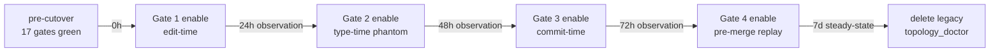

# CUTOVER_RUNBOOK

## Sunset: revisit_on_cutover

This runbook is rewritten as part of the Phase 5 cutover deliverable
itself (`IMPLEMENTATION_PLAN §7`). The version preserved here is the
**design-time blueprint**; the day-of artifact will be a successor file
authored by the Phase 5 owner.

## §1 Pre-cutover gates (all must be green)

Cutover does not begin until every row passes. Each row maps to a
briefing §9 acceptance criterion or a CHARTER §10 sunset clause.

| # | Gate | Threshold | Source | Briefing §9 row |
|---|---|---|---|---|
| 1 | Shadow router agreement | ≥98% over 7 consecutive days | Phase 0.F daily reports + Phase 4 final week | (none — Phase-0 floor + Phase-5 target) |
| 2 | CI: pytest core | green | `tests/test_*.py` | (implicit) |
| 3 | CI: replay-correctness lane | green; seeded regression caught | Phase 0.G + Phase 4 Gate 4 | "Replay-correctness gate live in CI" |
| 4 | CI: token budget T0..T3 | all 4 ≤ cap (500 / 1000 / 2000 / 4000) | `tests/test_route_card_token_budget.py` | "Route card output (T0/T2)" |
| 5 | CI: capability decorator coverage | 100% of `hard_kernel_paths` | `tests/test_capability_decorator_coverage.py` | "Capability tags on guarded writers" |
| 6 | CI: charter sunset required | 100% of YAML keys carry `sunset_date` | `tests/test_charter_sunset_required.py` | (CHARTER §5) |
| 7 | CI: charter mandatory evidence | 100% of `mandatory: true` helpers carry §4 evidence | `tests/test_charter_mandatory_evidence.py` | (CHARTER §4) |
| 8 | INV-HELP-NOT-GATE test | green | `tests/test_help_not_gate.py` | "INV-HELP-NOT-GATE relationship test" |
| 9 | LiveAuthToken phantom | type-check fails on submit without token | mypy / pyright | "LiveAuthToken enforced at submit boundary" |
| 10 | Edit-time gate | synthetic edit attempt on a hard-kernel path with wrong capability fails | manual fixture | "Hard-kernel paths blocked at Write tool" |
| 11 | Topology infrastructure LOC | ≤1,500 | `wc -l` of new + retained vs deleted | "Topology infrastructure total" |
| 12 | Bootstrap token cost | ≤30,000 | measurement script vs Phase 0.A baseline | "Total bootstrap token reduction ≥7×" |
| 13 | 20-hour replay friction | ≤2h | Phase 5 replay re-run | "20-hour replay friction" |
| 14 | 30d shadow [skip-invariant] rate | <2/week (R10 floor) | `git log --grep="skip-invariant"` | "[skip-invariant] rate over 30d" |
| 15 | 6 ADRs signed | yes (operator hash present) | `adr/ADR-*.md` frontmatter | "Operator signs ADR-1 through ADR-6" |
| 16 | All 5 anti-drift mechanisms wired | per-mechanism test green | `tests/test_charter_*.py` + `tests/test_help_not_gate.py` | "All 5 anti-drift mechanisms wired" |
| 17 | zeus-ai-handoff frontmatter | `mandatory: false` | `.agents/skills/zeus-ai-handoff/SKILL.md` audit | "zeus-ai-handoff auto-summon disabled" |

**No partial GO** (briefing §6). If any row is amber, operator either
files a CHARTER §9 override (≤14d expiry, single rule, single scope)
or halts cutover.

## §2 Cutover sequence (gradual, gated)



Gate 5 (runtime kill switch + settlement-window freeze) was promoted to
topology-layer in Phase 4 and is **already live**; it is not a cutover
step. The sequence above is the agent-facing enforcement layer. At each
step the rollback trigger is the per-step row in §3.

### 2.1 Step 1: Edit-time gate enable (T+0h)

**Action:** flip `ZEUS_ROUTE_GATE_EDIT=on` in
`config/runtime/feature_flags.yaml`. The Write-tool hook now consults
the route card for every edit attempt.

**Observation window:** 24h.

**Rollback trigger:** any of the §3 step-1 thresholds breached.

### 2.2 Step 2: Type-time phantom enable (T+24h)

**Action:** make the deprecation of the `@untyped_for_compat` escape
hatch active (the type system enforces `LiveAuthToken` everywhere it
should). The Phase 4 ABC split has been live since Phase 4; this step
is the **enforcement** of the type-system, not the introduction.

**Observation window:** 48h.

**Rollback trigger:** any of the §3 step-2 thresholds breached;
particularly important is "live execution test suite green" — Phase 4
R3 mitigation is verified here.

### 2.3 Step 3: Commit-time gate enable (T+72h)

**Action:** flip `ZEUS_ROUTE_GATE_COMMIT=on`. The diff verifier now
blocks commits when `original_intent.does_not_fit` matches the task.

**Observation window:** 72h.

**Rollback trigger:** §3 step-3 thresholds.

### 2.4 Step 4: Pre-merge replay-correctness gate enable (T+7d)

**Action:** promote replay-correctness CI lane from "advisory" to
"required for merge."

**Observation window:** 7 days steady state — this is the longest
single observation because replay-correctness false-positives (R2) are
the most likely to deadlock the team.

**Rollback trigger:** §3 step-4 thresholds.

### 2.5 Step 5: Delete legacy `topology_doctor` (T+14d)

**Action:** delete `scripts/topology_doctor.py` and remaining
`topology_doctor_*.py` modules; archive `architecture/topology.yaml` to
`docs/operations/historical/`.

**This step is irreversible** within the project's working tree but
fully reversible from git history. By design, this is the last step —
all prior steps are individually rollbackable; deleting legacy commits
to the redesign.

**Observation window:** 30d post-deletion telemetry watch (§3).

## §3 Telemetry watch — first 24h / 7d / 30d

| Step | Metric | Source | 24h threshold | 7d threshold | 30d threshold | Rollback if |
|---|---|---|---|---|---|---|
| 1 (edit) | edit-time block rate | `ritual_signal` outcome=blocked | <5% of attempts | <3% | <1% | >10% sustained 1h |
| 1 (edit) | edit-time bypass rate | `[skip-invariant]` commits | <0.5/day | <2/week | <1/week (target) | >2/day sustained |
| 2 (type) | live exec test suite | CI | 100% green | 100% green | 100% green | <100% on any run |
| 2 (type) | mypy/pyright errors net-new | CI lint diff | 0 in test paths | 0 | 0 | any net-new in test paths |
| 3 (commit) | commit-time block rate | `ritual_signal` | <5% | <2% | <1% | >10% sustained 1h |
| 3 (commit) | average T0 token usage | `ritual_signal` field | ≤500 | ≤500 | ≤500 | T0 violations >5/day |
| 4 (merge) | replay-correctness false-positive rate | CI flake stats | <1 / 100 PRs | <1 / 200 | <1 / 500 | >5 / 100 PRs in 24h |
| 4 (merge) | replay-correctness latency | CI lane median | <60s | <60s | <60s | >120s sustained 1h |
| 5 (delete) | broken legacy import | grep / import-time | 0 | 0 | 0 | any |
| all | lease service active leases | `lease_service.list_active()` | 0 stale | 0 stale | 0 stale | leases age > 1h sustained |
| all | M1 ritual_signal volume | `logs/ritual_signal/` line count | >0 | sustained | sustained | drops to 0 (telemetry broken) |

## §4 Rollback plan

### 4.1 Per-step partial rollback

Each per-step rollback is via feature flag in
`config/runtime/feature_flags.yaml`:

```yaml
ZEUS_ROUTE_GATE_EDIT:    on | off    # step 1
ZEUS_ROUTE_GATE_COMMIT:  on | off    # step 3
ZEUS_REPLAY_GATE_MERGE:  required | advisory | off    # step 4
```

Type-time gate (step 2) cannot be disabled by flag once
`@untyped_for_compat` is removed; rollback is via revert of the
deprecation commit.

A single per-step rollback does **not** undo the redesign — earlier
steps remain enforced. CHARTER §9 governs the override (≤14d expiry,
single scope).

### 4.2 Full rollback (only after step 5)

If post-deletion telemetry forces full rollback within 30d:

1. Restore `architecture/digest_profiles.py` from git tag
   `pre-phase3-2026-MM-DD`.
2. Restore `architecture/topology.yaml :: digest_profiles:` block.
3. Restore deleted `topology_doctor*.py` modules.
4. Disable all four route-function gates via feature flags.
5. Operator file post-mortem within 7 days documenting which acceptance
   criterion was violated and why anti-drift mechanisms did not catch it
   pre-cutover.

Full rollback is the **failure path** — its existence is for safety, not
for routine use. Triggering it auto-bumps CHARTER version (the rules did
not work; they need revision).

## §5 Post-cutover stabilization

Days 1-14 post-step-5:

| Day | Task |
|---|---|
| 1-3 | Dead-code sweep: remove all dead imports of legacy `topology_doctor*` |
| 3-7 | Doc updates: `AGENTS.md`, `workspace_map.md`, `README.md` updated to reference `route_function` and capability layer instead of topology |
| 7-14 | Telemetry baseline reset: archive Phase 0.A measurements; the new "post-cutover baseline" is the 30d post-step-5 ritual_signal aggregate |
| 14 | Runbook rewrite: this file's `revisit_on_cutover` clause activates; Phase 5 owner produces successor `CUTOVER_RUNBOOK_2026-MM-DD.md` |

## §6 Day-of operator checklist

```yaml
cutover_session:
  date:                    YYYY-MM-DD
  operator:                <name>
  pre_cutover_gates_green: yes | no
  step_1_enabled_at:       hh:mm
  step_1_24h_review:       hh:mm
  step_2_enabled_at:       hh:mm
  step_2_48h_review:       hh:mm
  step_3_enabled_at:       hh:mm
  step_3_72h_review:       hh:mm
  step_4_enabled_at:       hh:mm
  step_4_7d_review:        date
  step_5_enabled_at:       hh:mm
  step_5_30d_review:       date
  rollback_invoked:        no | step-N
  charter_overrides_filed: [list of ids if any]
  post_cutover_owner:      <role>
  evidence_file:           docs/operations/cutover_2026_MM_DD/evidence.md
```

## §7 Single-page emergency reference

```
HALT CUTOVER:
  set all four flags to off in config/runtime/feature_flags.yaml
  page operator immediately

PARTIAL ROLLBACK (post-step):
  edit-time:   ZEUS_ROUTE_GATE_EDIT=off
  type-time:   revert <phase-4 type-deprecation commit>
  commit-time: ZEUS_ROUTE_GATE_COMMIT=off
  merge-time:  ZEUS_REPLAY_GATE_MERGE=advisory

FULL ROLLBACK (only post-step-5):
  see §4.2

OBSERVATION WINDOWS:
  step 1 → 24h → step 2 → 48h → step 3 → 72h → step 4 → 7d → step 5 → 30d

OWNER ON CALL:
  Phase 5 implementer (primary)
  Operator (escalation)
  Critic (telemetry review)
```
