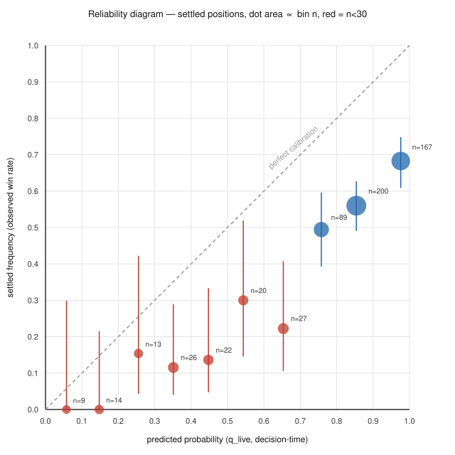

# Zeus settled-position calibration report

Generated: `2026-07-29T17:13:12.936311+00:00`
Generator: `python3 scripts/generate_calibration_report.py`

> **What this is.** A reliability diagram — the system's stated win probability (`q_live`, frozen at decision time on an immutable `ActionableTradeCertificate`) against the settled frequency it actually produced. **What this is not: a return figure.** See the closing section for why.

## Provenance — settled-only, no contamination path

Every row in this report comes from `settlement_attribution` (`src/analysis/settlement_skill_attribution.py`), the SOLE table whose `won` / `settled_in_bin` / `settled_value` columns are populated by `grade_receipt()` against a **VERIFIED** `settlement_outcomes` row, and whose `q_live` is the FROZEN decision-time value read from an immutable VERIFIED decision certificate — never a posterior reconstructed after the fact. This is the exact ground-truth law `loop/LEDGER.yaml` states: *"ground truth = decision certificate x real settlement join ONLY"*. This report never reads `forecast_posteriors` or any other table as if it were a settled outcome — the failure mode of a prior calibration store built on settlement midpoints backfilled as forecasts.

- Settled positions loaded: **538**, settlement window `2026-06-09T14:00:29.957276+00:00 .. 2026-07-29T13:05:04.841100+00:00`.
- Of those, **378** (70.3%) carry a resolvable decision-time predicted probability (`q_live`); the remaining 160 have no resolvable immutable decision-q certificate and are excluded from every calibration number below (never imputed) — they are counted, not guessed.
- Thin-sample threshold: **n < 30** per cell, `loop/LEDGER.yaml`'s own rule ("Statistical conclusions require min_n=30 per cell before a status can move off 'open'"). Every table below flags cells under that floor rather than hiding them.

## Reliability diagram

n = 378 settled positions with a resolvable predicted probability. Dot area is proportional to bin count; the vertical bar is the 95% Wilson interval on the observed win rate; a red dot marks a bin under the n<30 floor.

| bin | n | mean predicted | observed win rate | 95% Wilson interval | flag |
|---|---:|---:|---:|---|---|
| [0.0, 0.1) | 9 | 5.8% | 0.0% (0/9) | [0.0%, 29.9%] | thin (n<30) |
| [0.1, 0.2) | 14 | 14.8% | 0.0% (0/14) | [0.0%, 21.5%] | thin (n<30) |
| [0.2, 0.3) | 3 | 25.5% | 0.0% (0/3) | [0.0%, 56.1%] | thin (n<30) |
| [0.3, 0.4) | 11 | 35.4% | 18.2% (2/11) | [5.1%, 47.7%] | thin (n<30) |
| [0.4, 0.5) | 8 | 43.5% | 25.0% (2/8) | [7.1%, 59.1%] | thin (n<30) |
| [0.5, 0.6) | 8 | 55.7% | 25.0% (2/8) | [7.1%, 59.1%] | thin (n<30) |
| [0.6, 0.7) | 13 | 66.5% | 23.1% (3/13) | [8.2%, 50.3%] | thin (n<30) |
| [0.7, 0.8) | 51 | 76.4% | 49.0% (25/51) | [35.9%, 62.3%] |  |
| [0.8, 0.9) | 123 | 85.2% | 60.2% (74/123) | [51.3%, 68.4%] |  |
| [0.9, 1.0) | 138 | 98.1% | 69.6% (96/138) | [61.4%, 76.6%] |  |

## Decomposition — reliability vs resolution vs base rate

Murphy (1973) two-term decomposition of the Brier score: `Brier = reliability - resolution + uncertainty` (reliability/resolution computed on the 10 bins above — an expected small residual against the exact per-observation Brier is the discretization cost of binning).

| quantity | value | reads as |
|---|---:|---|
| n | 378 | settled positions with a resolvable predicted probability |
| base rate (uncertainty term) | 54.0% | fraction of settled positions that won |
| reliability | 0.0717 | miscalibration — **lower is better**, 0 = perfectly calibrated |
| resolution | 0.0411 | informativeness — **higher is better**, 0 = no better than the base rate |
| uncertainty | 0.2484 | irreducible variance of a coin at the base rate, `p(1-p)` |
| Brier score | 0.2754 | mean squared error of the predicted probability, lower is better |
| Brier skill score vs base rate | -0.109 | `1 - Brier/uncertainty` — positive beats always guessing the base rate, negative is worse than that |

**The pooled Brier skill score is negative (-0.109).** Across all 378 settled positions with a resolvable predicted probability — including `STALE_DECISION` rows, whose decision posterior was, by definition, already outdated — the stated probability is a worse predictor than simply guessing the 54.0% base rate. This is a real finding, not an artifact of the calculation; see the attribution-class cut below for where it concentrates.

## Cut: by side

| side | n (settled) | n (predicted-prob resolvable) | mean predicted | observed win rate | 95% Wilson interval | flag |
|---|---:|---:|---:|---:|---|---|
| buy_yes | 113 | 77 | 45.3% | 18.2% | [11.2%, 28.2%] |  |
| buy_no | 425 | 301 | 89.1% | 63.1% | [57.5%, 68.4%] |  |
| unknown | 0 | 0 | n/a | n/a | n/a | no resolvable predicted probability |

## Cut: by strategy

| strategy_key | n (settled) | n (predicted-prob resolvable) | mean predicted | observed win rate | 95% Wilson interval | flag |
|---|---:|---:|---:|---:|---|---|
| center_buy | 21 | 16 | 20.3% | 6.2% | [1.1%, 28.3%] | thin (n<30) |
| chain_only_reconciliation | 32 | 25 | 48.6% | 0.0% | [0.0%, 13.3%] | thin (n<30) |
| day0_nowcast_entry | 61 | 56 | 87.2% | 53.6% | [40.7%, 66.0%] |  |
| forecast_qkernel_entry | 200 | 157 | 84.2% | 60.5% | [52.7%, 67.8%] |  |
| opening_inertia | 151 | 110 | 84.4% | 62.7% | [53.4%, 71.2%] |  |
| settlement_capture | 21 | 14 | 97.9% | 64.3% | [38.8%, 83.7%] | thin (n<30) |
| unknown (no position_current match) | 52 | 0 | n/a | n/a | n/a | no resolvable predicted probability |

## Cut: by lead time (entry to settlement)

453/538 settled positions have a resolvable entry timestamp (`trades.position_events`, immutable append-only entry events); 85 predate that event log and are excluded from this cut (counted, not guessed).

| lead time | n (settled) | n (predicted-prob resolvable) | mean predicted | observed win rate | 95% Wilson interval | flag |
|---|---:|---:|---:|---:|---|---|
| <24h | 9 | 4 | 98.2% | 25.0% | [4.6%, 69.9%] | thin (n<30) |
| 24-72h (1-3d) | 345 | 281 | 81.6% | 55.9% | [50.0%, 61.6%] |  |
| 72-168h (3-7d) | 35 | 29 | 77.6% | 51.7% | [34.4%, 68.6%] | thin (n<30) |
| 168h+ (7d+) | 64 | 38 | 89.6% | 78.9% | [63.7%, 88.9%] |  |

## Cut: by attribution class — the interesting one

The six-class post-settlement grader (`settlement_skill_attribution.py`) separates forecast-earned wins from lucky ones specifically so only skill outcomes feed calibration. Four of the six categories are outcome-degenerate BY CONSTRUCTION (`SKILL_WIN`/`LUCKY_WIN` are defined as `won=1`, `SKILL_LOSS`/`MISCALIBRATED_LOSS` as `won=0`) — a within-category "win rate" for those four is the category's own definition restated, not a calibration statement. What IS comparable across them is the predicted probability itself: a forecast-earned win should carry a HIGH predicted probability; a lucky win, by the taxonomy's own definition, is one the fresh evidence disagreed with.

| attribution class | n (settled) | n (predicted-prob resolvable) | mean predicted | observed win rate | 95% Wilson interval | flag |
|---|---:|---:|---:|---:|---|---|
| SKILL_WIN | 101 | 92 | 89.5% | 100.0% | [96.0%, 100.0%] |  |
| LUCKY_WIN | 3 | 0 | n/a | n/a | n/a | no resolvable predicted probability |
| SKILL_LOSS | 49 | 46 | 49.8% | 0.0% | [0.0%, 7.7%] |  |
| MISCALIBRATED_LOSS | 34 | 34 | 88.2% | 0.0% | [0.0%, 10.2%] |  |
| STALE_DECISION | 243 | 206 | 81.4% | 54.4% | [47.5%, 61.0%] |  |
| UNATTRIBUTABLE_Q_MISSING | 108 | 0 | n/a | n/a | n/a | no resolvable predicted probability |

### Skill vs lucky — reported either way

**Cannot be computed from `q_live` in the current corpus.** `LUCKY_WIN` has n=3 settled positions and **0** of them carry a resolvable decision-q certificate — the comparison this cut exists to make (mean predicted probability: forecast-earned wins vs lucky wins) is structurally unavailable, not merely thin. `SKILL_WIN` (n=101, 92 with a resolvable `q_live`, mean predicted probability 89.5%) has no `LUCKY_WIN` counterpart to compare against today. This is itself the honest finding: report it as unresolved rather than substitute a different sample.

**`UNATTRIBUTABLE_Q_MISSING`** — n=108 settled positions (20.1% of the whole settled sample) have **no** resolvable immutable decision-q certificate at all: the system's own decision-time belief for roughly 1 in 5 settled trades is unknown, not merely unplotted. That gap in certificate coverage is a data-completeness finding in its own right, independent of what the calibration curve above shows.

## What this supports / does not support

- **n = 378/538** settled positions carry a resolvable predicted probability; every number above is scoped to that n, or to the smaller per-cut subsets shown in their own columns.
- **Supports:** a calibration read on the pooled reliability curve and decomposition above (n=378), and on any cut cell not flagged thin (n≥30).
- **Does not support:** a return/PnL claim of any kind — see the capital-scale note below; a `LUCKY_WIN` calibration comparison (n=3, 0 resolvable); a firm read on any cell flagged thin above; a claim that `UNATTRIBUTABLE_Q_MISSING` positions were miscalibrated (their `q_live` is unknown, not zero or bad).
- **Capital scale** (stated once, here, nowhere else in this report): the settled sample's total cost basis is a low four-figure dollar amount — far too small for the standard error on any realized-return figure to be distinguishable from zero. This report accordingly makes no return claim; capital-scale detail lives in the repo's operational accounting, not here.

